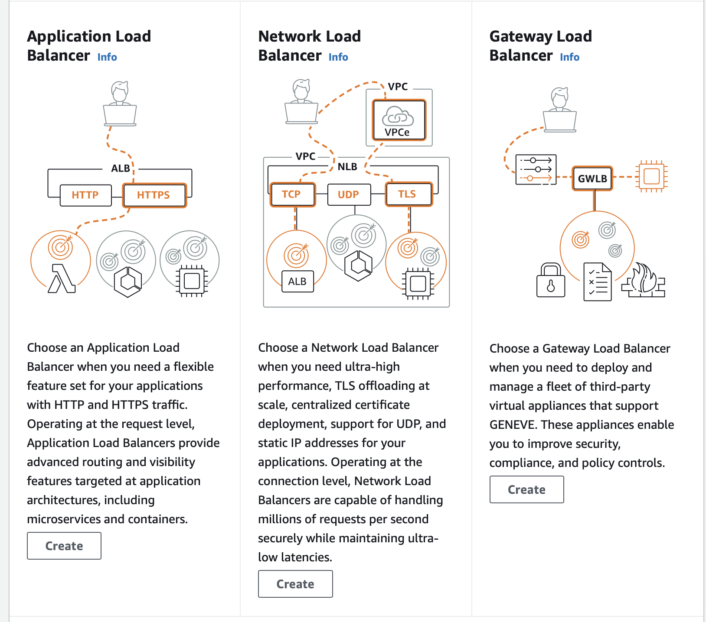
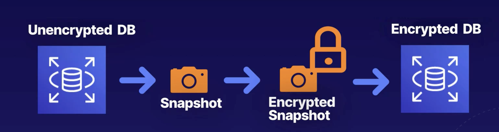

# AWS - Developer Associate Certificate

Domains of the course [Course-Link](https://d1.awsstatic.com/training-and-certification/docs-dev-associate/AWS-Certified-Developer-Associate_Exam-Guide.pdf)

1. Development of aws services (32%)
2. security (26%)
3. deployment (24%)
4. troubleshooting and optimization (18%)


130 minutes - 65 questions

## IAM

IAM - Identity Access Management

main usage - to controll acess to the resources
end points - users, groups , roles , policies

- roles - defines a set of conditions on resources , users or group or applications inherit these properties
- A role provides a dynamic way to provide permission of interact with the resoruces
- policies - A direct way to interact way with resources.

A role can follow a set of policies to interact with

E.g - creating a new policy and attaching a role to it

- policy name - `ReadOnlyAccessToS3Bucket`
```json
{
    "Version": "2012-10-17",
    "Statement": [
        {
            "Effect": "Allow",
            "Action": [
                "s3:GetObject",
                "s3:ListBucket"
            ],
            "Resource": [
                "arn:aws:s3:::example-bucket",
                "arn:aws:s3:::example-bucket/*"
            ]
        }
    ]
}

```

- Role Name: EC2ReadOnlyS3Role

```json
{
    "Version": "2012-10-17",
    "Statement": [
        {
            "Effect": "Allow",
            "Principal": {
                "Service": "ec2.amazonaws.com"
            },
            "Action": "sts:AssumeRole"
        }
    ]
}

```

To check if a policy can perform a set of actions we can use

- [Policy Sim](https://policysim.aws.amazon.com)

## EC2

- Elastic Cloud Compute

- pricing types

1. on Demand (pay per use)
2. Reserved (prepay and long term)
3. spot (fix a max price , the instances are balanced dynamically)
4. dedicated

EBS storage types

1. gp2 , gp3 - general purpose (3000 - 16000 IOPS)
2. io1,io2,SAN - faster access (16000 - 64000 IOPS)
3. SAN - (256000 IOPS)
4. st1 (500 mbps), sc1 (250mbps) - hdd storage

- ec2 instance and ebs volume should be in the same availability zone in order to attach them.

## Elastic Load Balancer

types

1. application (http / https requests)
2. network load (tcp)
3. gateway load balancers (used to serve third party applications such as firewalls)

- Main use case is to efficiently forward requests to the appropriate server
- the load balancer has a private address by default , it used the x-forwarded-by property to find the ip address of end user



## RDS

- main use case: In case of Transaction data , use RDS if use case need to perform analysis on large data use RedShift

to improve performance - Read replica snapshots of rds instances are provided
to resolve disasters - Multiple rds instances are allocated in different Availability zones


- two different options to perform backups

1. automated - handled by aws , these are performed in definitive time window, can be stored across multiple time zones

2. manual - a snapshot is created manually by the user and its stored in an s3 bucket (charged) , this snapshot would be having a different RDS endpoint compared to the parent

- An unencrypted RDS instance can be encrypted by making a manual snaphot and encrypting it.




