# AWS - Developer Associate Certificate

Domains of the course [Course-Link, PluralSight](https://d1.awsstatic.com/training-and-certification/docs-dev-associate/AWS-Certified-Developer-Associate_Exam-Guide.pdf)

1. Development of aws services (32%)
2. security (26%)
3. deployment (24%)
4. troubleshooting and optimization (18%)


130 minutes - 65 questions

## IAM

IAM - Identity Access Management

main usage - to controll acess to the resources
end points - users, groups , roles , policies

- roles - defines a set of conditions on resources , users or group or applications inherit these properties
- A role provides a dynamic way to provide permission of interact with the resoruces
- policies - A direct way to interact way with resources.

A role can follow a set of policies to interact with

E.g - creating a new policy and attaching a role to it

- policy name - `ReadOnlyAccessToS3Bucket`
```json
{
    "Version": "2012-10-17",
    "Statement": [
        {
            "Effect": "Allow",
            "Action": [
                "s3:GetObject",
                "s3:ListBucket"
            ],
            "Resource": [
                "arn:aws:s3:::example-bucket",
                "arn:aws:s3:::example-bucket/*"
            ]
        }
    ]
}

```

- Role Name: EC2ReadOnlyS3Role

```json
{
    "Version": "2012-10-17",
    "Statement": [
        {
            "Effect": "Allow",
            "Principal": {
                "Service": "ec2.amazonaws.com"
            },
            "Action": "sts:AssumeRole"
        }
    ]
}

```

To check if a policy can perform a set of actions we can use

- [Policy Sim](https://policysim.aws.amazon.com)

## EC2

- Elastic Cloud Compute

- pricing types

1. on Demand (pay per use)
2. Reserved (prepay and long term)
3. spot (fix a max price , the instances are balanced dynamically)
4. dedicated

EBS storage types

1. gp2 , gp3 - general purpose (3000 - 16000 IOPS)
2. io1,io2,SAN - faster access (16000 - 64000 IOPS)
3. SAN - (256000 IOPS)
4. st1 (500 mbps), sc1 (250mbps) - hdd storage

- ec2 instance and ebs volume should be in the same availability zone in order to attach them.

## Elastic Load Balancer

types

1. application (http / https requests)
2. network load (tcp)
3. gateway load balancers (used to serve third party applications such as firewalls)

- Main use case is to efficiently forward requests to the appropriate server
- the load balancer has a private address by default , it used the x-forwarded-by property to find the ip address of end user


## RDS

- main use case: In case of Transaction data , use RDS if use case need to perform analysis on large data use RedShift

to improve performance - Read replica snapshots of rds instances are provided
to resolve disasters - Multiple rds instances are allocated in different Availability zones


- two different options to perform backups

1. automated - handled by aws , these are performed in definitive time window, can be stored across multiple time zones

2. manual - a snapshot is created manually by the user and its stored in an s3 bucket (charged) , this snapshot would be having a different RDS endpoint compared to the parent

- An unencrypted RDS instance can be encrypted by making a manual snaphot and encrypting it.


- RDS proxy: its used to load balance all the incoming traffic to the rds instance , in case of any instance failures all the transactions are stored in the proxy servers and are resolved post failure resolving process.


## ElastiCache

In memory storage in aws, two types are available

1. memcache (used to store simple cache , session storage of website) - memcache sits in front of an RDS instance
2. Redis (complex datatypes, larger applications such as online gaming)

MemoryDB for redis is alternative to an RDS service

## Parameter Store

System manager service provides the parameter store to encrypt sensitive data and pass on to other resources

## Secrets Manager

- AWS secret manager is used to store all the database passwords , api keys . etc.
- rotation of the keys can be enables in secrets manager which is handled by an lambda function
- use programmatic way to retrive keys from the manager
- it uses a key from aws kms to encrypt and it can be replicated in other zones

## EC2 Image Builder

- EC2 instances can be used to test and build images


## S3

Simple Storage Service

Different types

1. Standard (general purpose)
2. standard - infrequent access (store backup files)
3. glacier and glacier archive (large archive data)
4. Intelligent Tiering (auto shift between storage types based on access frequency)

Encryption types

1. SSE-S3 (managed by s3 , not by kms - default)
2. SSE-KMS (managed by kms)
3. SSE-C (managed by customer)
4. DSSE-KMS (dual encryption managed by kms)

By default CORS is disabled between two s3 buckets , edit the properties and allow the host to enable CORS

## CloudFront

CDN network provided by aws

1. Edge Location (cache location with definitve ttl)
2. CloudFront origin (origin of files (s3,ec2,elb,r53))

- Can assign a resource to be restricted by use of signed URL or signed cookies.

additional topics - AWS WAF (firewall) --> mainly used to restrict all the incoming traffic to the origin

- A new origin access identity is required whenever we need to restrict access to the s3 buckets

### Allowed Methods

1. GET, HEAD (resource_headers) (read-only)
2. GET, HEAD, OPTIONS (request_to_know_allowed_methods) (read-only)
3. GET, HEAD, OPTIONS, PUT, POST, PATCH, DELETE (read-only and write)


## Athena

Service used to run SQL queries on data stored in s3 buckets

usecases - log analysis, generating reports based on s3 data, click data analysis

- need to create a new s3 bucket before analysis to store all the results of the queries.

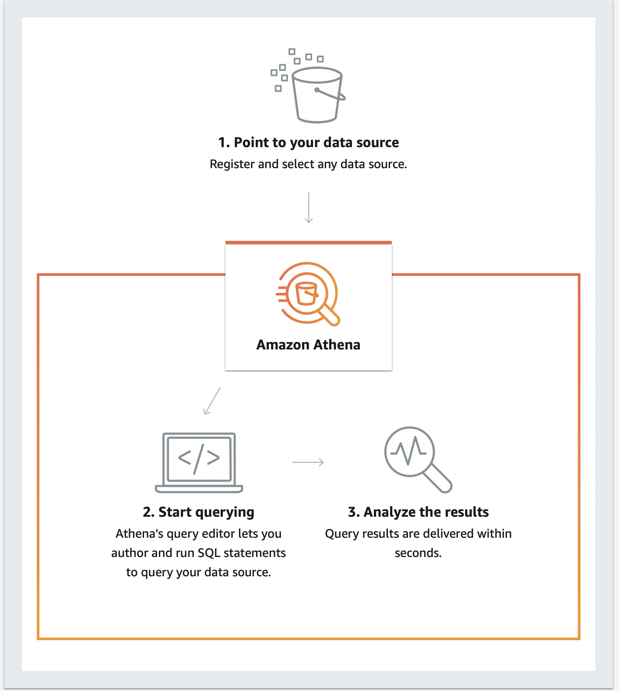

## ServerLess Architectures

diff types of serverless arch

1. lambda
2. sqs
3. sns
4. api gateway
5. dynamodb
6. s3

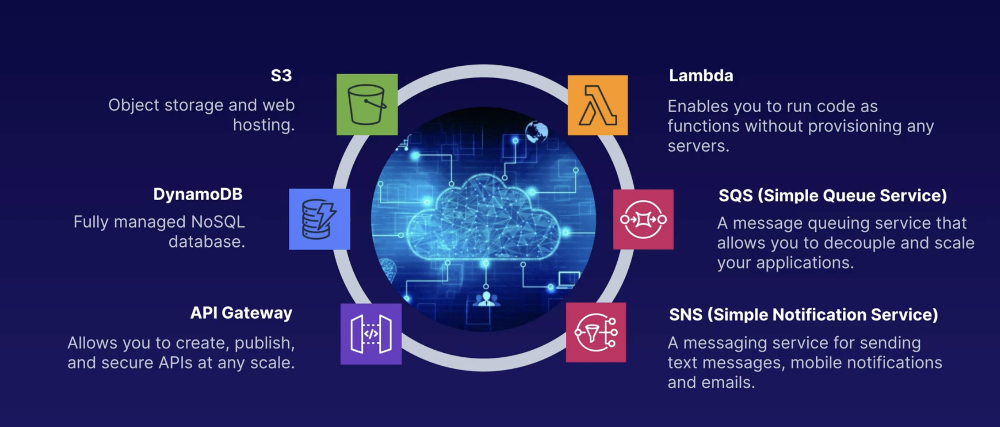

### lamda

- serverless arch to run applications and microservices , the run time environment is handled by aws

- priced based on number of requests and memory consumption of the program

- different triggers to invove a lamda function

1. change in s3 bucket, dynamo table (any changes to resources)
2. user requests (api gateway to invoke requests)

- increasing the memory of a lambda function automatically add CPU to the instance.

- error handling in lambda functions can be handled by usage of dead letter queues which send the error logs using the sns service.

### API Gateway

- service which sits in front of all RestFul API sockets and handles incoming requests.

- All requests made to API gateway are logged in cloudWatch

- API gateway allows importing of the openAPI profile and also allows SOAP protocol by transforming XML into JSON formats
- API gateway also allows mock integration endpoints for testing, use case when a front end dev team finsihes their code and wants to test but theres no available back end , they can create mock tests to test out the routes
- fields in the mock test
1. status code
2. body message

- API Gateway also provides option of caching , in this option all the responses are cached with a ttl of 300 seconds , any new request made to gateway uses the cache

- API gateway also allows throttling of the request.

1. by default it allows 10,000 requests per second
2. if we get more no of requests than the limit , the requests are throttled to the next second without resulting in an 429 server overload response code.

### version control

- lambda offers version control to manage different stage od SDLC , $LATEST sign indicates the default version. We can also create aliases in the functions to route traffic between two different versions of the code.

- lambda function can join a vpc and connect or create elastic resources in that particular vpc, need to add additional policies to acheive this.

### step functions

- service to orchestrate several serverless functions, the step function consists of a state machine which handles all the tasks in it.

- different types of executions
1. series tasks
2. parallel tasks
3. series + parallel
4. branching (conditional statements)

### Data storage in lambda functions

By default lambda functions are stateless, different options to provide storage to lambda functions

1. /tmp (accessible from 512mb to 10gb, works in the same environment and can be shared by all functions using the runtime)
2. layers (used to manage all the libraries required for the runtime (50mb ))
3. EFS (File system which can be mounted at runtime , it should be in the same vpc as the lambda function, allows dynamic read and writes)
4. DynamoDB (files or value directly stored to DB)
5. S3 (store files in s3)

## DynamoDB

- NoSQL database servie provide by aws, it does not have any schema structure , data is stored in tables , each row is an item and each column of the table is an attribute , the data is stored in json format

- two types of keys can be used to indicate the primary key
1. partition key
2. partition key + sort key (when a same user has multiple records , a student taking multiple course, in this case user_id+course_id is the PK)

- access to the DDB is controlled through IAM roles, access can be blocked by adding conditinal statements in policy

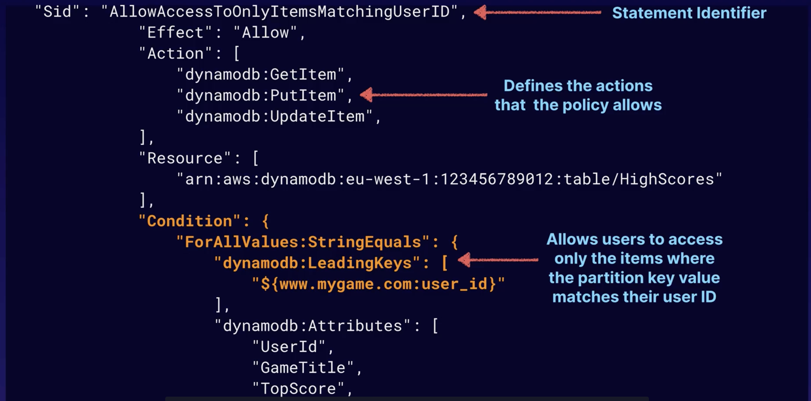

- in this example policy , the condition states only matching records with `user_id` should be displayed or queried as response.

- a local secondary index can also be used to query results along with a single partition key , a local secondary index must be created at the creation time
- a global secondary index on other hand can be paired up with multiple partion keys spread across table and can be created at any time.

### Read and write capacities

- dynamo db provides Read and write capacity units as metrics
- each `READ` unit can read 4kb per second data in eventual consistency and 2KB/sec in stong consistency.
- each `WRITE` unit can write 1kb/sec

### DAX

- dynamo db offers in memory cache which sits infront of the db
- workflow --> when ever a user queries , it first checks the DAX if its a cache hit , return res, else query db
- usefull in case of eventual read consistency and heavy read intensive applciations , black friday sales

### TTL

- dynambo db offers the service to auto remove objects from the table based on a defined ttl.
- the attribute used to set ttl must be in `epoch-time` format

### DynamoDB Streams

- its a service which stores time - ordered sequence data in table
- it stores the data for 24 hours
- it has a different api than the dynamo db , its usefull as a trigger for lambda functions.
- all the records are cleaned after 24 hours

- usecase
1. when ever a payment record is stored in the db stream , a lambda event is triggered
2. the lambda event sends a sns notification and adds the item to sqs queue which is processed and a reciet is genereated


### ProvisionedThroughPutException

- when the request exceed the read and write units quota .this exception is thrown
- to avoid this a `exponential backoff` pattern is followed, (e.g first try 50ms ,second - 100ms , third -200)

## KMS

- AWS key management service, it can be inherited by other storage services to encrypt / decrypt incoming and outgoing data
- it follows envolope encryption method , where a master key encrypts a data key which in turn is used to encrypt the main data files

- useful commands in kms
1. encrypt , decrypt
2. rotate key (periodically update the customer master key)
3. generate data key (used to generate a new key , which in turn can be used to encrypt and decrypt other data contents)

- GenerateDataKeyAPI is used in envolope encryption process
- envolope encryption process is used to avoid the transfer of big data files into kms server , instead it would just transfer just the data key over the network.

## SQS

- usecase -> its a pull based queue service sitting between the receiving end and the output receiving end. API calls are made to poll the events from queue
- every item has a visibility timeout (30sec), if the event is not processed within the time limits, its pushed back onto the queue to reprocess.
- default retention period of sqs is 4 days and each item can be <=250kb

two types of queue are presnet

1. standard (default, allows duplicated and can be unordered)
2. FIFO (ordered queue , rate limit at 300 TPS)

- Delays can be introduced into the SQS to properly allow the functioning of async operations. default is 0 , max is 900 seconds
- if file size is >256kb , can use s3 to store the data, in order to perform this the components needed are

1. SQS Extended client for java
2. aws sdk java

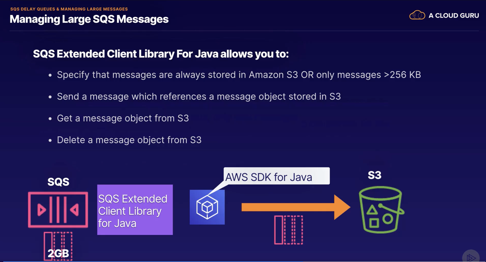

## SNS

- simple notification service , used a pub/sub model to deliver notifications
- a topic is created and all the consumers subscribe to that topic
- can be used to trigger lambda functions

### SES

- simple email service , its similar to SNS but only for emails , supports both incoming and outgoing mails , mails are stored in an s3 bucket.
- used for marketing , can be used as a trigger to lambda function

## Kinesis

- service to provide real time data analyis services , three different types
1. kinesis streams
2. kinesis data firehose
3. data analytics

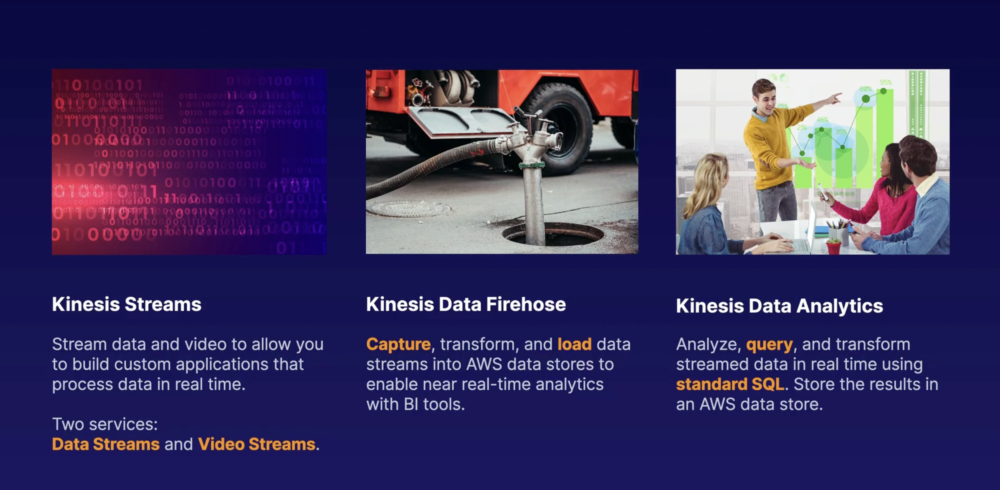

### streams

- mainly used for data stream analysis or video analysis
- the whole input stream is divided into multiple shards which define the rate limit of the stream
- can connect to lambda for processing and store in s3, or emr or redshift

### data firehose

- similar to streams but has no shards or no retention
- directly stores data onto the storage units

### data analytics

- sits in between the kinesis stream and the storage units
- can run on demands sql queries related to BI and store the results in storage units

### consumers

- The kinesis provides a Client library which handles the connections between the consumers and the shards
- its a one:many relation , one consumer can process multiple shards.
- whenever a reshard occurs the client library handles the load balancing of the consumers.

## Elastic Bean Stack

- PaaS service , which handles all the infrastructer and deploys the applications
- supports docker container or recommended servers

### deployment options

- for this use case consider all the instances running v1 and need to update to v2

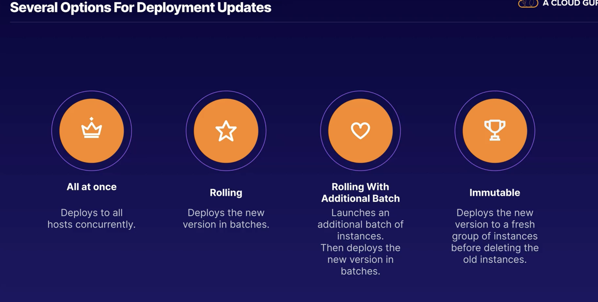

1. All at once:
In this case , all the existing instances are deployed at once , the system is offline during the deployment phase , suitable for testing
2. rolling:
In this case , the instances are divided into batches and each batch is updated concurrently , suitable for less load servers
3. rolling with additional batch :
In this case , a additional batch of instances of batch size is initialized , and the batches are deployed by concurrently , no down time of the servers
4. immutable:
In this case, new instance for each existing instance is initialized before deployment, after the complete deployment the intances are swapped , no down time, preferrable for production servers

### traffic splitting

- In case of immutatble deployment option, a portion of traffic is routed to the new version for a test period, post test pass checks, the slots are swapped.

### Advanced EBS

#### Script Files

- In pre amazon linux 2 environments, all the configurations such as packages to install, shell commands, creating users, enabling services,configuring load balanncers are present in the .config file
- the .config file should be located in the .ebconfig folder at the root dir

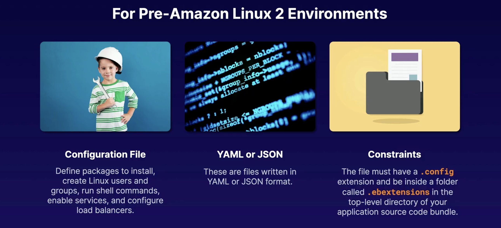

- In latest versions, the same functionalities are divided into different sections offering modularity

1. BuildFile

- used to run commands that run for a short time and exit
- format --> <process_name>:<command>

2. ProcFile
- used for running long commands post start of instance
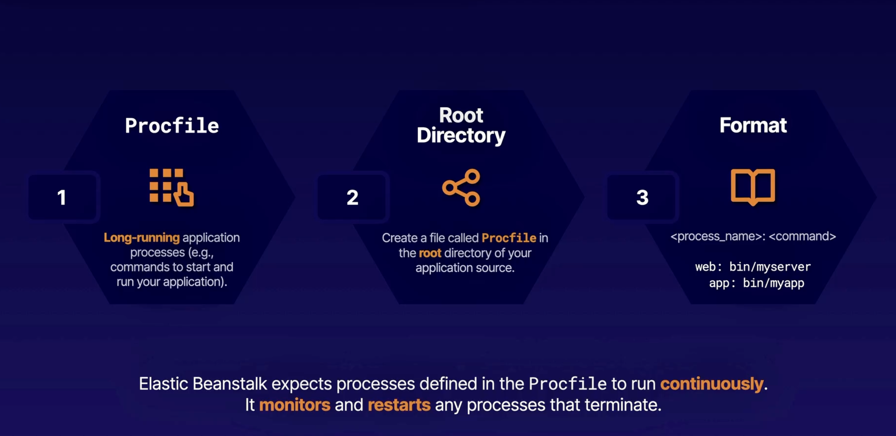

3.PlatformHooks
- this files are used to run scripts after the environment is set up in the EBS. Different scripts can be run at different stages of the application runtime.

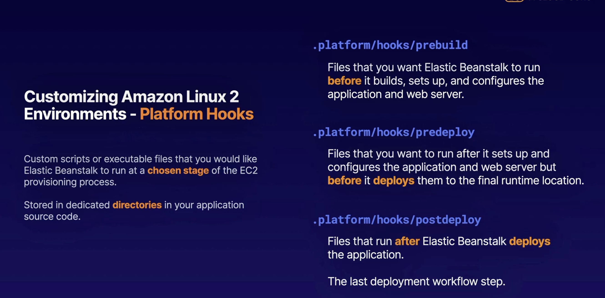

#### RDS Connections

- If an RDS instance is included during the build process of the EBS instance, whenever we terminate the instace the RDS will be terminated and lost.
- To avoid this we can create the RDS instance seperately and include both EBS and RDS inside a security group and pass the database connection details as environment variables.

## CI/CD

- aws provides option of maintaining an git repository through codeRepostiory service

## codeDeploy

- provided options for code deployment

1. in-place deployment (replace each instance, will be having reduced performance)
2. blue/green deployment (new instances are issued and new verision is deployed in the green instance, onSuccess the traffic is routed to the new version and the slots are swapped)

- All the main aspects of the deployment life cycle and configuration files should be present in the `appspec.yml` file

- example of appsec.yml file

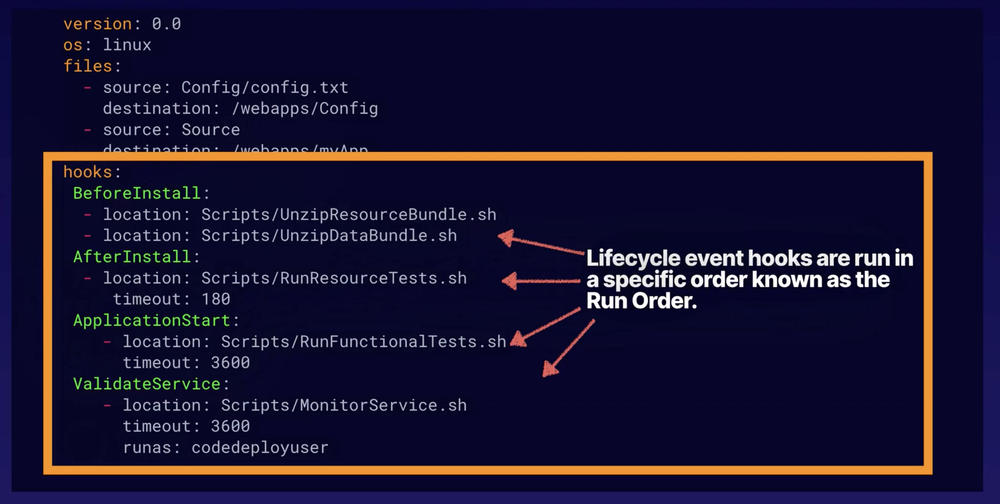

- The phases of the deployment life cycle

1. beforeBlockTraffic (tasks before de-regestering from load balancer)
2. blockTraffic (task to de-register from load balancer)
3. afterBlockTraffic (tasks post de-registering from load balancer)
4. applicationStop (tasks to stop the application)
5. DownloadBundle (fetch resources from the repo.)
6. BeforeInstall (backing up current version)
7. Install (copy files to the dest.)
8. postInstall (clean up scripts, set permissions)
9. ApplicationStart
10. ValidateStart

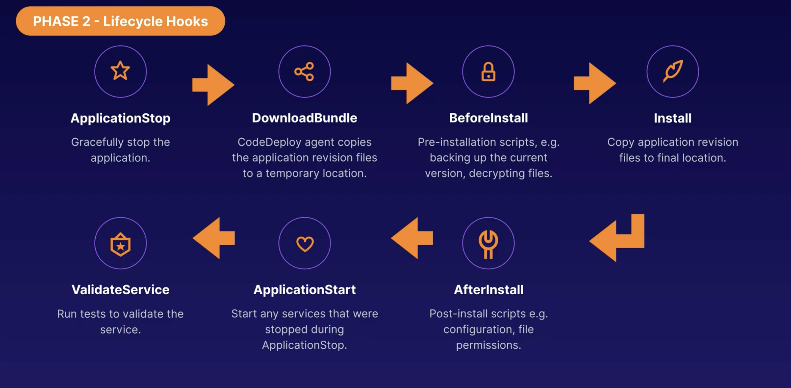


