# LeetCode Solutions

## Algorithms

## Bellman - Ford


## Intervals

### [1851. Minimum Interval to Include Each Query](https://leetcode.com/problems/minimum-interval-to-include-each-query/description/)

```java
class Solution {
    public int[] minInterval(int[][] intervals, int[] queries) {
        /*
            edge cases:
                1. if just one elem exists in the intervals, return the size of the container, if the querie exists in the range of the interval
            algo:
                1. sort the intervals and queries to avoid iterating over more elements
                2. init a minheap to store the matching intervals for each query
                3. iterate over the intervals to check for match, and offer to minheap
                4. after iterating, poll from the minheap and pick the least value
                5. assing it to the originalindex in the res
            t.c - O(nlogn + qlogn) - iterate over the intervals, and iterate over each interval
            s.c - O(queriesIndex) + O(res) + O(minHeap)

        */
        int n = intervals.length;
        int qlen = queries.length;
        int[][] queriesIndex = new int[qlen][2];
        int[] res = new int[qlen];

        //map the queriesIndex to maintain the original order
        for(int ind=0;ind<qlen;ind++){
            queriesIndex[ind] = new int[]{queries[ind],ind};
        }

        //sort the arrays based on the starting index in asc order
        Arrays.sort(intervals,(a,b)->a[0]-b[0]);

        //sort the queries in asc order
        Arrays.sort(queriesIndex,(a,b)->a[0]-b[0]);

        //maintain a minHeap (pq) to return the least interval size container for each querie
        PriorityQueue<int[]> mh = new PriorityQueue<>((a, b) -> (a[1] - a[0] + 1) - (b[1] - b[0] + 1));

        //process each query
        int index = 0;
        for(int[] q:queriesIndex){
            int query = q[0];
            int originalInd = q[1];
            while(index<n && intervals[index][0]<=query){
                //found interval with a match offer to min heap
                mh.offer(intervals[index]);
                index++;
            }

            //poll from the min heap and assign the min value to the res[originalIndex]
            while(!mh.isEmpty() && mh.peek()[1]<query){
                //poll
                mh.poll();
            }

            res[originalInd] = mh.isEmpty()?-1:(mh.peek()[1]-mh.peek()[0])+1;
        }
        return res;
    }
}
```

### [435. Non-overlapping Intervals](https://leetcode.com/problems/non-overlapping-intervals/description/)

```java
class Solution {
    public int eraseOverlapIntervals(int[][] intervals) {
        /*
            edge cases:
                1. If there’s only one interval, return 0 since no overlaps are possible.
                2. In the case [a1, b1], [a2, b2] if b1 == a2, do not count it as an overlap.

            algo:
                1. Sort the intervals based on their end time to facilitate minimizing removals.
                2. Iterate through the sorted intervals and count overlaps by comparing the start of the current interval with the end of the previous non-overlapping interval.
                3. Return the number of intervals removed to eliminate all overlaps.

            t.c - o(nlogn) due to sorting.
            s.c - o(logn) for the stack space used by sorting.
        */

        if (intervals.length <= 1) {
            return 0;
        }

        // Sort intervals by their end time in ascending order
        Arrays.sort(intervals, (a, b) -> a[1] - b[1]);

        int res = 0;  // To count the number of removed intervals
        int prevEnd = intervals[0][1];

        for (int i = 1; i < intervals.length; i++) {
            // If current interval starts before the end of the previous non-overlapping interval, it's an overlap
            if (intervals[i][0] < prevEnd) {
                res++;
            } else {
                // Update prevEnd to the end time of the current interval if there's no overlap
                prevEnd = intervals[i][1];
            }
        }

        return res;
    }
}
```

### [56. Merge Intervals](https://leetcode.com/problems/merge-intervals/description/)

```java
class Solution {
    public int[][] merge(int[][] intervals) {
        /*
            algo:
                1. sort the intervals to avoid mixup and missing ranges
                2. if the intervals match merge
                return;
            t.c - o(nlogn)
            s.c - o(n)
        */

        List<int[]> res = new ArrayList<>();
        Arrays.sort(intervals,(a,b)->a[0]-b[0]);

        res.add(intervals[0]);

        for(int ind=1;ind<intervals.length;ind++){
            //get the last element from the arraylist and check with the curr
            int[] last = res.get(res.size()-1);
            if(last[1]>=intervals[ind][0]){
                // [1,3] [2,6] --> merge and update the last
                last[1] = Math.max(last[1],intervals[ind][1]);
            }
            else{
                // ranges do not match add to res
                res.add(intervals[ind]);
            }
        }

        return res.toArray(int[][]::new);
    }
}
```

### [57. Insert Interval](https://leetcode.com/problems/insert-interval/description/)

```java
class Solution {
    public int[][] insert(int[][] intervals, int[] newInterval) {

        /*
            algo:
                three cases
                1. if the interval is less than newInterval; skip
                2. merge: if the interval lies in the range, update the newInterval
                3. if the interval is greater than newInterval; skip
            t.c - o(n)
            s.c - o(n)
        */

        List<int[]> res = new ArrayList<>();
        int n = intervals.length;
        int ind = 0;

        //case 1 [1,2] --> [4,8] (greater)
        while(ind<n && (newInterval[0]>intervals[ind][1])){
            res.add(intervals[ind]);
            ind++;
        }

        //case 2 [3,5] --> [4,8] (merge)
        while(ind<n && (newInterval[1]>=intervals[ind][0])){
            //update the newInterval
            newInterval[0] = Math.min(intervals[ind][0],newInterval[0]);
            newInterval[1] = Math.max(intervals[ind][1],newInterval[1]);
            ind++;
        }

        //after merge add it to res
        res.add(newInterval);

        //case 3 , add the rest of the elements greater than newInterval [6,9] [2,5]
        while(ind<n){
            res.add(intervals[ind]);
            ind++;
        }

        return res.toArray(int[][]::new);
    }
}
```


## DP

### [5. Longest Palindromic Substring](https://leetcode.com/problems/longest-palindromic-substring/description/)

```java
class Solution {

    /*
        brute force -> check all the possible strings and return the largest combinations from those strings
        t.c -> O(n^2) to check pairs , O(n) to check if string is palindrome : total : O(n^3)
        s.c -> O(validPalindromes) , considering StringBuilder Objects

        algo:
        1. to check in one pass , have to consider a element as a center and check left and right boundaries
        2. in case of odd , consider single element as center , in case of even consider z and z+1 (two chars)
        3. return the longest substring
    */

    private String res = "";

    public void util(String s, int l, int r) {
        while (l >= 0 && r < s.length() && s.charAt(l) == s.charAt(r)) {
            int palindromeLen = r - l + 1;
            if (palindromeLen > res.length()) {
                res = s.substring(l, r + 1);
            }
            l--;
            r++;
        }
    }

    public String longestPalindrome(String s) {
        int n = s.length();
        if (n == 0) {
            return "";
        }

        for (int z = 0; z < n; z++) {
            // check for odd length palindromes , considering z as center and checking boundaries
            util(s, z, z);
            // check for even length palindromes , considering 2 elements as center
            util(s, z, z + 1);
        }

        return res;
    }
}
```

`Manacher Approach - O(n)`


### [70. Climbing Stairs](https://leetcode.com/problems/climbing-stairs/)

```java
class Solution {
    /*
        b.f --> generate all the paths and calculate the total sum (backtracking) t.c - O(2^n)
        t.c - O(n)
        s.c - O(n)
        approach:
        1. we need 1 step at n and n-1 index
        2. for (n-2) to 0 , each index have sum of n-1 and n-2 as steps required
        3. return dp[n]
    */

    public int climbStairs(int n) {
        int[] dp = new int[n+1];
        dp[0] = 1;
        dp[1] = 1;

        for(int z = 2; z<n+1;z++){
            dp[z] = dp[z-1] + dp[z-2];
        }
        return dp[n];
    }
}
```

### [91. Decode Ways](https://leetcode.com/problems/decode-ways/description/)

`brute-force: back-tracking`

```java
class Solution {

    private List<List<Character>> res = new ArrayList<>();

    public void bt(int index, List<Character> subset, String s) {
        if (index == s.length()) {
            res.add(new ArrayList<>(subset));
            return;
        }

        // Single-digit case
        int digit = s.charAt(index) - '0';
        if (digit >= 1 && digit <= 9) {
            subset.add((char) (digit + 'A' - 1));
            bt(index + 1, subset, s);
            subset.remove(subset.size() - 1);
        }

        // Two-digit case
        if (index + 1 < s.length()) {
            int twoDigits = Integer.parseInt(s.substring(index, index + 2));
            if (twoDigits >= 10 && twoDigits <= 26) {
                subset.add((char) (twoDigits + 'A' - 1));
                bt(index + 2, subset, s);
                subset.remove(subset.size() - 1);
            }
        }
    }

    public int numDecodings(String s) {
        // Check if index 0 is 0, return 0
        if (s.charAt(0) == '0') {
            return 0;
        }
        bt(0, new ArrayList<>(), s);

        for (var el : res) {
            System.out.println(el);
        }
        return res.size();
    }
}
```

`DP approach`

```java
public class Solution {
    /*
        t.c - O(n)
        s.c - O(n)
        approach:
        1. for each char in the string , we can either form a single digit combination or two digit combination
        2. start from(2,n) check for single and two digit , if in range(1-9) and (10-26) , add to dp
        3. return dp[n]
    */
    public int numDecodings(String s) {
        int n = s.length();

        if (n == 0) {
            return 0;
        }

        int[] dp = new int[n + 1];
        dp[0] = 1; // Base case: Empty string can be decoded in one way (no characters).
        dp[1] = s.charAt(0) == '0' ? 0 : 1; // First character can be decoded only if it's not '0'.

        for (int i = 2; i <= n; i++) {
            int oneDigit = Integer.parseInt(s.substring(i - 1, i));
            int twoDigits = Integer.parseInt(s.substring(i - 2, i));

            if (oneDigit >= 1 && oneDigit <= 9) {
                dp[i] += dp[i - 1];
            }

            if (twoDigits >= 10 && twoDigits <= 26) {
                dp[i] += dp[i - 2];
            }
        }

        return dp[n];
    }
}
```

### [139. Word Break](https://leetcode.com/problems/word-break/)

`brute-force: recursion`

```java
class Solution {
    public boolean wordBreak(String s, List<String> wordDict) {
        /*
            brute - force(recursive approach)
            1. base case when the word is found in dictionary return true;
            2. start from (1,n) , if the substring is found in dictionary (found the first match )
            3. pass the rest of the string recursively , if all recursive calls return true
            4. return
        */


        int n = s.length();

        // Base case: if the string is in the dictionary, return true
        if (wordDict.contains(s)) {
            return true;
        }

        for (int z = 1; z < n; z++) {
            String ss = s.substring(0, z);
            // find the first part, pass on the second part recursively
            if (wordDict.contains(ss)) {
                String suf = s.substring(z);
                if (wordBreak(suf, wordDict)) {
                    return true;
                }
            }
        }
        return false;
    }
}
```

`dp approach`

```java
class Solution {
    public boolean wordBreak(String s, List<String> wordDict) {
        /*
            dp approach (bottom-up)
            1. base case dp[len(word)] as true, start from n-1 to 0
            2. if any substring is found in wordDict , set dp[index] as true
            3. to check the final string can be split or not , set dp[0] as dp[0+len(matchedWord)]

            leetcode , [leet,code]
            dp[8] = true
            dp[7] = dp[6] = dp[5] = false
            dp[4] = true (found code)
            dp[3] = dp[2] = dp[1] = false
            dp[0] = dp[0+4] 4 --> len(matchedWord) i.e leet
        */
        int n = s.length();
        boolean[] dp = new boolean[n+1];
        dp[n] = true;

        for (int z = n - 1; z >= 0; z--) {
            for (String word : wordDict) {
                int end = z + word.length();
                if (end <= n && s.substring(z, end).equals(word)) {
                    dp[z] = dp[end] || dp[z];
                }
            }
        }

        return dp[0];
    }
}
```

### [152. Maximum Product Subarray](https://leetcode.com/problems/maximum-product-subarray/)

`brute-force`

```java
class Solution {
    public int maxProduct(int[] nums) {
        /*
            brute force
            1. O(n**2), init the product of every number as i
            2. multiply until n-1
            3. return max

        */
        int n = nums.length;
        int maxProduct = Integer.MIN_VALUE;

        for (int i = 0; i < n; i++) {
            int product = 1;
            for (int j = i; j < n; j++) {
                product *= nums[j];
                maxProduct = Math.max(maxProduct, product);
            }
        }

        return maxProduct;
    }
}
```

`using prefix and suffix sum`

```java
class Solution {
    public int maxProduct(int[] nums) {
        /*
            approach - 2 (using suffix and prefix)
            1. start with 1 for pre and suff , mulitply z (0 to n-1)
            2. if digit is 0 , make the pre and suff back to 1 (will not be considered as sub-array)
            3. return the max
        */

        int n = nums.length;
        int maxProduct = nums[0]; // Initialize maxProduct with the first element
        int pre = 1;
        int suff = 1;

        for (int i = 0; i < n; i++) {
            pre *= nums[i];
            suff *= nums[n - i - 1];

            // Update maxProduct with the maximum of maxProduct, pre, and suff
            maxProduct = Math.max(maxProduct, Math.max(pre, suff));

            // Reset pre and suff if they become 0
            if (pre == 0) {
                pre = 1;
            }
            if (suff == 0) {
                suff = 1;
            }
        }

        return maxProduct;
    }
}
```

### [198. House Robber](https://leetcode.com/problems/house-robber/)

```java
class Solution {
    /*
        brute.f -> make combinations , choosing one home or leaving it and calculate sum (back-tracking)
        t.c - O(2^n)

        approach:
        1. first choice -> select first home , second choice -> select second home or first home
        2. from third house , two choices , either select current + first or second (cannot select second as it is adjacent)
        3. return dp[last]
        t.c - O(n)
        s.c - O(n)

    */

    public int rob(int[] nums) {
        int n = nums.length;
        if (n == 0) {
            return 0;
        } else if (n == 1) {
            return nums[0];
        }

        int[] dp = new int[n];
        dp[0] = nums[0];
        dp[1] = Math.max(nums[0], nums[1]);

        for (int z = 2; z < n; z++) {
            dp[z] = Math.max(nums[z] + dp[z - 2], dp[z - 1]);
        }

        return dp[n - 1];
    }
}
```

### [213. House Robber II](https://leetcode.com/problems/house-robber-ii/)

```java
class Solution {
    /*
        b.f -> to select in circle have to avoid first and last as they are adjacent , run backtracking including first and excluding last and vice versa
        t.c - 2 * O(2^n)

        dp:
        1. init two arrays f = nums[1:] , s = nums[0:n-1]
        2. a helper function to find max amount to rob from a house (h.r I)
        3. return max of helper(f),helper(s)

        t.c - 2*O(n)
        s.c - 2*O(n)

    */
    public int h(int[] nums){
        int n = nums.length;
        if(n==0){
            return 0;
        }
        if(n==1){
            return nums[0];
        }

        int[] dp = new int[n];
        dp[0] = nums[0];
        dp[1] = Math.max(dp[0], nums[1]);

        for(int z = 2;z<n;z++){
            dp[z] = Math.max(nums[z]+dp[z-2], dp[z-1]); //cannot select z-1 (adjacent)
        }
        return dp[n-1];
    }

    public int rob(int[] nums) {
        int n = nums.length;
        if(n==0){
            return 0;
        }
        if(n==1){
            return nums[0];
        }
        int[] f = new int[n - 1];
        int[] s = new int[n - 1];

        for (int i = 0; i < n - 1; i++) {
            f[i] = nums[i];
            s[i] = nums[i + 1];
        }

        return Math.max(h(f), h(s));
    }
}
```

### [300. Longest Increasing Subsequence](https://leetcode.com/problems/longest-increasing-subsequence/)

`O(n^2)`

```java
class Solution {
    public int lengthOfLIS(int[] nums) {
        /*
            Approach:
            1. we can form a subsequence of length 1 with each element in the array , so dp[i] of each index is initialized as 1
            2. for (0,n) -> start as 1 , check from (0 to i) . if element is less than orginal , modity dp[i]
            3. at each index update the maxLen in comparision with dp[i]
            4.return
        */

        int n = nums.length;
        int[] dp = new int[n];
        int maxLen = 1; //base case

        for (int i = 0; i < n; i++) {
            dp[i] = 1; // Initialize to 1 as every element is a subsequence of length 1

            for (int j = 0; j < i; j++) {
                if (nums[i] > nums[j]) {
                    dp[i] = Math.max(dp[i], dp[j] + 1);
                }
            }

            maxLen = Math.max(maxLen, dp[i]);
        }
        return maxLen;
    }
}
```

`O(nlogn)`
```java
class Solution {
    /*
        approach:
        1. idea is to calculate the length of th LIS not return the LIS , so we can modify the array
        2. add the first elem to a temp list and set the length as 1 (base case)
        3. for(1,n) -> check if the element is greater than z-1 index , if yes add it to list , len++
        4. else , find the index in the temporarry list where the element can be added ( lower bound (binary seach))
        5. return

        t.c - O(nlogn)
        s.c - O(n) - arrayList to hold the elements
    */


    public int lengthOfLIS(int[] nums) {
        List<Integer> tail = new ArrayList<>();

        for (final int num : nums) {
            if (tail.isEmpty() || num > tail.get(tail.size() - 1)) {
                tail.add(num);
            } else {
                int ind = firstGreaterEqual(tail, num);
                tail.set(ind, num);
            }
        }

        return tail.size();
    }

    private int firstGreaterEqual(List<Integer> A, int target) {
        int l = 0;
        int r = A.size();
        while (l < r) {
            final int m = (l + r) / 2;
            if (A.get(m) >= target) {
                r = m;
            } else {
                l = m + 1;
            }
        }
        return l;
    }
}
```

### [322. Coin Change](https://leetcode.com/problems/coin-change/description/)

`brute-force: back-tracking`

```java
class Solution {

    private List<List<Integer>> res = new ArrayList<>();

    private void backtrack(List<List<Integer>> result, List<Integer> current, int[] coins, int start, int remainingAmount) {
        if (remainingAmount == 0) {
            res.add(new ArrayList<>(current));
            return;
        }

        for (int i = start; i < coins.length; i++) {
            if (remainingAmount - coins[i] >= 0) {
                current.add(coins[i]);
                backtrack(result, current, coins, i, remainingAmount - coins[i]);
                current.remove(current.size() - 1); // Backtrack
            }
        }
    }

    public int coinChange(int[] coins, int amount) {
        backtrack(res, new ArrayList<>(), coins, 0, amount);
        for(var el:res){
            System.out.println(el);
        }

        return res.size();
    }
}
```

`DP-approach`

```java
class Solution {

    public int coinChange(int[] coins, int amount) {
        if (amount < 0 || coins.length == 0 || coins == null) {
            return -1;
        }

        int[] dp = new int[amount + 1];
        Arrays.fill(dp, amount + 1);
        dp[0] = 0;

        for (int coin : coins) {
            for (int z = coin; z <= amount; z++) {
                dp[z] = Math.min(dp[z], 1 + dp[z - coin]);
            }
        }

        return dp[amount] <= amount ? dp[amount] : -1;
    }
}
```

### [416. Partition Equal Subset Sum](https://leetcode.com/problems/partition-equal-subset-sum/)

`brute-force`

```java
class Solution {
    /*
        brute - force:
        1. if the sum of nums is odd , cannot parition the nums
        2. generate all the subsets using backtracking and check if targetsum can be acheived
        3. return
    */

    public boolean canPartition(int[] nums) {
        int totalSum = 0;
        for (int num : nums) {
            totalSum += num;
        }

        if (totalSum % 2 != 0) {
            return false; // If total sum is odd, cannot partition equally
        }

        return canPartitionRec(nums, 0, 0, totalSum / 2);
    }

    private boolean canPartitionRec(int[] nums, int index, int currentSum, int targetSum) {
        if (currentSum == targetSum) {
            return true;
        }

        if (index >= nums.length || currentSum > targetSum) {
            return false;
        }

        // Include the current element in the subset
        if (canPartitionRec(nums, index + 1, currentSum + nums[index], targetSum)) {
            return true;
        }

        // Exclude the current element from the subset
        if (canPartitionRec(nums, index + 1, currentSum, targetSum)) {
            return true;
        }

        return false;
    }
}
```

`DP using sets`

```java
class Solution {
    public boolean canPartition(int[] nums) {
        int sum = 0;
        for (var s : nums) {
            sum += s;
        }
        if (sum % 2 == 1) {
            // base case, cannot partition the array
            return false;
        }
        Set<Integer> set = new HashSet<>();
        // base case can form a set of length 0, if no elements are included
        set.add(0);
        for (int z = 0; z < nums.length; z++) {
            Set<Integer> tempSet = new HashSet<>(set); // Temporary set to hold updated values
            // iterate over the elements in the set and add nums[z]
            for (var el : set) {
                int ns = el + nums[z];
                if (ns == sum / 2) {
                    return true;
                }
                tempSet.add(ns);
            }
            set.addAll(tempSet); // Update the main set after the iteration is complete
        }
        return false;
    }
}
```

### [746. Min Cost Climbing Stairs](https://leetcode.com/problems/min-cost-climbing-stairs/description/)

```java
class Solution {
    public int minCostClimbingStairs(int[] cost) {
        /*
            b.f --> generate all the list of paths and return the math with min sum (back tracking)
            approach:
            t.c - o(n)
            s.c - o(n)
            1. set the last step as 0 , first step as cost[n]
            2. for (2,n)--> dp[z] = dp[z-1] + cost[z-1] or dp[z-2] + cost[z-1]
            3. return min of last and second last index

        */


        int n = cost.length;
        int[] dp = new int[n+1];
        dp[0] = 0;
        dp[1] = cost[0];

        for(int z = 2; z <= n; z++) {
            dp[z] = Math.min(dp[z-1] + cost[z-1], dp[z-2] + cost[z-1]);
        }

        return Math.min(dp[n], dp[n-1]);
    }
}
```

## Graph

### [1334. Find the City With the Smallest Number of Neighbors at a Threshold Distance](https://leetcode.com/problems/find-the-city-with-the-smallest-number-of-neighbors-at-a-threshold-distance/description/?envType=daily-question&envId=2024-07-26)
```java
class Solution {

    public int[][] floydWarshall(int n,int[][] edges,int distanceThreshold){
        /*
            1.start with the base distance arr(A) which consists of n*n distances to each node
            2.start from node 0, use the base arr and compute a new array
            3. for each comparision A[i,j] = min(A[i,j] , prevArr[i,current_index]+[current_index,j])
            4. return the final array consisting of minimum distance to reach each node
        */

        int[][] dist = new int[n][n];

        for (int i = 0; i < n; i++) {
            Arrays.fill(dist[i], distanceThreshold+1);
            dist[i][i] = 0; // Distance to itself is 0
        }
        //make the distance array
        for(int[] edge: edges){
            int p1 = edge[0];
            int p2 = edge[1];
            int d = edge[2];

            dist[p1][p2] = d;
            dist[p2][p1] = d;
        }


        for(int k=0;k<n;k++){
            for(int i=0;i<n;i++){
                for(int j=0;j<n;j++){
                    dist[i][j] = Math.min(dist[i][j], (dist[i][k]+dist[k][j]));
                }
            }
        }

        return dist;
    }

    public int findTheCity(int n, int[][] edges, int distanceThreshold) {
        /*
            floyd - warshall algo (to find shortest path using all pairs , advancement of djikstras)
            time: O(n^3)
            space: O(n^2)
        */

        int[][] minDist = floydWarshall(n,edges,distanceThreshold);
        int res = -1;

        int minCity = n;

        for(int i=0;i<minDist.length;i++){
            int cityCount = 0;
            for(int j=0;j<minDist.length;j++){
                if(i!=j && minDist[i][j]<=distanceThreshold){
                    cityCount++;
                }
            }
            if(cityCount<=minCity){
                res = i;
                minCity = cityCount;
            }
        }

        return res;
    }
}
```

### [2285. Maximum Total Importance of Roads](https://leetcode.com/problems/maximum-total-importance-of-roads/description/)

```java
class Solution {
    public long maximumImportance(int n, int[][] roads) {
        /*
            base case: a maximum sum can be acheived if a city with more roads has higher weight attached to it. duplicates are fine as the order doesn't matter in sum calculation (2+3 = 5 or 3+2 = 5)

            1. find the weights of each node in the graph and create a topological sort of the graph
            2. run a loop on the input graph , for each edge calcuate the importance and store to res
            3. return res
        */


        // Calculate the degree of each node
        int[] degree = new int[n];
        for (int[] road : roads) {
            degree[road[0]]++;
            degree[road[1]]++;
        }

        //  Sort cities by degree in descending order
        Integer[] cities = new Integer[n];
        for (int i = 0; i < n; i++) {
            cities[i] = i;
        }
        Arrays.sort(cities, (a, b) -> degree[b] - degree[a]);

        // Assign values to cities based on sorted order
        int[] values = new int[n];
        for (int i = 0; i < n; i++) {
            values[cities[i]] = n - i;
        }

        // Calculate the total importance
        long res = 0;
        for (int[] road : roads) {
            res += values[road[0]] + values[road[1]];
        }

        return res;
    }
}
```

### [127. Word Ladder](https://leetcode.com/problems/word-ladder/)

```java
class Solution {
    public int ladderLength(String beginWord, String endWord, List<String> wordList) {
        /*
            t.c -
            to add words - word size m --> o(m^2)
            to traverse the list - o(n)
            for bfs --> o(n^2) , no.of nodes in the q
            o(m) to traverse the word

            s.c -
            hm - O(m*n)

            approach:
            1. add beginWord to the wordList as we will be using that in count
            2. for each word , make a new string with * replaced at each index
            e.g hit --> *it , h*t , hi*
            3. add the word (hit) to all the possible formations
            4. create a q with beingWord
            5. make the formations and get all the possible neighbors from the hm , add to q
            6. increse res at each level
            7. return res , when endWord is found at a level
            8.if not found , return 0

        */


        Map<String, List<String>> hm = new HashMap<>();
        Set<String> set = new HashSet<>();
        Queue<String> q = new LinkedList<>();
        int res = 1;

        if (!wordList.contains(endWord)) {
            return 0;
        }

        wordList.add(beginWord);

        for (String word : wordList) {
            for (int i = 0; i < word.length(); i++) {
                StringBuilder sb = new StringBuilder(word);
                sb.setCharAt(i, '*');
                String pattern = sb.toString();
                List<String> wordlist = hm.getOrDefault(pattern, new ArrayList<String>());
                wordlist.add(word);
                hm.put(pattern, wordlist);
            }
        }

        q.offer(beginWord);
        set.add(beginWord);

        while (!q.isEmpty()) {
            res++; // Increment res at each level
            int size = q.size();
            for (int i = 0; i < size; i++) {
                String w = q.poll();
                for (int z = 0; z < w.length(); z++) {
                    StringBuilder sb = new StringBuilder(w);
                    sb.setCharAt(z, '*');
                    String pattern = sb.toString();
                    List<String> neigh = hm.getOrDefault(pattern, new ArrayList<String>());
                    for (String nei : neigh) {
                        if (nei.equals(endWord)) {
                            return res; // Return res when endWord is found
                        }
                        if (set.contains(nei)) {
                            continue;
                        }
                        q.offer(nei);
                        set.add(nei);
                    }
                }
            }
        }

        return 0;
    }
}
```

### [130. Surrounded Regions](https://leetcode.com/problems/surrounded-regions/)

```java
class Solution {
    public void dfs(int r, int c, char[][] board) {
        if (r < 0 || c < 0 || r >= board.length || c >= board[0].length || board[r][c] != 'O') {
            return;
        }
        board[r][c] = '*';
        dfs(r + 1, c, board);
        dfs(r, c + 1, board);
        dfs(r - 1, c, board);
        dfs(r, c - 1, board);
    }

    public void solve(char[][] board) {
        int rows = board.length;
        int cols = board[0].length;

        // Start DFS from border cells in the first and last columns
        for (int r = 0; r < rows; r++) {
            dfs(r, 0, board);
            dfs(r, cols - 1, board);
        }

        // Start DFS from border cells in the first and last rows
        for (int c = 0; c < cols; c++) {
            dfs(0, c, board);
            dfs(rows - 1, c, board);
        }

        // Convert '*' back to 'O' and 'O' to 'X'
        for (int r = 0; r < rows; r++) {
            for (int c = 0; c < cols; c++) {
                if (board[r][c] == 'O') {
                    board[r][c] = 'X';
                } else if (board[r][c] == '*') {
                    board[r][c] = 'O';
                }
            }
        }
    }
}
```

### [133. Clone Graph](https://leetcode.com/problems/clone-graph/description/)

```java
class Solution {

    /*
        t.c - o(n) - to iterate over the n elements
        s.c - o(n) - to store n elements in the map
        approach:
        1. edge case , if the node is null , return
        2. start with the first node , maintain a map (integer,Node) to store the elements
        3. in the dfs func , if the node exists return else create a new node and add the children of the elems
        4. return

    */

    public Node dfs(Node node){
        if(hs.containsKey(node.val)){
            return hs.get(node.val);
        }
        //create a new node
        Node cp = new Node(node.val,new ArrayList<>());
        hs.put(node.val,cp);
        //iterate over the children
        for(Node child: node.neighbors){
            cp.neighbors.add(dfs(child));
        }

        return cp;

    }

    private HashMap<Integer,Node> hs = new HashMap<>();

    public Node cloneGraph(Node node) {
        if(node==null){
            return null;
        }

        return dfs(node);
    }
}
```

### [200. Number of Islands](https://leetcode.com/problems/number-of-islands/description/)

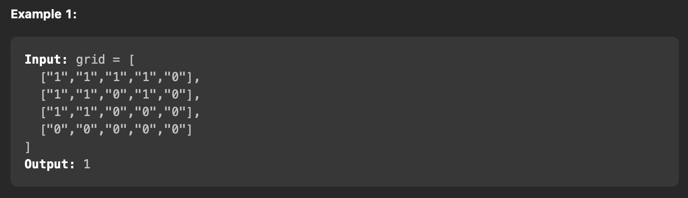

```java
class Solution {
    /*
        t.c - O(m*n) - 2 loops to check the element , dfs takes O(1)
        s.c - O(m*n) - worst case if complete graph is an island , size of the call stack

        approach:
        1. init row and col values , check if the element is 0 or 1
        2. if 1 --> check its neighbours
        3. if neighbours are 1 , mark them as 0 and move to find the next elem in the two nested loops
        4. return count

    */


    private void dfs(int r, int c , char[][] grid){
        //check boundaries
        if(r<0 || c<0 || r>=grid.length || c>=grid[0].length || grid[r][c]=='0'){
            return;
        }
        //mark as visited
        grid[r][c]='0';
        dfs(r+1,c,grid);
        dfs(r-1,c,grid);
        dfs(r,c+1,grid);
        dfs(r,c-1,grid);
    }

    public int numIslands(char[][] grid) {
        if(grid.length==0){
            return 0;
        }

        int row = grid.length;
        int col = grid[0].length;
        int res = 0;

        for(int r = 0; r<row;r++){
            for(int c = 0 ;c<col;c++){
                if(grid[r][c]=='1'){
                    dfs(r,c,grid);
                    res++;
                }
            }
        }
        return res;
    }
}
```

### [207. Course Schedule](https://leetcode.com/problems/course-schedule/)

```java
class Solution {

    private Map<Integer,List<Integer>> hm = new HashMap<>();
    private Set<Integer> set = new HashSet<>();

    public boolean dfs(int course){
        if(set.contains(course)){
            //found cycle
            return false;
        }

        //if an empty list is found as value for key in hm , not more pre --> can finsh the course
        if(hm.get(course).size()==0){
            return true;
        }

        set.add(course);
        List<Integer> pre = hm.get(course);
        for(var el:pre){
            if(!dfs(el)){
                return false;
            }
        }
        set.remove(course);
        //mark the pre as visited
        hm.get(course).clear();
        return true;


    }

    public boolean canFinish(int numCourses, int[][] prerequisites) {
        //create a hashMap to store the crs: pre pairs


        //create empty ArrayList for each course
        for(int z = 0 ; z<numCourses;z++){
            hm.put(z,new ArrayList<>());
        }

        for(int[] preList:prerequisites){
            int crs = preList[0];
            int pre = preList[1];

            List<Integer> ls = hm.get(crs);
            ls.add(pre);
        }


        //iterate through all the courses if in case its an unconnected graph

        for(int x = 0 ; x<numCourses;x++){
            if(!dfs(x)){
                return false;
            }
        }

        return true;


    }
}
```

### [210. Course Schedule II](https://leetcode.com/problems/course-schedule-ii/)

```java
class Solution {


    //variable instantitaion

    private List<Integer> mid = new ArrayList<>();
    private Set<Integer> cycle = new HashSet<>();
    private Set<Integer> vis = new HashSet<>();
    private Map<Integer,List<Integer>> hm = new HashMap<>();


    public boolean dfs(int course,int[] res){
        if(cycle.contains(course)){
            return false;
        }

        if(vis.contains(course)){
            //already visited no need to continue
            return true;
        }

        cycle.add(course);
        //do a dfs for each pre
        List<Integer> pre = hm.get(course);
        for(var el:pre){
            if(!dfs(el,res)){
                return false;
            }
        }
        mid.add(course);
        cycle.remove(course);
        vis.add(course);
        return true;
    }

    public int[] findOrder(int numCourses, int[][] prerequisites) {
        //create an empty list for each crs
        int[] res = new int[numCourses];

        for(int z = 0 ;z<numCourses;z++)
            hm.put(z,new ArrayList<>());

        //add prereq to the crs
        for(int[] el : prerequisites){
            int crs = el[0];
            int pre = el[1];
            List<Integer> ls = hm.get(crs);
            ls.add(pre);
        }

        //run dfs for all the courses
        for(int x = 0 ; x<numCourses;x++){
            if(!dfs(x,res)){
                return new int[0];
            }
        }

        //add values to res
        for (int i = 0; i < numCourses; i++) {
            res[i] = mid.get(i); // Reversed order
        }

        return res;
    }
}
```

### [417. Pacific Atlantic Water Flow](https://leetcode.com/problems/pacific-atlantic-water-flow/)

```java
class Solution {

    int[][] dir = { { 0, 1 }, { 0, -1 }, { 1, 0 }, { -1, 0 } };

    public List<List<Integer>> pacificAtlantic(int[][] heights) {
        List<List<Integer>> res = new ArrayList<>();

        int rows = heights.length, cols = heights[0].length;
        boolean[][] pacific = new boolean[rows][cols];
        boolean[][] atlantic = new boolean[rows][cols];

        for (int i = 0; i < cols; i++) {
            dfs(heights, 0, i, Integer.MIN_VALUE, pacific);
            dfs(heights, rows - 1, i, Integer.MIN_VALUE, atlantic);
        }

        for (int i = 0; i < rows; i++) {
            dfs(heights, i, 0, Integer.MIN_VALUE, pacific);
            dfs(heights, i, cols - 1, Integer.MIN_VALUE, atlantic);
        }

        for (int i = 0; i < rows; i++) {
            for (int j = 0; j < cols; j++) {
                if (pacific[i][j] && atlantic[i][j]) {
                    res.add(Arrays.asList(i, j));
                }
            }
        }
        return res;
    }

    private void dfs(
        int[][] heights,
        int i,
        int j,
        int prev,
        boolean[][] ocean
    ) {
        if (i < 0 || i >= ocean.length || j < 0 || j >= ocean[0].length) return;
        if (heights[i][j] < prev || ocean[i][j]) return;

        ocean[i][j] = true;
        for (int[] d : dir) {
            dfs(heights, i + d[0], j + d[1], heights[i][j], ocean);
        }
    }
}
```

### [684. Redundant Connection](https://leetcode.com/problems/redundant-connection/)

```java
class Solution {
    /*
        t.c. - o(n) , for find and union function for n edges
        s.c - o(n+1) - to store (n+1) elements in int[] to store parent , rank

        appraoch:
        1. union function , returns the parent of two nodes
        2. find function , returns the parent of a node
        3. for all the nodes in the int[][] , return the uninon function , if both have same parent found the res
        4. return res

    */

    private int[] parent;
    private int[] rank;

    //function to find union
    public boolean union(int n1,int n2){
        int p1 = find(n1);
        int p2 = find(n2);

        if(p1==p2){
            //found same parent edge found
            return false;
        }
        if(rank[p1]<rank[p2]){
            parent[p1] = p2;
        }
        else if(rank[p1]>rank[p2]){
            parent[p2] = p1;
        }
        else{
            parent[p1] = p2;
            rank[p2]++;
        }
        return true;

    }

    //function to find the parent
    public int find(int u){
        return parent[u] == u ? u : (parent[u] = find(parent[u]));
    }


    public int[] findRedundantConnection(int[][] edges) {
        int n = edges.length+1;
        parent = new int[n];
        rank = new int[n];

        //fill the parent array
        for(int z = 0 ; z<n ; z++){
            parent[z] = z;
        }

        for(int[] node:edges){
            if(!union(node[0],node[1])){
                return node;
            }
        }

        throw new IllegalArgumentException();


    }
}
```

### [695. Max Area of Island](https://leetcode.com/problems/max-area-of-island/)

```java
class Solution {
    /*
        t.c - O(m*n)
        s.c - o(m*n) -- recursive call stack

        approach:
        1. init val as 0 , start the dfs
        2. check if inbounds (should be inside the range) , add 1 to it and return the max area
    */
    private int res = 0;
    public int dfs(int r , int c, int[][] grid){
        //check if in the bounds
        if(r<0 || c<0 || r==grid.length || c==grid[0].length || grid[r][c]==0){
            return 0;
        }
        //mark as vis
        grid[r][c]=0;
        return (1+ dfs(r+1,c,grid)+ dfs(r,c+1,grid)+ dfs(r,c-1,grid)+ dfs(r-1,c,grid));
    }

    public int maxAreaOfIsland(int[][] grid) {
        int row = grid.length;
        int col = grid[0].length;
        for(int r = 0;r<row;r++){
            for(int c = 0 ; c<col ; c++){
                res = Math.max(dfs(r,c,grid),res);
            }
        }

        return res;
    }
}
```

### [994. Rotting Oranges](https://leetcode.com/problems/rotting-oranges/)

```java
class Solution {

    private static class Cell {
        int row;
        int col;

        public Cell(int row, int col) {
            this.row = row;
            this.col = col;
        }
    }

    public int orangesRotting(int[][] grid) {
        Deque<Cell> q = new ArrayDeque<>();

        int res = 0;
        int freshOranges = 0;

        // Count the fresh oranges and add the rotten to the queue
        int row = grid.length;
        int col = grid[0].length;

        for (int r = 0; r < row; r++) {
            for (int c = 0; c < col; c++) {
                if (grid[r][c] == 1) {
                    freshOranges++;
                } else if (grid[r][c] == 2) {
                    q.offer(new Cell(r, c));
                }
            }
        }

        int[][] directions = {{0, 1}, {0, -1}, {-1, 0}, {1, 0}};

        // BFS on the grid
        while (q.size() > 0 && freshOranges > 0) {
            int size = q.size();
            for (int e = 0; e < size; e++) {
                Cell cell = q.poll();
                int elRow = cell.row;
                int elCol = cell.col;
                for (int[] dire : directions) {
                    int newRow = elRow + dire[0];
                    int newCol = elCol + dire[1];
                    if (newRow >= 0 && newCol >= 0 && newRow < row && newCol < col && grid[newRow][newCol] == 1) {
                        // Found a fresh orange, change to rotten and add to queue
                        grid[newRow][newCol] = 2;
                        q.offer(new Cell(newRow, newCol));
                        freshOranges--;
                    }
                }
            }
            res++;
        }

        return freshOranges == 0 ? res : -1;
    }
}
```

## Advanced Graphs

### [332. Reconstruct Itinerary](https://leetcode.com/problems/reconstruct-itinerary/description/)

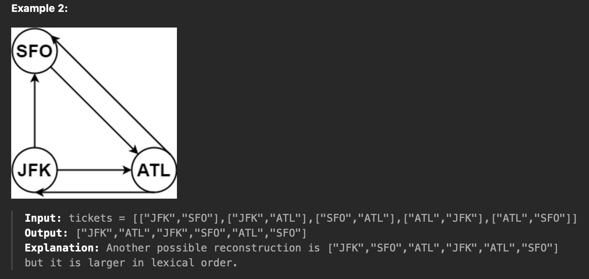

```java
class Solution {
    /*
        approach:

        1. using dfs approach on the graph to find the next nodes (need to explore the present branch before backtracking on the node)
        2. to store the neigh's of the nodes in the adj list , use a priority queue
        3. use a stack to store the current visited node
        4. add to stack until neighbours are null
        5. pop from stack and add to res
        6. return reverse of the linked list (can use addFirst to avoid reversing while poping from the stack)

        t.c:
        1. to construct adj list , O(no. of tickes * log(no.of tickets)) (with lexical sort)
        2. stack calls O(E)
        total -> O(E.log(E))

        s.c:
        1. to store nodes in graph , O(E)
        2. stack , O(E)
        3. res O(E)
        total -> O(E)
    */

    private LinkedList<String> res = new LinkedList<>();
    private Stack<String> st = new Stack();
    private Map<String,PriorityQueue<String>> gr = new HashMap<>();

    public List<String> findItinerary(List<List<String>> tickets) {
        //iterate over the tickets and build the graph

        for(var ticket:tickets){
            gr.putIfAbsent(ticket.get(0),new PriorityQueue<>());
            gr.get(ticket.get(0)).offer(ticket.get(1));
        }

        st.push("JFK");
        while(!st.isEmpty()){
            String nxt = st.peek();
            if(!gr.getOrDefault(nxt, new PriorityQueue<>()).isEmpty()){
                st.push(gr.get(nxt).poll()); // gets the next list and remove the first element
            }
            else{
                //reached the end of the stack , keep building the res
                res.addFirst(st.pop());
            }
        }

        return res;
    }
}
```

### [743. Network Delay Time](https://leetcode.com/problems/network-delay-time/description/)

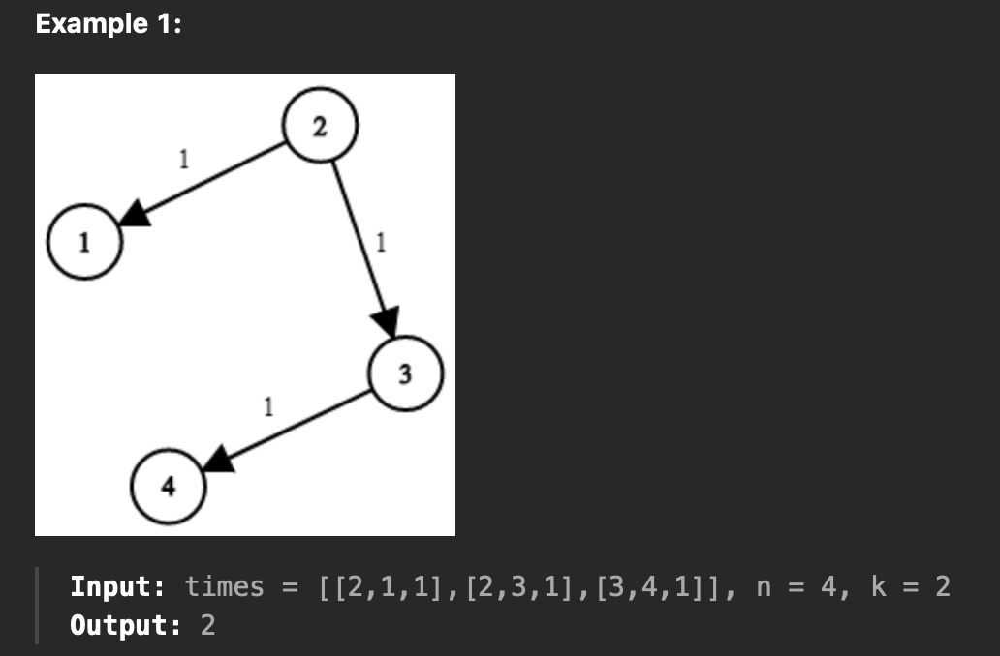

`Dijkstra's approach`

```java
import java.util.*;

class Solution {
    /*
        1. generate adj list map(int, int[node,weight]) --> keep track of neigh of each node
        2. init a dist matrix with values as int_max except for node k
        3. maintain a queue(int[node,weight]) , init with [source,0]
        4. until q is empty , pop a node , travese its neigh and update the dist matrix
        5. return the max of dist mat
    */
    public int networkDelayTime(int[][] times, int n, int k) {
        Map<Integer, List<int[]>> mp = new HashMap<>();
        PriorityQueue<int[]> q = new PriorityQueue<>((a, b) -> a[1] - b[1]);
        int[] dist = new int[n + 1];
        Arrays.fill(dist, Integer.MAX_VALUE);
        int res = -1;

        dist[k] = 0;

        for (int[] time : times) {
            int source = time[0];
            int dst = time[1];
            int w = time[2];

            mp.computeIfAbsent(source, key -> new ArrayList<>()).add(new int[]{dst, w});
        }

        q.offer(new int[]{k, 0});

        while (!q.isEmpty()) {
            int[] el = q.poll();
            int s = el[0];
            int weight = el[1];

            if (!mp.containsKey(s)) continue;

            List<int[]> neigh = mp.get(s);
            for (int[] nn : neigh) {
                int nw = nn[1] + weight;
                if (nw < dist[nn[0]]) {
                    dist[nn[0]] = nw;
                    q.offer(new int[]{nn[0], nw});
                }
            }
        }

        for (int i = 1; i <= n; i++) {
            if (dist[i] == Integer.MAX_VALUE) {
                return -1;
            }
            res = Math.max(res, dist[i]);
        }
        return res;
    }
}
```

`Bell-man-ford approach`

```java
import java.util.*;

class Solution {
    public int networkDelayTime(int[][] times, int n, int k) {
        int[] dist = new int[n + 1];
        Arrays.fill(dist, Integer.MAX_VALUE);
        dist[k] = 0;

        // Bellman-Ford algorithm
        for (int i = 0; i < n - 1; i++) {
            for (int[] time : times) {
                int source = time[0];
                int dst = time[1];
                int weight = time[2];

                if (dist[source] != Integer.MAX_VALUE && dist[source] + weight < dist[dst]) {
                    dist[dst] = dist[source] + weight;
                }
            }
        }

        int res = -1;

        for (int i = 1; i <= n; i++) {
            if (dist[i] == Integer.MAX_VALUE) {
                return -1;
            }
            res = Math.max(res, dist[i]);
        }

        return res;
    }
}
```

## Back Tracking

### [17. Letter Combinations of a Phone Number](https://leetcode.com/problems/letter-combinations-of-a-phone-number/description/)

```java
class Solution {

    /*
        t.c - o(4^n) - n : no of digits
        s.c - o(n.4^n)

        approach:
            1. make a map from digit:characters
            2. make dfs adding to subset str and increment index
            3. if len() matches , add to res
            4. return

    */


    private List<String> res = new ArrayList<>();

    public void dfs(int index ,String subset,String digits,Map<Character,String> digitToChar){
        if(subset.length() == digits.length()){
            res.add(subset);
            return;
        }

        if(index >= digits.length()){
            return;
        }

        String dig = digitToChar.get(digits.charAt(index));
        for(char c : dig.toCharArray()){
            dfs(index+1,subset+c,digits,digitToChar);
        }
    }

    public List<String> letterCombinations(String digits) {
        /*
        */

        Map<Character, String> digitToChar = Map.of(
            '2',
            "abc",
            '3',
            "def",
            '4',
            "ghi",
            '5',
            "jkl",
            '6',
            "mno",
            '7',
            "pqrs",
            '8',
            "tuv",
            '9',
            "wxyz"
        );

    if(digits.length()==0){
        return new ArrayList<>();
    }

    dfs(0,"",digits,digitToChar);

    return res;
    }
}
```

### [39. Combination Sum](https://leetcode.com/problems/combination-sum/description/)

```java
class Solution {

    private List<List<Integer>> res = new ArrayList<>();

    /*
        t.c - o(2^target)
        s.c - o(target) - arrayList for target amount

        approach:
        1. two decision , one to include the number , target = total - val[index]
        2. second decision , not to include the number , index++
        3. if target == 0 , add to res
        4. base case --> if target < 0 or index > len(nums) , return
        5. return res

    */


    public void dfs(int index, List<Integer> subset, int target, int[] candidates, int total) {
        // Base case: if the target is reached, add the current subset to the result
        if (target == 0) {
            res.add(new ArrayList<>(subset));
            return;
        }

        // If the target is exceeded or all elements are processed, return
        if (target < 0 || index >= candidates.length) {
            return;
        }

        // Include the current element and make the recursive call with the same index
        subset.add(candidates[index]);
        dfs(index, subset, target - candidates[index], candidates, total + candidates[index]);

        // Exclude the current element and make the recursive call with the next index
        subset.remove(subset.size() - 1);
        dfs(index + 1, subset, target, candidates, total);
    }

    public List<List<Integer>> combinationSum(int[] candidates, int target) {
        dfs(0, new ArrayList<>(), target, candidates, 0);
        return res;
    }
}
```
### [40. Combination Sum II](https://leetcode.com/problems/combination-sum-ii/description/)

```java
class Solution {

    /*
        t.c - o(2^n)
        s.c - o(n.2^n) , n arrayLists for 2^n times

        approach:
        1. sort the array
        2. init dfs , two choices to add the elem and not to add the elem
        3. check if the current elem is same as next (or prev according to implementation)
        4. if same skip the elem
        5. return


    */

    private List<List<Integer>> res = new ArrayList<>();

    public void dfs(int index , List<Integer> subset, List<List<Integer>> res, int target , int[] nums){
        if(target<0){
            return;
        }

        if(target==0){
            res.add(new ArrayList<>(subset));
            return;
        }


        for (int i = index; i < nums.length; i++) {
            if (i > index && nums[i] == nums[i - 1]) continue;
            subset.add(nums[i]);
            dfs(i+1, subset,res,target - nums[i], nums);
            subset.remove((subset.size() - 1));
        }

    }


    public List<List<Integer>> combinationSum2(int[] candidates, int target) {
        Arrays.sort(candidates);
        dfs(0,new ArrayList<>(), res, target,candidates);
        return res;
    }
}
```

### [46. Permutations](https://leetcode.com/problems/permutations/description/)

```java
class Solution {


    private List<List<Integer>> res = new ArrayList<>();


    public void backTrack(boolean[] usedValues , List<Integer> subset , int[] nums){
        //base case
        if(subset.size() == nums.length){
            res.add(new ArrayList<>(subset));
            return;
        }

        for(int z = 0 ; z< nums.length; z++){
            if(usedValues[z]){ //value already added
                continue;
            }

            usedValues[z] = true;
            subset.add(nums[z]);
            backTrack(usedValues,subset,nums);
            subset.remove(subset.size()-1);
            usedValues[z] = false; //backtrack
        }
    }

    public List<List<Integer>> permute(int[] nums) {
        /*
            t.c - O(n*n!)
            s.c - O(n!)

            approach:
            1. use a boolean array to keep track whether a val is added or not
            2. if not added , set to true , add to subset
            3. backtrack setting it false for  next index
            4. return res
        */

        backTrack(new boolean[nums.length], new ArrayList<>(), nums);
        return res;
    }
}
```

### [51. N-Queens](https://leetcode.com/problems/n-queens/description/)

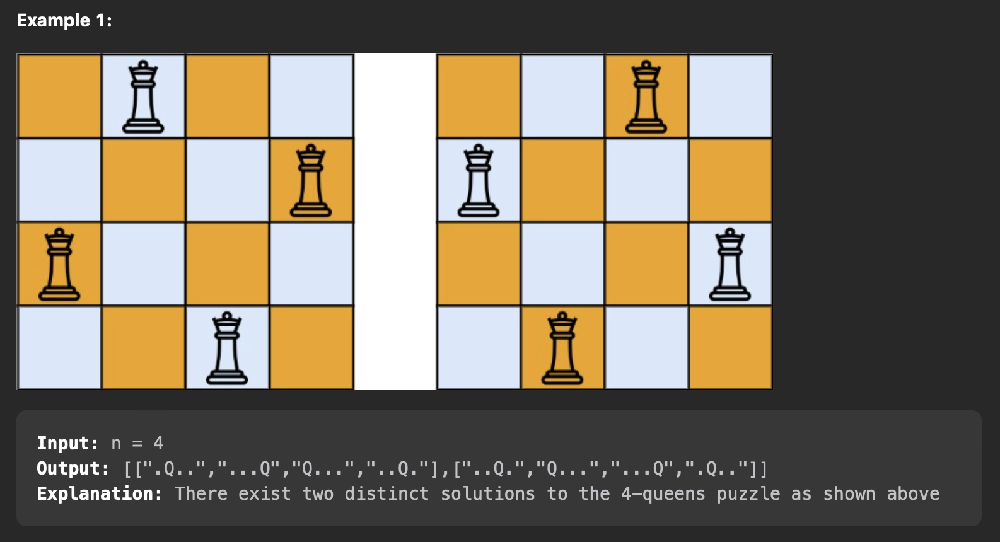

```java
class Solution {


    public void dfs(int r , int n , boolean[] col , boolean[] posDiag , boolean[] negDiag , char[][] board ){
        if(r==n){
            //construct string and add to res
            res.add(constructString(board));
            return;
        }

        for(int c = 0 ; c<n;++c){
            //check if the c is visited , or posDiag is vis or negDiag is vis
            if(col[c] || posDiag[r+c] || negDiag[r-c+n-1]){
                continue;
            }

            //mark as vis
            col[c] = true;
            posDiag[r+c] = true; // n = 4 , r = 1 , c = 2 (3) , max of PosDiag (0,7)
            negDiag[r-c+n-1] = true;
            board[r][c] = 'Q';

            dfs(r+1,n,col,posDiag,negDiag,board);

            //remove and backtrack
            col[c] = false;
            posDiag[r+c] = false;
            negDiag[r-c+n-1] = false;
            board[r][c] = '.';
        }

    }

    public List<String> constructString(char[][] board){
        List<String> el = new ArrayList<>();
        for(int r = 0 ; r<board.length;r++){
            el.add(String.valueOf(board[r]));
        }
        return el;

    }

    private List<List<String>> res = new ArrayList<>();

    public List<List<String>> solveNQueens(int n) {

        /*
            t.c - n.n!
            dfs --> n!
            constructString --> n (traverse through each row)
            s.c
            new List<List> to store res

            approach:
            1. init the board with '.' in n*n
            2. keep track of visited col, positiveDiagonal , negative diagonal using boolean[]
            3. if row==n, add to res (all rows visited)
            4. visit each col and mark as visited , do dfs, mark unvisited for backtracking
            5. return
        */
        char[][] board = new char[n][n];
        //fill the board
        for(int r = 0 ; r<n;r++){
            Arrays.fill(board[r],'.');
        }

        dfs(0,n,new boolean[n],new boolean[2*n-1],new boolean[2*n-1],board);

        return res;

    }
}
```

### [78. Subsets](https://leetcode.com/problems/subsets/description/)

```java
class Solution {
    /*
        t.c - o(2^n)
        s.c - o(n*2^n)

        approach:
        1. init res , start at index 0
        2. at each index , 2 operations , either to add index or exclude the index
        3. add to subset , call dfs , remove from subset , call dfs
        4. if length reaches size of nums , add to res
        5. return
    */


    public void dfs(int[] nums,int index,List<Integer> subset,List<List<Integer>> res){
        if(index>=nums.length){
            res.add(new ArrayList<>(subset));
            return;
        }

        //left tree add at index i
        subset.add(nums[index]);
        dfs(nums,index+1,subset,res);

        //right tree not to add index i
        subset.remove(subset.size()-1);
        dfs(nums,index+1,subset,res);

    }


    public List<List<Integer>> subsets(int[] nums) {
        List<List<Integer>> res = new ArrayList<>();
        dfs(nums,0,new ArrayList<>(),res);
        return res;
    }
}
```

### [79. Word Search](https://leetcode.com/problems/word-search/description/)

```java
class Solution {
    /*
        t.c -> o(m*n* 4^len(word))
        s.c --> (n.4^len(word)) --> 4 dfs calls at each index

        approach:
        1. check the edge cases to exit the dfs
        2. if index reaches the last index , return true
        3. mark the el in board as visited and run dfs
        4. modify the el back to its state to backtrack
        5. return

    */


    public boolean dfs(int r, int c, char[][] board, String word, int index) {
        //end cases
        //row , column overflow
        if (r < 0 || r == board.length || c < 0 || c == board[0].length) {
            return false;
        }

        //index match
        if (board[r][c] == word.charAt(index)) {
            // If it is the last character of the word, return true
            if (index == word.length() - 1) {
                return true;
            }

            final char el = board[r][c];
            // mark the el as visited
            board[r][c] = '*';

            // make a dfs on four directions
            final boolean isValid = dfs(r + 1, c, board, word, index + 1) ||
                                    dfs(r - 1, c, board, word, index + 1) ||
                                    dfs(r, c + 1, board, word, index + 1) ||
                                    dfs(r, c - 1, board, word, index + 1);

            // replace the elem with cache
            board[r][c] = el;

            return isValid;
        }

        return false;
    }

    public boolean exist(char[][] board, String word) {
        for (int r = 0; r < board.length; r++) {
            for (int c = 0; c < board[0].length; c++) {
                if (dfs(r, c, board, word, 0)) {
                    return true;
                }
            }
        }
        return false;
    }
}
```


### [90. Subsets II](https://leetcode.com/problems/subsets-ii/description/)

```java
class Solution {

    /*
        t.c - O(n*2^n)
        s.c - o(n*2^n)

        approach:
        1. sort the arr , start the dfs
        2. add at index , dfs on next non duplicate index , remove elem , backtrack
        3. return res

    */

    private List<List<Integer>> res = new ArrayList<>();


    public void dfs(int index, List<Integer> subset, int[] nums){
        res.add(new ArrayList<>(subset));

        for (int i = index; i < nums.length; i++) {
            if (i > index && nums[i] == nums[i - 1]) {
                continue; // Skip duplicates
            }

            subset.add(nums[i]);
            dfs(i + 1, subset, nums);
            subset.remove(subset.size() - 1);
        }

    }

    public List<List<Integer>> subsetsWithDup(int[] nums) {
        Arrays.sort(nums);
        dfs(0,new ArrayList<>(),nums);
        return res;
    }
}
```

### [131. Palindrome Partitioning](https://leetcode.com/problems/palindrome-partitioning/description/)

```java
class Solution {

    private List<List<String>> res = new ArrayList<>();


    public boolean isPalindrome(String s,int l,int r){
        while(l<r)
            if(s.charAt(l++)!=s.charAt(r--))
                return false;
        return true;
    }

    public void dfs(String s, int index,List<String> subset){
        if(index == s.length()){
            res.add(new ArrayList<>(subset));
            return;
        }

        for(int i = index ; i<s.length();i++){
            //check if palindrome from index, i
            if(isPalindrome(s,index,i)){
                subset.add(s.substring(index,i+1));
                dfs(s,i+1,subset);
                subset.remove(subset.size()-1);
            }
        }
    }

    public List<List<String>> partition(String s) {
        dfs(s,0,new ArrayList<>());
        return res;
    }
}
```

## Trie

### [208. Implement Trie (Prefix Tree)](https://leetcode.com/problems/implement-trie-prefix-tree/description/)

```java
class TrieNode{
    public TrieNode[] children = new TrieNode[26];
    public boolean isEnd = false;
}

class Trie {
    /*
        t.c: o(word)
        s.c: o(word*avg(word))

        approach:
        1. init trie node class , each node consits of 26 children capacity and a boolean to check if its the end
        2. to insert check if node exits , add it childrenm , else create a new node
        3. to check startsWith , check if node exits ? true :false

    */
    private TrieNode root = new TrieNode();
    //helper functions
    public TrieNode find(String prefix) {
        var curr = root;
        for(char c : prefix.toCharArray()){
            final int ind = c - 'a';
            if(curr.children[ind]==null){
                return null;
            }
            curr = curr.children[ind];
        }
        return curr;
    }

    public void insert(String word) {
        TrieNode curr = root;
        for(final char c:word.toCharArray()){
            //find index
            final int i = c - 'a';
            if(curr.children[i]==null){
                curr.children[i] = new TrieNode();
            }
            curr = curr.children[i];
        }
        curr.isEnd = true;
    }

    public boolean search(String word) {
        var findNode = find(word);
        return findNode!=null && findNode.isEnd;

    }

    public boolean startsWith(String prefix) {
        var findNode = find(prefix);
        return findNode!=null;
    }
}
```

### [211. Design Add and Search Words Data Structure](https://leetcode.com/problems/design-add-and-search-words-data-structure/)

```java
class TrieNode{
    public TrieNode[] children = new TrieNode[26];
    public boolean isEnd = false;
}

class WordDictionary {
    /*
       t.c - add(o(word)) , search : o(26)

       approach:
       1. create words in the trie
       2. to search , check if the value at index is '.'
       3. if '.' --> check if the next char exists then return true : false
       4. if normal char , make a dfs on index+1
       5.return
    */

    private TrieNode root = new TrieNode();

public boolean dfs(String word, TrieNode root, int ind) {
    if (ind == word.length()) {
        return root.isEnd;
    }

    // If not '.', do dfs on ind+1
    if (word.charAt(ind) != '.') {
        var nextNode = root.children[word.charAt(ind) - 'a'];
        return nextNode == null ? false : dfs(word, nextNode, ind + 1);
    }

    // Found '.', check all 26 children
    for (int z = 0; z < 26; ++z) {
        var nextChild = root.children[z];
        if (nextChild != null && dfs(word, nextChild, ind + 1)) {
            return true;
        }
    }

    // Not found
    return false;
}


    public void addWord(String word) {
        var curr = root;
        for(final char c : word.toCharArray()){
            final int ind = c - 'a';
            if(curr.children[ind]==null){
                curr.children[ind] = new TrieNode();
            }
            curr = curr.children[ind];
        }
        curr.isEnd = true;
    }

    public boolean search(String word) {
        return dfs(word,root,0);
    }
}
```

### [212. Word Search II](https://leetcode.com/problems/word-search-ii/description/)

```java
class TrieNode{
    public TrieNode[] children = new TrieNode[26];
    public boolean isEnd = false;
}

class Solution {
    /*
        t.c -
            addWords --> o(total(words) * avg(word))
            findWord --> o(1)
            dfs --> o(row * col * 4^max(words) )

        s.c -
            addWords --> o(total(words) * avg(word))
            dfs --> o(max(words))

        approach:
            1. init trienode class and add all the words
            2. init dfs , check if its visited or exists in the trie
            3. if exists , check if its the end , then add to string builder
            4. else dfs in four directions
            5. return

    */


    private TrieNode root = new TrieNode();
    private List<String> res = new ArrayList<>();

    private void addWords(TrieNode root,String[] words){
        for(var word : words){
            var curr = root;
            for(final char c: word.toCharArray()){
                final int index = c - 'a';
                if(curr.children[index]==null){
                    curr.children[index] = new TrieNode();
                }
                curr = curr.children[index];
            }
            curr.isEnd = true;
        }
    }

    private boolean findWord(TrieNode root,char el){
        int index = el - 'a';
        return root.children[index]!=null;
    }


    private void dfs(int row, int col, char[][] board,TrieNode root,StringBuilder word){
        // 1.check if the elem exists in root.children (first level) , else go to next
        // 2. do a dfs and check if word forms and add it to res
        char el = board[row][col];
        if(el=='$' || !findWord(root,el)){
            return;
        }

        root = root.children[el - 'a'];
        word.append(el);
        if (root.isEnd) {
            res.add(word.toString());
            root.isEnd = false; // Mark as visited to avoid duplicates
        }

        char temp = board[row][col];
        board[row][col] = '$'; // Mark the cell as visited

        if (row > 0) dfs(row - 1, col, board, root, word);
        if (row < board.length - 1) dfs(row + 1, col, board, root, word);
        if (col > 0) dfs(row, col - 1, board, root, word);
        if (col < board[0].length - 1) dfs(row, col + 1, board, root, word);

        board[row][col] = temp; // Restore the cell value for backtracking
        word.deleteCharAt(word.length() - 1);
    }

    public List<String> findWords(char[][] board, String[] words) {
        final int r = board.length;
        final int c = board[0].length;
        addWords(root, words);

        for (int row = 0; row < r; ++row) {
            for (int col = 0; col < c; ++col) {
                dfs(row, col, board, root, new StringBuilder());
            }
        }

        return res;


    }
}
```

## Binary Tree

### [98. Validate Binary Search Tree](https://leetcode.com/problems/validate-binary-search-tree/description/)

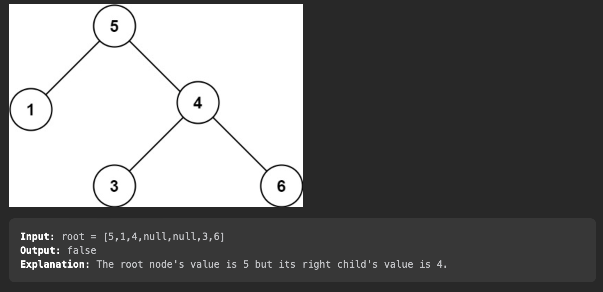

```java
class Solution {
    /*
        t.c - o(n)
        s.c - o(h)
        approach:
        1. to validate have to check the boundaries for each iteration
        2. init the iteration with -inf to +inf
        3. for each iter, for left tree update right boundary to root.val
        4. for each iter , for right tree update left boundary to root.val
        5. if condition is not satisfied ? return false : true

    */
    public boolean dfs(TreeNode root,Integer left,Integer right){
        if(root==null){
            //empty tree can be a bst
            return true;
        }
        if((left!=null && root.val<=left)||( right!=null && root.val>=right)){
            // condition not satisfied for a bst
            return false;
        }

        return ((dfs(root.left,left,root.val))&&(dfs(root.right,root.val,right)));
    }


    public boolean isValidBST(TreeNode root) {
        return dfs(root,null,null);
    }
}
```


### [102. Binary Tree Level Order Traversal](https://leetcode.com/problems/binary-tree-level-order-traversal/description/)


```java
class Solution {

    /*
        t.c - o(n)
        s.c - o(n)
        approach:
            1. init a deque with root elem
            2. if elem has left and right , append them into queue
            3. in the range of the lenght of q , pop left and add to currlevel , if it has left and right append to q

    */


    public List<List<Integer>> levelOrder(TreeNode root) {
        List<List<Integer>> res = new ArrayList<>();
        if(root==null){
            return res;
        }
       Deque<TreeNode> q = new ArrayDeque<>();
        q.offer(root);
        while(!q.isEmpty()){
            List<Integer> currLevel = new ArrayList<>();
            int levelSize = q.size();
            for(int z = 0;z<levelSize;z++){
                TreeNode t = q.pollFirst();
                currLevel.add(t.val);
                if(t.left!=null){
                    q.offer(t.left);
                }
                if(t.right!=null){
                    q.offer(t.right);
                }
            }
            res.add(currLevel);
        }
        return res;
    }
}
```

### [105. Construct Binary Tree from Preorder and Inorder Traversal](https://leetcode.com/problems/construct-binary-tree-from-preorder-and-inorder-traversal/description/)

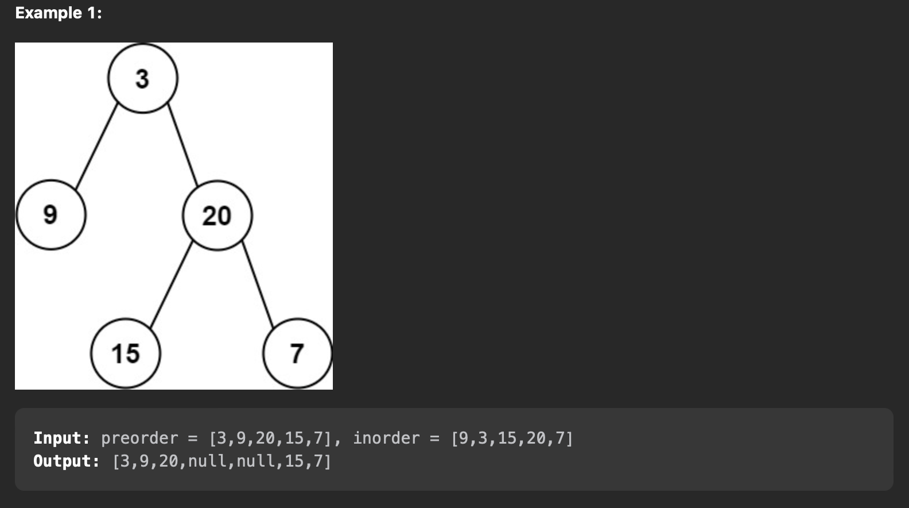

```java
class Solution {
    /*
        t.c - o(n)
        s.c - o(n) - hm to hold the index of the elements
        approach:
        1. two diff traversals are pre-order(root,left,right) and inorder(left,root,right)
        2. the first index of preorder is always the root , check for the index of root in inorder
        3. everything left to the found index , will be in the left subtree of the root
        4. everything right to the found index , will be in the right subtree of the root
        5. build the tree accordingly
    */


    public TreeNode build(int[] preorder, int preStart , int preEnd , int[] inorder , int inStart, int inEnd,   Map<Integer,Integer> inToIndex){
        //base case to exit
        if (preStart > preEnd)
            return null;

        final int rootVal = preorder[preStart];
        final int rootInIndex = inToIndex.get(rootVal);
        final int leftSize = rootInIndex - inStart;

        TreeNode root = new TreeNode(rootVal);
        //root.left
        //preorder --> [1:mid+1] , inorder[:mid]

        root.left = build(preorder, preStart + 1, preStart + leftSize, inorder, inStart,
                        rootInIndex - 1, inToIndex);

        //root.right
        //preorder --> [mid+1:] , inorder [mid+1:]
        root.right = build(preorder, preStart + leftSize + 1, preEnd, inorder, rootInIndex + 1, inEnd,inToIndex);

        return root;
    }


    public TreeNode buildTree(int[] preorder, int[] inorder) {
        //hm to store the indexes
         Map<Integer, Integer> inToIndex = new HashMap<>();

        for (int i = 0; i < inorder.length; ++i)
            inToIndex.put(inorder[i], i);

        return build(preorder, 0, preorder.length - 1, inorder, 0, inorder.length - 1, inToIndex);
    }

}
```

### [110. Balanced Binary Tree](https://leetcode.com/problems/balanced-binary-tree/description/)

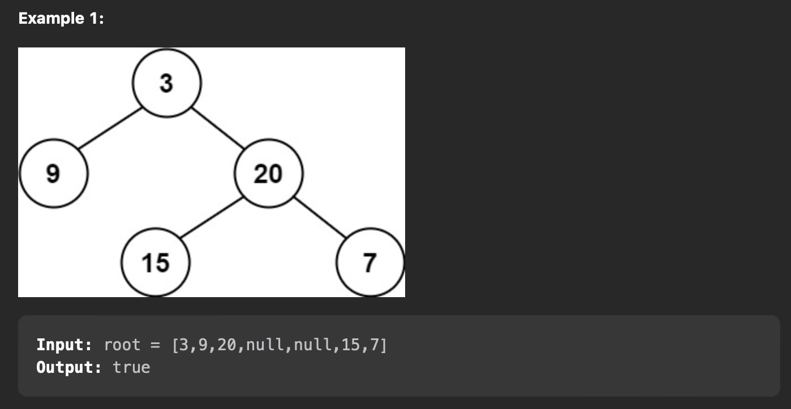

```java
class Solution {
    /*
        t.c - o(n)
        s.c - o(h)
        approach: (bottom up to reduce to o(n), top down is o(n**2))
            1. initially if root is null , return a new pair of (true,0)
            2. check for left and right node , if both the trees are valid and their height diff <=1
            3. return the boolean at last
    */
    public Pair<Boolean,Integer> dfs(TreeNode root){
        if(root==null){
            return new Pair<Boolean,Integer>(true,0);
        }

        var left = dfs(root.left);
        var right = dfs(root.right);

        Boolean balanced = (left.getKey() && right.getKey() && Math.abs(left.getValue() - right.getValue())<=1);

        return new Pair<Boolean,Integer>(balanced, 1 + Math.max(left.getValue(),right.getValue()));
    }

    public boolean isBalanced(TreeNode root) {
        return dfs(root).getKey();
    }
}
```

### [124. Binary Tree Maximum Path Sum](https://leetcode.com/problems/binary-tree-maximum-path-sum/description/)

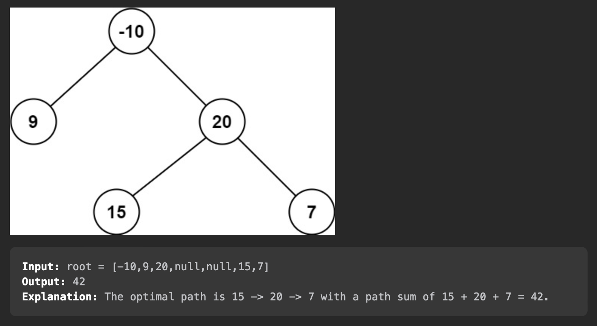

```java
class Solution {
    /*
        t.c - o(n)
        s.c - o(h)
        approach:
            1. two possible options for every node , either to split it or not split it
            2. make two calculations and update the max variable
            3. return the max variable

    */

    private int res = Integer.MIN_VALUE;

    private int dfs(TreeNode root){
        //base case
        if(root==null)
            return 0;

        final int leftSum = Math.max(dfs(root.left),0);
        final int rightSum = Math.max(dfs(root.right),0);
        //with splitting
        res = Math.max(res, root.val + leftSum + rightSum);
        //without splitting (either take the left path or the right path )
        return root.val + Math.max(leftSum,rightSum);

    }

    public int maxPathSum(TreeNode root) {
        dfs(root);
        return res;
    }
}
```


### [199. Binary Tree Right Side View](https://leetcode.com/problems/binary-tree-right-side-view/description/)

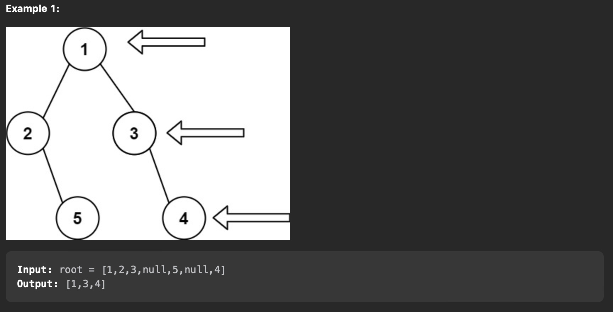

```java
class Solution {
    /*
        t.c o(n)
        s.c o(n)
        approach:
            1. init empty res , if root is null return empty res
            2. add root to queue and start bfs
            3. in each iter, add the last elem of the level to the res
            4. return
    */

    public List<Integer> rightSideView(TreeNode root) {
        List<Integer> res = new ArrayList<>();
        //base case
        if(root==null){
            return res;
        }
       Deque<TreeNode> q = new ArrayDeque<>();
        q.offer(root);
        while(!q.isEmpty()){
            TreeNode rightNode = null;
            int levelSize = q.size();
            for(int z = 0;z<levelSize;z++){
                TreeNode t = q.pollFirst();
                rightNode = t;
                if(t.left!=null){
                    q.offer(t.left);
                }
                if(t.right!=null){
                    q.offer(t.right);
                }
            }
            res.add(rightNode.val);
        }
        return res;
    }
}
```

### [230. Kth Smallest Element in a BST](https://leetcode.com/problems/kth-smallest-element-in-a-bst/description/)

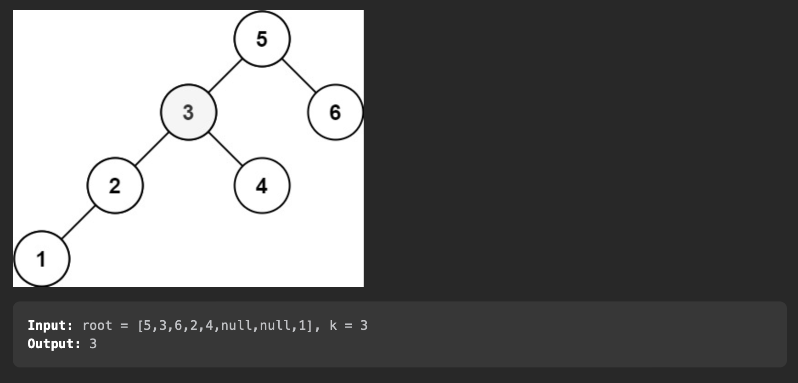

```java
class Solution {
    /*
        t.c - o(n)
        s.c - o(h)
        approach:
        1. init an array list to store the elem
        2. do an in order traversal and store the values
        3. return k-1
    */

    public void inOrder(TreeNode root, List<Integer> res){
        if(root==null) return;

        inOrder(root.left,res);
        res.add(root.val);
        inOrder(root.right,res);
    }

    public int kthSmallest(TreeNode root, int k) {
        List<Integer> res = new ArrayList<>();
        inOrder(root,res);
        return res.get(k-1);
    }
}
```

`stack` - approach

```java
class Solution {
    /*
        t.c - o(n)
        s.c - o(h)
        approach:
        1. init stack and append root
        2. traverse until the end of the left tree
        3. for k-1 times , pop from stack and move the root to right tree and traverse it's left tree
        4. return top of the stack value
    */

    public int kthSmallest(TreeNode root, int k) {
        Stack<TreeNode> st = new Stack<>();
        TreeNode curr = root;

        while(curr!=null){
            st.push(curr);
            curr = curr.left;
        }

        //at the end of the left

        for(int z = 0 ; z<k-1;z++){
            TreeNode tmp = st.pop();
            tmp = tmp.right;
            while(tmp!=null){
                st.push(tmp);
                tmp = tmp.left;
            }
        }

        return st.peek().val;
    }
}
```

### [235. Lowest Common Ancestor of a Binary Search Tree](https://leetcode.com/problems/lowest-common-ancestor-of-a-binary-search-tree/description/)

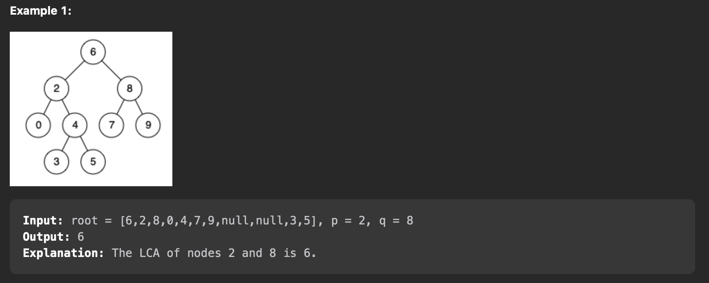

```java
class Solution {
    /*
        LCA - either p,q is descent of the elem or the elem is equal to p or q (can be descendant of itself)
        t.c - o(logn)
        s.c - o(1)

        approach:
            1. have to return the node where both p and q are not greater or less than the TreeNode elem
            2. start with root , check two conditions to change the curr to left or right
            3. return the curr , when the condition satisfies

    */


    public TreeNode lowestCommonAncestor(TreeNode root, TreeNode p, TreeNode q) {
        TreeNode curr = root;

        while(curr!=null){
            if(p.val> curr.val && q.val > curr.val){
                //present in the right tree
                curr = curr.right;
            }
            else if(p.val < curr.val && q.val < curr.val){
                //present in left tree
                curr = curr.left;
            }
            else{
                return curr;
            }
        }
        return null;
    }
}
```

### [297. Serialize and Deserialize Binary Tree](https://leetcode.com/problems/serialize-and-deserialize-binary-tree/description/)

```java
public class Codec {
    /*

        approach:
        1. either use dfs/bfs to create a string , seperated by delimiter
        2. use the string and start a dfs to construct the tree
        3. return node

    */

    private int index = 0;

    public void serializeDFS(TreeNode root,List<String> res){
        if(root==null){
            res.add("N");
            return;
        }
        res.add(String.valueOf(root.val));
        serializeDFS(root.left,res);
        serializeDFS(root.right,res);
    }

    public TreeNode deserializeDFS(String[] tokens){

        String str = tokens[this.index];
        if(str.equals("N")){
            this.index++;
            return null;
        }

        TreeNode nn = new TreeNode(Integer.parseInt(str));
        this.index++;
        nn.left = deserializeDFS(tokens);
        nn.right = deserializeDFS(tokens);

        return nn;
    }

    // Encodes a tree to a single string.
    public String serialize(TreeNode root) {
        List<String> res = new ArrayList<>();
        serializeDFS(root,res);
        return String.join(",",res);
    }

    // Decodes your encoded data to tree.
    public TreeNode deserialize(String data) {
        String[] tokens = data.split(",");
        return deserializeDFS(tokens);
    }
}
```

### [1448. Count Good Nodes in Binary Tree](https://leetcode.com/problems/count-good-nodes-in-binary-tree/description/)

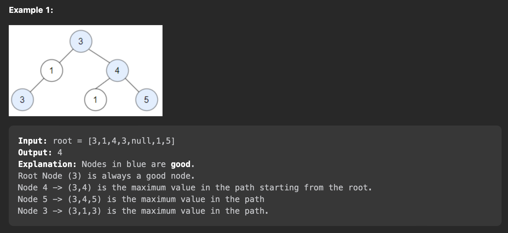

`dfs` approach

```java
class Solution {
    /*
        t.c - o(n)
        s.c - o(h)
        approach:
            1. do a dfs on left and right subtree
            2. compare if val > maxVal then res++;
            3. return res

    */
    public int dfs(TreeNode root,int maxVal){
        if(root==null) return 0;

        int res = root.val >=maxVal ? 1:0;

        res+= dfs(root.left,Math.max(root.val,maxVal));
        res+=dfs(root.right,Math.max(root.val,maxVal));

        return res;
    }

    public int goodNodes(TreeNode root) {
        return dfs(root,Integer.MIN_VALUE);
    }
}
```

`bfs` approach

```java
class Solution {
    /*
        approach : bfs
        1. init q and maxValq to maintain the nodes
        2. for each level compare with maxVal and res++
        3. return res
    */

    public int goodNodes(TreeNode root) {
        if (root == null) {
            return 0;
        }

        int res = 0;
        Deque<TreeNode> nodeQueue = new LinkedList<>();
        Deque<Integer> maxValQueue = new LinkedList<>();

        nodeQueue.offer(root);
        maxValQueue.offer(root.val);

        while (!nodeQueue.isEmpty()) {
            TreeNode node = nodeQueue.poll();
            int maxVal = maxValQueue.poll();

            if (node.val >= maxVal) {
                res++;
            }

            int newMaxVal = Math.max(maxVal, node.val);

            if (node.left != null) {
                nodeQueue.offer(node.left);
                maxValQueue.offer(newMaxVal);
            }

            if (node.right != null) {
                nodeQueue.offer(node.right);
                maxValQueue.offer(newMaxVal);
            }
        }

        return res;
    }
}
```


## Linked list

### [2. Add Two Numbers](https://leetcode.com/problems/add-two-numbers/)

```java
/**
 * Definition for singly-linked list.
 * public class ListNode {
 *     int val;
 *     ListNode next;
 *     ListNode() {}
 *     ListNode(int val) { this.val = val; }
 *     ListNode(int val, ListNode next) { this.val = val; this.next = next; }
 * }
 */
class Solution {
    /*
        T.C - o(n)
        s.c - o(1)

        approach;;
        1. check if carry exists or l1 or l2
        2. add value to carry , make a new node with carry%10
        3. return
    */


    public ListNode addTwoNumbers(ListNode l1, ListNode l2) {
        ListNode dum = new ListNode();
        ListNode curr = dum;
        int carry = 0;

        while(carry>0 || l1!=null || l2!=null){
            if(l1!=null){
                carry+=l1.val;
                l1 = l1.next;
            }
            if(l2!=null){
                carry+=l2.val;
                l2 = l2.next;
            }
            curr.next = new ListNode(carry%10);
            carry /=10;
            curr = curr.next;
        }

        return dum.next;

    }
}
```

### [19. Remove Nth Node From End of List](https://leetcode.com/problems/remove-nth-node-from-end-of-list/description/)

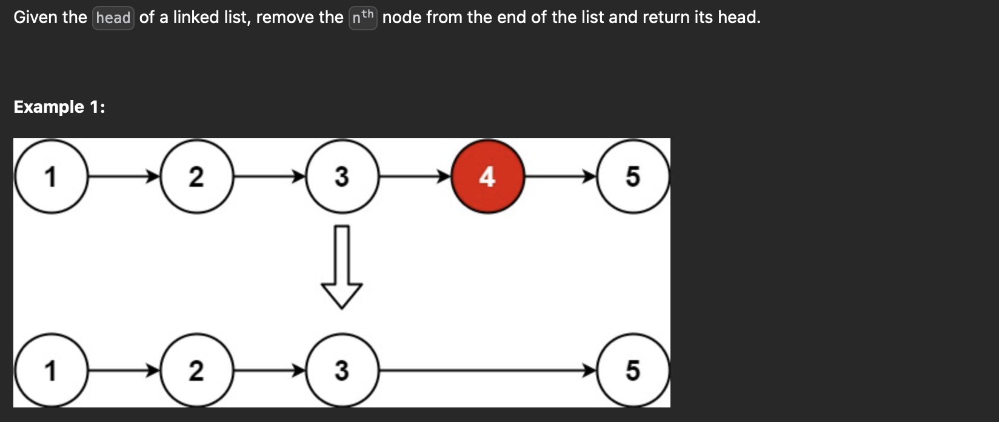


```java
/**
 * Definition for singly-linked list.
 * public class ListNode {
 *     int val;
 *     ListNode next;
 *     ListNode() {}
 *     ListNode(int val) { this.val = val; }
 *     ListNode(int val, ListNode next) { this.val = val; this.next = next; }
 * }
 */
class Solution {
    /*
        t.c o(n)
        s.c o(1)
        approach:
            1.create a dummy node ,dummy.next = head
            2. assign l,r pointers to find the nth element from last
            3. l = dummy , r= moved by n times from head
            4. delete the node
            5. return
    */


    public ListNode removeNthFromEnd(ListNode head, int n) {
        ListNode dummy = new ListNode(0,head);
        ListNode l_ptr = dummy;
        ListNode r_ptr = head;

        while(n>0){
            r_ptr = r_ptr.next;
            n--;
        }

        while(r_ptr!=null){ //reaches the node n
            l_ptr = l_ptr.next;
            r_ptr = r_ptr.next;
        }

        l_ptr.next = l_ptr.next.next; //delete the node

        return dummy.next;

    }
}
```

### [21. Merge Two Sorted Lists](https://leetcode.com/problems/merge-two-sorted-lists/description/)

```java
/**
 * Definition for singly-linked list.
 * public class ListNode {
 *     int val;
 *     ListNode next;
 *     ListNode() {}
 *     ListNode(int val) { this.val = val; }
 *     ListNode(int val, ListNode next) { this.val = val; this.next = next; }
 * }
 */
class Solution {
    /*
        t.c o(n)
        s.c o(1)
        approach:
        1.create a dummy node to track
        2.while both l1 and l2 exists , check which is less and add to dum
        3.at end if any list is not all add to dum
        4.return dummy.next
    */


    public ListNode mergeTwoLists(ListNode list1, ListNode list2) {
        final ListNode dum = new ListNode();
        ListNode dum_ptr = dum;
        while(list1!=null && list2!=null){
            if(list1.val<list2.val){
                dum_ptr.next = list1;
                list1 = list1.next;
            }
            else{
                dum_ptr.next = list2;
                list2 = list2.next;
            }
            dum_ptr = dum_ptr.next;
        }
        //check for remaining portion
        dum_ptr.next = list1!=null?list1:list2;
        return dum.next;
    }
}
```

### [23. Merge k Sorted Lists](https://leetcode.com/problems/merge-k-sorted-lists/description/)

```java
/**
 * Definition for singly-linked list.
 * public class ListNode {
 *     int val;
 *     ListNode next;
 *     ListNode() {}
 *     ListNode(int val) { this.val = val; }
 *     ListNode(int val, ListNode next) { this.val = val; this.next = next; }
 * }
 */
class Solution {
    /*
        t.c o(nlogk)
        s.c o(1)

        approach:
        1. merge 2 lists at a time (helper function to merge)
        2. append to the main list after every merge
        3. return
    */
    private ListNode mergeTwoLists(ListNode list1, ListNode list2) {
        final ListNode dum = new ListNode();
        ListNode dum_ptr = dum;
        while(list1!=null && list2!=null){
            if(list1.val<list2.val){
                dum_ptr.next = list1;
                list1 = list1.next;
            }
            else{
                dum_ptr.next = list2;
                list2 = list2.next;
            }
            dum_ptr = dum_ptr.next;
        }
        //check for remaining portion
        dum_ptr.next = list1!=null?list1:list2;
        return dum.next;
    }


    public ListNode mergeKLists(ListNode[] lists) {
        int n = lists.length;
        int window =1;
        while(window<n){
            for(int z=0;z<n-window;z+=2*window){
                lists[z] = mergeTwoLists(lists[z],lists[z+window]);
            }
            window*=2;
        }
        return n>0?lists[0]:null;
    }
}
```

### [25. Reverse Nodes in k-Group](https://leetcode.com/problems/reverse-nodes-in-k-group/description/)

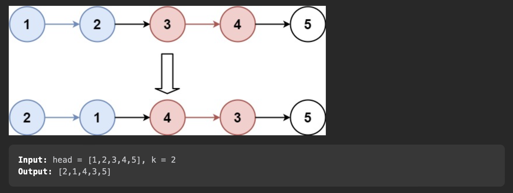

```java
class Solution {
class Solution {
    /*
        t.c - o(n)
        s.c - o(1)

        approach:
        1. find the total length , to split it into k parts
        2. for each part reverse the section and maintatin the curr as first elem of next section
        3. return dummy

    */


  public ListNode reverseKGroup(ListNode head, int k) {
    if (head == null || k == 1)
      return head;

    final int length = getLength(head);
    ListNode dummy = new ListNode(0, head);
    ListNode prev = dummy;
    ListNode curr = head;

    for (int i = 0; i < length / k; ++i) {
      for (int j = 0; j < k - 1; ++j) {
        // 1 - > 2 , 3->4
        // 2->1 -> curr (3) ,4-> 3->curr(5)
        ListNode tmp = curr.next; // 2
        curr.next = tmp.next; // 3
        tmp.next = prev.next; //1
        prev.next = tmp; // 2
      }
      prev = curr; //5
      curr = curr.next;
    }

    return dummy.next;
  }

  private int getLength(ListNode head) {
    int length = 0;
    for (ListNode curr = head; curr != null; curr = curr.next)
      ++length;
    return length;
  }
}
```

### [138. Copy List with Random Pointer](https://leetcode.com/problems/copy-list-with-random-pointer/)

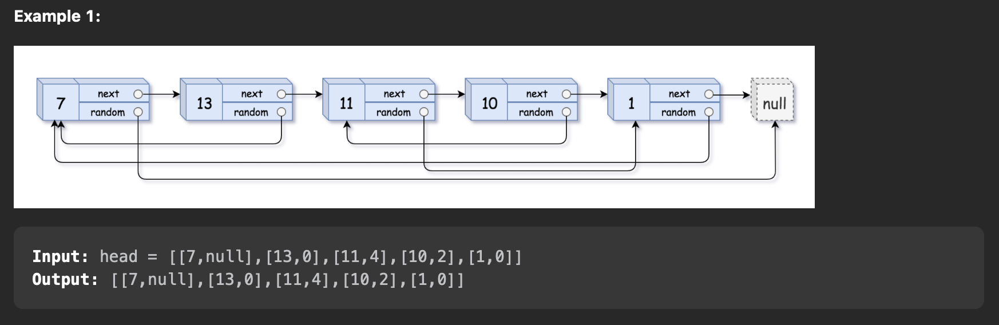

```java
/*
// Definition for a Node.
class Node {
    int val;
    Node next;
    Node random;

    public Node(int val) {
        this.val = val;
        this.next = null;
        this.random = null;
    }
}
*/

class Solution {
    public Node copyRandomList(Node head) {

        /*
            t.c = 0(n)
            s.c = o(n) - hash map
            approach:
                1. two passes to make the deepy copy
                2. first pass , store the (curr,val) in the hashmap
                3. second pass , build the node by fetching values from the hashmap
        */
        Node curr = head;
        Map<Node,Node> hm = new HashMap<>();

        //first pass
        while(curr!=null){
            hm.put(curr,new Node(curr.val)); //create a new node
            curr = curr.next;
        }
        curr = head; //bring back curr for next iter
        while(curr!=null){
            hm.get(curr).next = hm.get(curr.next); //check for the curr.val in the map for curr
            hm.get(curr).random = hm.get(curr.random);
            curr = curr.next;
        }
        //return head from map
        return hm.get(head);
    }
}
```


### [143. Reorder List](https://leetcode.com/problems/reorder-list/description/)

```java
/**
 * Definition for singly-linked list.
 * public class ListNode {
 *     int val;
 *     ListNode next;
 *     ListNode() {}
 *     ListNode(int val) { this.val = val; }
 *     ListNode(int val, ListNode next) { this.val = val; this.next = next; }
 * }
 */
class Solution {
    /*
        t.c o(n)
        s.c o(1)
        approach:
            1. find the mid point of the llist
            2. reverse the portion from mid to end
            3. merge first and second portion

    */

    private ListNode findMid(ListNode head){
        ListNode slow = head;
        ListNode fast = head;
        ListNode prev = null;

        while(fast!=null && fast.next!=null){
            prev = slow;
            slow = slow.next;
            fast = fast.next.next;
        }
        //attach prev to null
        prev.next = null;
        return slow;
    }

    private ListNode reverse(ListNode head){
        ListNode prev = null;
        ListNode curr = head;
        while(curr!=null){
            ListNode tmp = curr.next;
            curr.next = prev;
            prev = curr;
            curr = tmp;
        }
        return prev;
    }

    private void merge(ListNode l1,ListNode l2){
        //1 2 --> l1
        //4 3 --> l2
        //1->4->2->3
        while(l2!=null){
            ListNode tmp = l1.next; //2
            l1.next = l2; // 1->4
            l1 = l2;// moves l1 to 4
            l2 = tmp;//1-4->2
        }
    }


    public void reorderList(ListNode head) {
        if (head == null || head.next == null){
            return;
        }
        ListNode mid = findMid(head);
        ListNode reverseOrder = reverse(mid);
        merge(head,reverseOrder);
    }
}
```

### [146. LRU Cache](https://leetcode.com/problems/lru-cache/description/)

```java
class LRUCache {
    /*
        t.c - o(1)
        s.c - 0(capacity)
        approach:
            1. create a doubly linked list to store the elems (lru_ptr ---- elemenets --- mru_ptr)
            2. keep a track of the most freq and least freq in the list
            3. after inserting , check the capacity and if exceed remove the lru element
    */
    private class Node{
        Node prev;
        Node next;

        private int key;
        private int value;

        public Node(int key,int value){
            this.key = key;
            this.value = value;
        }
    }

    //helper functions

    public void remove(Node elem){
        Node prev = elem.prev;
        Node nxt = elem.next;

        // 1 -> <- 2 -> <- 3

        prev.next = nxt;
        nxt.prev = prev;

    }

    public void insert(Node elem){
        //insert the end of the list (at the mru position)
        Node prev = this.mru.prev;
        Node nxt = this.mru;

        // prev -- x -- next
        prev.next = elem;
        elem.prev = prev;

        elem.next = nxt;
        nxt.prev = elem;

    }


    //define the hashmap and lru and mru pointers

    private Map<Integer,Node> hm;
    Node lru;
    Node mru;
    private int cap;
    public LRUCache(int capacity) {
        //init
        this.cap = capacity;
        hm = new HashMap<>();
        this.lru = new Node(0,0);
        this.mru = new Node(0,0);

        //keep all the values in between lru and mru

        this.lru.next = this.mru;
        this.mru.prev = this.lru;
    }

    public int get(int key) {
        //to get the key check if the key exists return
        if(hm.containsKey(key)){
            //add the element as mru
            remove(hm.get(key));
            insert(hm.get(key));
            return hm.get(key).value;
        }
        else{
            return -1;
        }
    }

    public void put(int key, int value) {
        //insert into the right end before mru
        if(hm.containsKey(key)){
            remove(hm.get(key));
        }

        hm.put(key,new Node(key,value));
        insert(hm.get(key));

        if(hm.size()>cap){
            Node lru_ptr = this.lru.next;
            remove(lru_ptr);
            hm.remove(lru_ptr.key);
        }
    }
}

/**
 * Your LRUCache object will be instantiated and called as such:
 * LRUCache obj = new LRUCache(capacity);
 * int param_1 = obj.get(key);
 * obj.put(key,value);
 */
```


## Sliding Window

### [3. Longest Substring Without Repeating Characters](https://leetcode.com/problems/longest-substring-without-repeating-characters/description/)

```java
class Solution {
    /*
        t.c o(n) s.c o(n) - set
        approach:
        1. use a set to check for duplicates
        2. start the left at 0 and increase the sliding window until no duplicates are found
        3. return the max res
    */

    public int lengthOfLongestSubstring(String s) {
        Set<Character> cs = new HashSet<>();
        char[] ns = s.toCharArray();
        int res = 0;
        int l = 0;
        int n = s.length();

        for(int r=0;r<n;r++){
            while(cs.contains(ns[r])){
                //remove elements update the pointer
                cs.remove(ns[l]);
                l++;
            }
            cs.add(ns[r]);
            res = Math.max(res, r-l+1);
        }
        return res;
    }
}
```

`second approach` - `t.c O(n), s.c O(128)`

```java
class Solution {
    /*
        t.c o(n)
        s.c o(128)
        approach:
            1. use a array of 128 len to represent all characters
            2. if any element in array has count>1 , indicates duplicates are found
            3. init l at 0 , r at 0 , increment the counter of the right elelment
            4. if count > 1 , move the left towards right (update the sliding window)
            5.return res
    */
    public int lengthOfLongestSubstring(String s) {
        int res = 0;
        int[] cnt = new int[128];

        for(int l=0,r=0;r<s.length();++r){
            ++cnt[s.charAt(r)];
            while(cnt[s.charAt(r)]>1){
                --cnt[s.charAt(l++)];
            }
            res = Math.max(res,r-l+1);
        }

        return res;

    }
}
```

### [76. Minimum Window Substring](https://leetcode.com/problems/minimum-window-substring/description/)

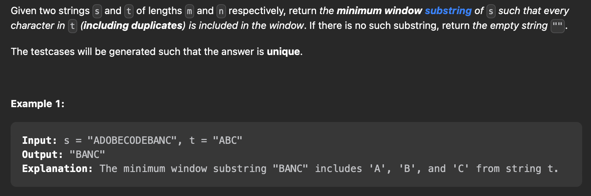

```java
class Solution {
    public String minWindow(String s, String t) {
        /*
        t.c o(m+n)
        s.c o(m)
        Approach:
            1. have to maintain hash map to check the counts between two strings
            2. init l,r as 0,0 where l stores the start of the subString to return , run until r reaches end
            3. match --> indicates total found matches
                minLen --> min substr found until now
            4. when match is found at r , add to map and decrement by 1 , if count == 0 , correct match
            5. run a while loop where matched == len(t) , keep on moving the left towards right to find the min len
            6.return the substr
        */

        HashMap<Character,Integer> hm = new HashMap<>();
        int l = 0;
        int match = 0;
        int subStrStart = 0;
        int minLen = s.length()+1; // can be any number > len of s

        //make map for string t
        for(char c:t.toCharArray()){
            hm.put(c,hm.getOrDefault(c,0)+1);
        }


        for(int r=0;r<s.length();r++){
            //move until match is found
            char right = s.charAt(r);
            if(hm.containsKey(right)){
                //decrement the count in map and check if it's 0
                hm.put(right,hm.get(right)-1);
                if(hm.get(right)==0){
                    //correct match
                    match++;
                }
            }

            //loop to move left
            while(match == hm.size()){
                //update minLen and subStrStart
                if(r-l+1 < minLen){
                    minLen = r-l+1;
                    subStrStart = l;
                }
                //pop left and check the count and l++
                char left = s.charAt(l++);
                if(hm.containsKey(left)){
                    if(hm.get(left)==0){
                        match--;
                    }
                    hm.put(left,hm.get(left)+1);
                }


            }
        }
        return minLen > s.length() ? "" : s.substring(subStrStart,subStrStart+minLen);
    }
}
```

`second approach` using s.c O(128)

```java
 class Solution {
    public String minWindow(String s, String t) {
    int[] count = new int[128];
    int required = t.length();
    int bestLeft = -1;
    int minLength = s.length() + 1;

    for (final char c : t.toCharArray())
      ++count[c];

    for (int l = 0, r = 0; r < s.length(); ++r) {
      if (--count[s.charAt(r)] >= 0)
        --required;
      while (required == 0) {
        if (r - l + 1 < minLength) {
          bestLeft = l;
          minLength = r - l + 1;
        }
        if (++count[s.charAt(l++)] > 0)
          ++required;
      }
    }

    return bestLeft == -1 ? "" : s.substring(bestLeft, bestLeft + minLength);
    }
}
```


### [121. Best Time to Buy and Sell Stock](https://leetcode.com/problems/best-time-to-buy-and-sell-stock/)

```java
class Solution {
    public int maxProfit(int[] prices) {
        /*
            t.c : o(n) s.c o(1)
            approach:
                1.init two pointer , l = 0 , r = 1
                2. check until r <= total_len
                3. if prices[l] < prices[r] // upward curve (calculate profit)
                4. else update left to the right (shift the whole window)
                5. return
        */

        int res = 0;
        int l = 0;
        int r = 1;

        while(r<prices.length){
            if(prices[l]<prices[r]){
                int profit = prices[r] - prices[l];
                res = Math.max(res,profit);
            }
            else{
                l = r; // shifting the whole window
            }
            r+=1;
        }

        return res;

    }
}
```

### [239. Sliding Window Maximum](https://leetcode.com/problems/sliding-window-maximum/description/)

```java
class Solution {
    public int[] maxSlidingWindow(int[] nums, int k) {
        /*
            brute force:
            t.c - o(k.(n-k)) s.c o(1)
            pass through each window and calculate the max


            linear - montonic decreasing queue
            t.c - o(n)
            s.c - o(n) - queue
            approach:
            1. init l,r =0, for first case offer all element in the range to the dequeue
            2. for the next iteration , check if the q is not empty and if r > last elem of queue , pop everything to left
            3. if windows size matches , add to the result array
            4. return
        */
        int n = nums.length;
        int[] res = new int[n-k+1];
        Deque<Integer> q = new LinkedList<>();

        int l = 0;
        for(int r=0;r<n;r++){
            //check if q is empty and the left index is not out of bounds
            if(!q.isEmpty() && q.peekFirst() < r-k+1){
                 q.pollFirst();
            }
            while(!q.isEmpty() && nums[r]> nums[q.peekLast()]){
                q.pollLast();
            }
            //add the element to queue
            q.offer(r);
            if(r>=k-1){
                res[l++] = nums[q.peekFirst()];
            }
        }

        return res;

    }
}
```


### [424. Longest Repeating Character Replacement](https://leetcode.com/problems/longest-repeating-character-replacement/description/)

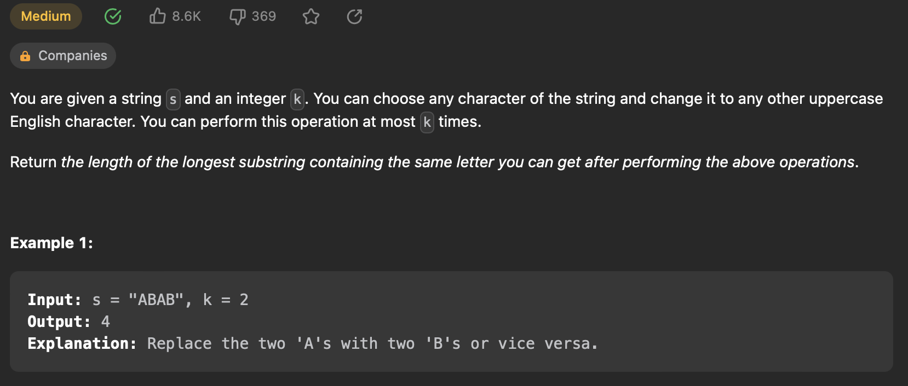

```java
class Solution {
    public int characterReplacement(String s, int k) {
        /*
            t.c - o(26*n)
            s.c - o(26) - hashmap
            approach:
            1. init arr to store the cnt of characters
            2. start l,r = 0 until r reaches end - break point
            3. increase the cnt of char at r by 1
            4. check if window is valid (windowSize - max(hashMap) <= k)
            5. else decrese the count of char and increase the l
            6. return res
        */

        int res = 0;
        int[] hm = new int[26];
        int max = 0;
        for(int l=0,r=0;r<s.length();r++){
            hm[s.charAt(r)-'A']++;
            max = Math.max(max,hm[s.charAt(r)-'A']);
            //check if window is valid
            if(r-l+1 - max >k){
                //invalid
                hm[s.charAt(l)-'A']--;
                l++;
            }
            res = Math.max(res,r-l+1);
        }
        return res;
    }
}
```

### [567. Permutation in String](https://leetcode.com/problems/permutation-in-string/description/)

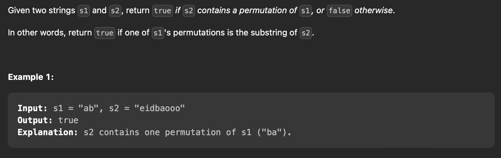

```java
class Solution {
    public boolean checkInclusion(String s1, String s2) {
        /*
            t.c O(26+n)
            s.c O(26)
            approach:
            1. init count arr for s1 and s2 o(26)
            2. init l as 0 and r in range until end
            3. check for matches (when both arrays are equal) , for a premutation substr matches should be 26 (return true)
            4. check for l and r and update matches accordingly
            5.
            5.return matches == 26

        */
        //base case
        if (s1.length() > s2.length()) {
            return false;
        }

        int[] s1Count = new int[26];
        int[] s2Count = new int[26];

        for (int i = 0; i < s1.length(); i++) {
            s1Count[s1.charAt(i) - 'a']++;
            s2Count[s2.charAt(i) - 'a']++;
        }

        int matches = 0;
        for (int i = 0; i < 26; i++) {
            matches += (s1Count[i] == s2Count[i]) ? 1 : 0;
        }

        int l = 0;
        for (int r = s1.length(); r < s2.length(); r++) {
            if (matches == 26) {
                return true;
            }

            int index = s2.charAt(r) - 'a';
            s2Count[index]++;
            if (s1Count[index] == s2Count[index]) {
                matches++;
            } else if (s1Count[index] + 1 == s2Count[index]) { //check with 0
                matches--;
            }

            index = s2.charAt(l) - 'a';
            s2Count[index]--;
            if (s1Count[index] == s2Count[index]) {
                matches++;
            } else if (s1Count[index] - 1 == s2Count[index]) { //check with 1
                matches--;
            }
            l++;
        }

        return matches == 26;
    }
}
```


## Binary Search

### [4. Median of Two Sorted Arrays](https://leetcode.com/problems/median-of-two-sorted-arrays/)

```java
class Solution {
    public double findMedianSortedArrays(int[] nums1, int[] nums2) {
        /*
            t.c o(log(min(m,n))) s.c o(1)

            Approach;
                1. No need to merge both the arrays the whole thing can be made into left and right portions
                2. take the min_len array , make l , r as start and end
                3. for the other array , set l as 0 and right as ((total/2) - end of first arr)
                4. check if the partitions are correct by checking the boundaries
                5. if even:
                        max(first_array)+min(second_array) / 2
                    odd:
                        max(left_array)
        */

       int m = nums1.length;
        int n = nums2.length;

        if (m > n) {
            return findMedianSortedArrays(nums2, nums1);
        }

        int total = m + n;
        int half = (total + 1) / 2;

        int left = 0;
        int right = m;

        var result = 0.0;

        while (left <= right) {
            int i = left + (right - left) / 2;
            int j = half - i;

            // get the four points around possible median
            int left1 = (i > 0) ? nums1[i - 1] : Integer.MIN_VALUE;
            int right1 = (i < m) ? nums1[i] : Integer.MAX_VALUE;
            int left2 = (j > 0) ? nums2[j - 1] : Integer.MIN_VALUE;
            int right2 = (j < n) ? nums2[j] : Integer.MAX_VALUE;

            // partition is correct
            if (left1 <= right2 && left2 <= right1) {
                // even
                if (total % 2 == 0) {
                    result =
                        (Math.max(left1, left2) + Math.min(right1, right2)) /
                        2.0;
                    // odd
                } else {
                    result = Math.max(left1, left2);
                }
                break;
            }
            // partition is wrong (update left/right pointers)
            else if (left1 > right2) {
                right = i - 1;
            } else {
                left = i + 1;
            }
        }

        return result;
    }
}
```

### [33. Search in Rotated Sorted Array](https://leetcode.com/problems/search-in-rotated-sorted-array/)

```java
class Solution {
    public int search(int[] nums, int target) {
        /*
            T.C  o(logn) s.c o(1)

            approach:
                1.init l,r = 0,len(nums)-1
                2. check if target is in left portionn or right portion (based on nums[l])
                3. if left portion:
                        check with nums[l] and mid:
                            if target<nums[l] or target>mid: //element in right portion
                                left = mid+1
                            else:
                                r = mid-1
                    if right portion:
                        check with nums[r] and mid:
                            if target < mid or target > nums[r]: // element in left portion
                                r = mid-1
                            else:
                                l = mid+1
        */
        int l = 0;
        int r = nums.length - 1;

        while(l<=r){

            int mid = (l+r)/2;

            if(nums[mid] == target){
                return mid;
            }
            //left sorted
            if(nums[l]<=nums[mid]){
                if(target > nums[mid] || target < nums[l]){
                    l = mid + 1;
                }else{
                    r = mid - 1;
                }
            }else{//right sorted
                if(target < nums[mid] || target > nums [r]){
                    r = mid - 1;
                }else{
                    l = mid + 1;
                }
            }

        }
        return -1;
    }
}
```

### [74. Search a 2D matrix](https://leetcode.com/problems/search-a-2d-matrix/description/)

```java
class Solution {
    public boolean searchMatrix(int[][] matrix, int target) {
        /*
            t.c - o(logm+logn) s.c - o(1)
            Approach:
                1.find the row which contains the element by b,s log(m)
                2.peform a second b,s to find the element in that row log(n)
                3.return el
        */
        //edge case
        if(matrix.length==0){
            return false;
        }


        int ROWS = matrix.length;
        int COL = matrix[0].length;

        int top = 0;
        int btm = ROWS-1;

        while (top<=btm){
            int row = (top + btm) / 2;
            System.out.println(row);
            System.out.println(COL-1);
            if (target > matrix[row][matrix[row].length-1]){ // after the mid
                top = row+1;
            }
            else if(target < matrix[row][0]){
                btm = row-1;
            }
            else{
                break;
            }
        }

        //if no row is found with the elem , break
        if(!(top<=btm)){
            return false;
        }
        //search in the row
        int s_row = (top + btm) / 2;
        int l = 0;Sea
        int r = matrix[0].length;

        while (l<=r){
            int mid = (l+r) / 2;
            if(matrix[s_row][mid]==target){
                return true;
            }
            if (matrix[s_row][mid]>target){ //ans in left portion
                r = mid-1;
            }
            else if(matrix[s_row][mid]<target){
                l = mid+1;
            }
        }
        return false;
    }
}
```

`second approach` - works for smaller matrix , less number of rows

```java
class Solution {
  public boolean searchMatrix(int[][] matrix, int target) {
    /*
        t.c o(log(m*n)) s.c o(1)
        approach:
        1. flatten the matrix , left = start , end = m*n
        2.search for el
        3.return


    */
    //edge case
    if (matrix.length == 0)
      return false;

    final int m = matrix.length;
    final int n = matrix[0].length;
    int l = 0;
    int r = m * n;

    while (l < r) {
      final int mid = (l + r) / 2;
      final int i = mid / n;
      final int j = mid % n;
      if (matrix[i][j] == target)
        return true;
      if (matrix[i][j] < target)
        l = mid + 1;
      else
        r = mid;
    }

    return false;
  }
}
```

### [153. Find Minimum in Rotated Sorted Array](https://leetcode.com/problems/find-minimum-in-rotated-sorted-array/)

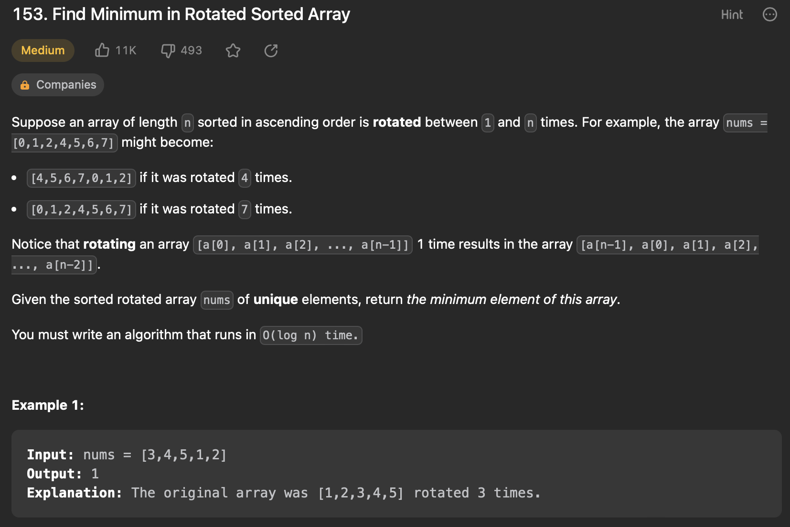

```java
class Solution {
    /*
        t,c - o(logn) s,c o(1)

        ALGO:
        1. maintain a res to hold min
        2. in a sorted rotated array , at any point mid can belong either to right sorted portion or left sorted portion
        3. if nums[mid]>= nums[left] --> belongs to left portion , have to search in right portion for min value (set left = mid+1)
        4.else belongs to right portion , have to search in left (set right = mid)
        5.return left

    */


    public int findMin(int[] nums) {
        // int m = Integer.MAX_VALUE;
        // for(int c:nums)
        //     m = Math.min(m,c);
        // return m;

        int res = 0;
        int l = 0;
        int r = nums.length-1;

        while(l<=r){
            if (nums[l] <= nums[r]) {
                return nums[l]; //termination condition , minimum at left
            }
            int mid = (l+r)/2;
            if(nums[mid]>=nums[l]){
                l = mid+1;
            }
            else if(nums[mid]<=nums[l]){
                r = mid;
            }
        }
        return 0;
    }
}
```

### [704. Binary Search](https://leetcode.com/problems/binary-search/description/)

```java
class Solution {
    public int search(int[] nums, int target) {

        /*
            t.c - O(logn) s.c - O(1)
            Approach:
                s.w
                1.init l,r at start and end
                2.find mid and compare with target
                3.update left and right
                4.return mid when equal
        */

        int l = 0;
        int r = nums.length-1;
        while (l<=r){
            int mid = (l+r) / 2;
            if(nums[mid]==target){
                return mid;
            }
            if (nums[mid]>target){ //ans in left portion
                r = mid-1;
            }
            else if(nums[mid]<target){
                l = mid+1;
            }
        }
        return -1;
    }
}
```

### [875. Koko Eating Bananas](https://leetcode.com/problems/koko-eating-bananas/)

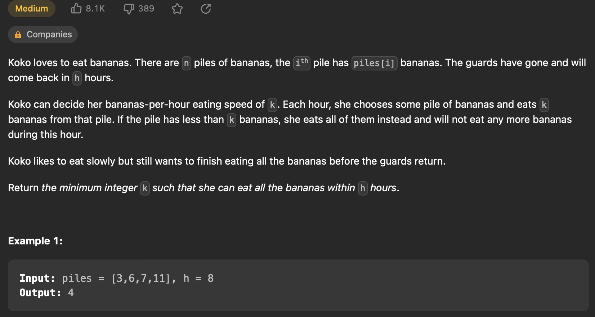

```java
class Solution {
        /*
            t.c - o(Nlog(max(n))) s.c o(1)
            approach-
            1. need to find the k which is optimal to finish in less than h hours
            2. total possible for k ->[1,max(piles)] , do a binary search on this range
            3. calculate total hours for a specific k , if calculated_hours< h , search in left portion , else right
            4.return mid
        */
    public int calucateHours(int[] piles,int k){
        //calcuate hours taken for a k
        int res = 0;
        for(int c:piles){
            res+= Math.ceil((double) c / k);
        }
        return res;
    }

    public int minEatingSpeed(int[] piles, int h) {


        int l = 1;
        int r = 1;
        for(int c:piles)
            r = Math.max(r,c);

        while (l<r){
            int mid = (l+r)/2;
            int hrs = calucateHours(piles,mid);
            if (hrs<=h){
                r = mid;
            }
            else if(hrs>h){
                l = mid+1;
            }
        }
        return r;
    }
}
```

### [981. Time Based Key-Value Store](https://leetcode.com/problems/time-based-key-value-store/)

```java
class TimeMap {
    /*
        t.c - o(logn) s.c O(1)
        approach:
        1. items in set operation are sorted (time is always increasing)
        2. perform binary operation on the dict[key]
        3. find the closest to the timestamp (<=)
        4. return
    */
    private HashMap<String,List<Pair<String,Integer>>> mp;

    private String binaySearch(List<Pair<String,Integer>> val,int ts){
        //peform binary
        int l = 0;
        int r = val.size()-1;
        String res = "";
        while (l<=r){
            int m = (l+r)/2;
            //check if <= timestamp
            int el = val.get(m).getValue();
            if(el <= ts){
                res = val.get(m).getKey();
                l = m+1;
            }
            else{
                r = m-1;
            }
        }
        return res;
    }

    public TimeMap() {
        mp = new HashMap();
    }

    public void set(String key, String value, int timestamp) {
        //set to the key
        if(!mp.containsKey(key)){
            mp.put(key,new ArrayList<>());
        }
        mp.get(key).add(new Pair(value,timestamp));
    }

    public String get(String key, int timestamp) {
        //check if key exists
        if(!mp.containsKey(key))
            return "";
        List<Pair<String,Integer>> val = mp.get(key);
        return binaySearch(val,timestamp);
    }
}

/**
 * Your TimeMap object will be instantiated and called as such:
 * TimeMap obj = new TimeMap();
 * obj.set(key,value,timestamp);
 * String param_2 = obj.get(key,timestamp);
 */
```


## Stack

### [1190. Reverse Substrings Between Each Pair of Parentheses](https://leetcode.com/problems/reverse-substrings-between-each-pair-of-parentheses/description/)

```java
class Solution {

    private void util(char[] arr, int left, int right){
        //util to reverse the string
        while(left<right){
            char tmp = arr[left];
            arr[left] = arr[right];
            arr[right] = tmp;
            left++;
            right--;
        }
    }

    public String reverseParentheses(String s) {
        /*
            algo:
                (ed(et(oc))el)
                co --> etco --> octe --> edocteel --> leetcode
                1.store the index of '(', at first occurence of ')', take the largest index and reverse the substring between the index in the string, remove the brackets
                2. continue until the index array is empty
                3. return the string

                t.c --> O(n): traversing the string
                s.c --> O(n): charArray and stack
        */

        Stack<Integer> st = new Stack<>();
        char[] ca = s.toCharArray();

        for(int ind=0;ind<ca.length;ind++){
            if(ca[ind]=='('){
                st.push(ind);
            }
            else if(ca[ind]==')'){
                int leftIndex = st.pop();
                util(ca,leftIndex+1,ind-1);
            }
        }

        StringBuilder sb = new StringBuilder();
        for(char c:ca){
            if(c!='(' && c!=')'){
                sb.append(c);
            }
        }

        return sb.toString();
    }
}
```

### [22.Generate Parentheses](https://leetcode.com/problems/generate-parentheses/description/)

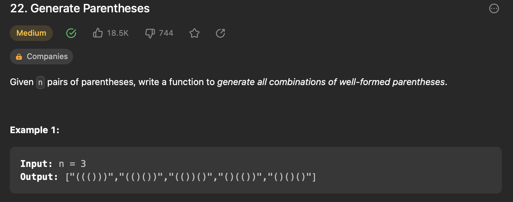

```py
class Solution:
    def generateParenthesis(self, n: int) -> List[str]:
        '''
         t.c - O(2^n) s.c O(n) to hold stack and O(2^n) for res stack
         Approach:
            backtrack algo
            start with (0,0)
            maintain two integers open and close
            if open < n:
                add('(')
                backtrack(open+1)
                pop()
            if close < o: (closed cant be greater than o)
                add(')')
                backtrack(close+1)
                pop()
        '''
        res = []
        st = []

        def bt(o,c):
            if o == c == n:
                res.append("".join(st))
                return
            if o < n:
                st.append("(")
                bt(o+1,c)
                st.pop()
            if c < o:
                st.append(")")
                bt(o,c+1)
                st.pop()
        bt(0,0)
        return res
```

### [36.Valid Paranthesis]()

```py
class Solution:
  def isValid(self, s: str) -> bool:
    stack = []

    for c in s:
      if c == '(':
        stack.append(')')
      elif c == '{':
        stack.append('}')
      elif c == '[':
        stack.append(']')
      elif not stack or stack.pop() != c:
        return False

    return not stack
```

### [84. Largest Rectangle in Histogram](https://leetcode.com/problems/largest-rectangle-in-histogram/)

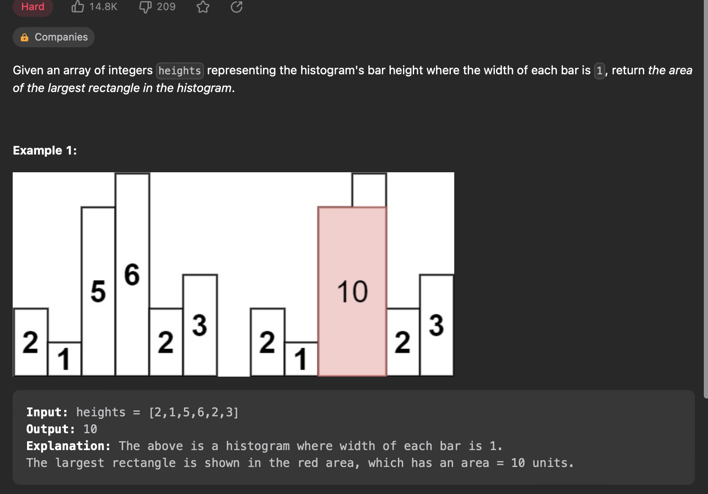

```java
class Solution {
    public int largestRectangleArea(int[] heights) {
        /*
            largest area --> max_width or max_height
            area = (l*b)
            t.c -> O(n)
            s.c -> O(n)
            Approach:
                1. we can make an rectangle only when the next element is greater than the current
                2. start at ind 0, add to stack with pair (ind,height)
                3. when element height is less than stack peek , pop from stack and calcuate the area
                4. at last if any elements are left in the stack , they can extend all the way until end
                5. return the maxArea formed
        */

        int res = 0;
        int n = heights.length;
        int start;

        Stack<Pair<Integer,Integer>> st = new Stack<>();
        //start iteration
        for(int z=0;z<n;z++){
            int el = heights[z];
            start = z;
            //start poping from stack and modify the start index
            while(!st.empty() && st.peek().getValue()>el){
                Pair<Integer,Integer> p = st.pop();
                int index = p.getKey();
                int val = p.getValue();
                res = Math.max(res,val*(z-index)); //calculating all rectangles
                start = index; //update start index
            }
            //add to stack
            st.push(new Pair(z,el));
        }

        //check for the remaining element in the stack (can be extended until end)
        while(!st.empty()){
            Pair<Integer,Integer> s = st.pop();
            int i = s.getKey();
            int h = s.getValue();
            res = Math.max(res,h*(n-i));
        }

        return res;
    }
}
```

### [150.Evaluate Reverse Polish Notation](https://leetcode.com/problems/evaluate-reverse-polish-notation/description/)

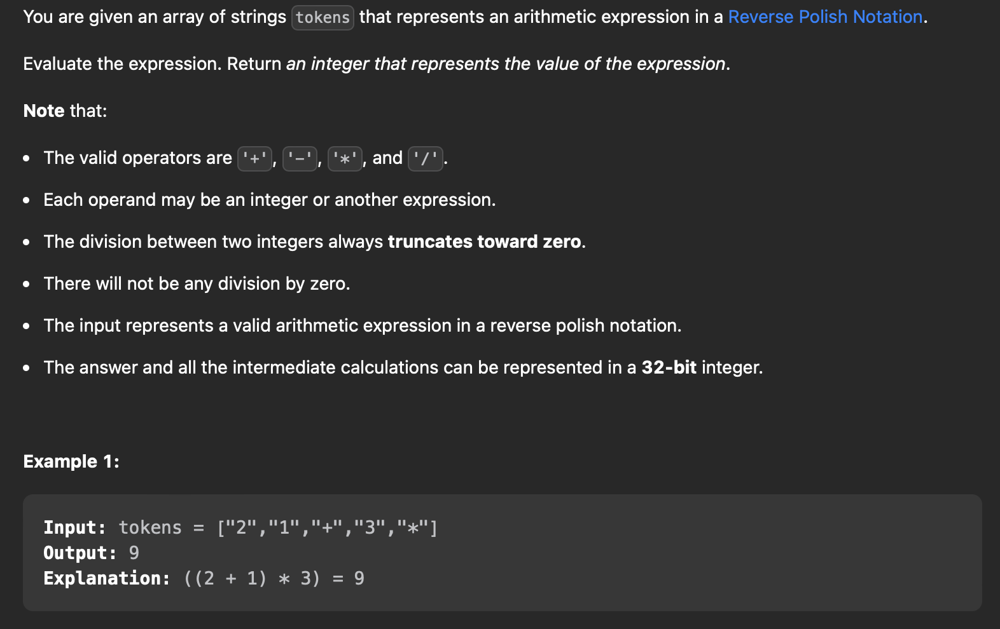

```java
class Solution {
    /*
        t.c -> O(n) , s.c O(n)
        Approach:
            whenever we approach a expression pop two elements from the stack and add the result back to the stack


    */


    public int evalRPN(String[] tokens) {
        Stack<Integer> st = new Stack<>();

        for(String c:tokens){
            if(c.equals("+")){
                int a = st.pop();
                int b = st.pop();
                st.push(a+b);
            }
            else if(c.equals("-")){
                int a = st.pop();
                int b = st.pop();
                st.push(b-a);
            }
            else if(c.equals("*")){
                st.push(st.pop() * st.pop());
            }
            else if(c.equals("/")){
                int a = st.pop();
                int b = st.pop();
                st.push(b/a);
            }
            else{
                st.add(Integer.parseInt(c));
            }
        }

        return st.pop();
    }
}
```

### [155.Min Stack](https://leetcode.com/problems/min-stack/description/)

```java
class MinStack {
        /*t.c O(1) , s.c O(n)
         Approach:
         to find the minValue in constant time , maintain a minstack which stores the min until now

        */
    private Stack<Integer> st;
    private Stack<Integer> minSt;

    public MinStack(){
        st = new Stack<>();
        minSt = new Stack<>();
    }

    public void push(int val) {
        st.push(val);

        val = Math.min(val, minSt.isEmpty()?val:minSt.peek());
        minSt.push(val);
    }

    public void pop() {
        st.pop();
        minSt.pop();
    }

    public int top() {
        return st.peek();
    }

    public int getMin() {
        return minSt.peek();
    }
}
```

### [739.Daily Temperatures](https://leetcode.com/problems/daily-temperatures/description/)

```java
class Solution {
    public int[] dailyTemperatures(int[] temperatures) {
        /*
            t.c - O(n) s.c O(n) extra stack

            Approach:
                keep a stack to store the elements
                start from the back , check if the stack is empty , if empty then append 0
                else:
                    check if element is greater then pop (continue until stack exists)
                    if element is less than the top of stack , append the difference between curr and top stack to res
        */

        int[] ans = new int[temperatures.length];
        Stack<Integer> stack = new Stack<>();
        for (int currDay = 0; currDay < temperatures.length; currDay++) {
            while (!stack.isEmpty() && temperatures[currDay] > temperatures[stack.peek()]) {
                int prevDay = stack.pop();
                ans[prevDay] = currDay - prevDay;
            }
            stack.add(currDay);
        }
        return ans;
    }
}
```

### [853.Car Fleet](https://leetcode.com/problems/car-fleet/description/)

```java
class Car{
    public int position;
    public double time;
    public Car(int pos,double time){
        this.position = pos;
        this.time = time;
    }
}

class Solution {
    public int carFleet(int target, int[] position, int[] speed) {
        /*
            Approach 1 : t.c - O(nlogn) s.c O(n) - stack
            algo:
                1.make pairs of cars [[pos,speed]]
                2.start from right , add time taken by car to stack
                3. if stack has more than 2 items , check if st[-1] <= st[-2] , pop from stack
                4.return total len of the stack
            Approach 2: t.c - O(sort) , s.c O(n)
            algo:
                1.make car class objects car(pos,time)
                2.sort the array,
                3.for car in carArr , if car.time > maxTime --> res++
                4.return res

        */
        double maxTime = 0;
        int n = position.length;
        int res = 0;
        Car[] car = new Car[n];
        for(int z = 0 ; z<n; z++){
            car[z] = new Car(position[z],(double)(target-position[z])/speed[z]);
        }
        Arrays.sort(car,(a,b)-> b.position - a.position);

        for(Car c:car){
            if(c.time>maxTime){
                maxTime = c.time;
                res++;
            }
        }
        return res;

    }
}
```

## Two Pointers

### [11.Container With Most Water](https://leetcode.com/problems/container-with-most-water/)

```java
class Solution {
    public int maxArea(int[] height) {

        int res = 0;
        int l = 0;
        int r = height.length - 1;
        int area = Integer.MIN_VALUE;

        while(l<r){
            area = (r-l) * Math.min(height[l],height[r]);
            res = Math.max(res,area);

            if(height[l]<height[r]){
                l++;
            }
            else{
                r--;
            }
        }
        return res;
    }
}
```

### [15.3Sum](https://leetcode.com/problems/3sum/)

```py
class Solution:
  def threeSum(self, nums: List[int]) -> List[List[int]]:
    if len(nums) < 3:
      return []

    ans = []

    nums.sort()

    for i in range(len(nums) - 2):
      if i > 0 and nums[i] == nums[i - 1]:
        continue
      l = i + 1
      r = len(nums) - 1
      while l < r:
        summ = nums[i] + nums[l] + nums[r]
        if summ == 0:
          ans.append((nums[i], nums[l], nums[r]))
          l += 1
          r -= 1
          while nums[l] == nums[l - 1] and l < r:
            l += 1
          while nums[r] == nums[r + 1] and l < r:
            r -= 1
        elif summ < 0:
          l += 1
        else:
          r -= 1

    return ans
```

### [42.Trapping rain water](https://leetcode.com/problems/trapping-rain-water/)

```py
class Solution:
    def trap(self, height: List[int]) -> int:
        #edge case
        if not height:
            return 0

        res = 0
        l = 0
        r = len(height)-1
        maxL = height[l]
        maxR = height[r]

        while(l<r):
            if(maxL<maxR):
                res+= maxL - height[l]
                l+=1
                maxL = max(maxL,height[l])
            else:
                res+=maxR - height[r]
                r-=1
                maxR = max(maxR,height[r])
        return res
```

## Matrix

### [36.Valid Sudoku](https://leetcode.com/problems/valid-sudoku/)

```java
class Solution {
    public boolean isValidSudoku(char[][] board) {
        Set<String> seen = new HashSet<>();

        for(int i = 0 ; i<9;i++){
            for(int j = 0 ; j<9;j++){
                if(board[i][j]=='.'){
                    continue;
                }
                final char c = board[i][j];
                if (!seen.add(c + "@row" + i) || //
                    !seen.add(c + "@col" + j) || //
                    !seen.add(c + "@box" + i / 3 + j / 3))
                return false;
            }
        }
        return true;
    }
}
```
