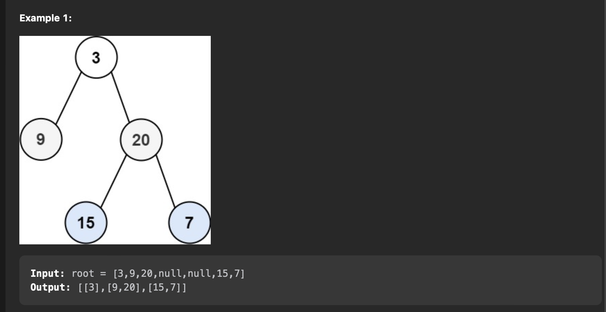

# LeetCode Solutions

## Stack

### Valid Paranthesis

```py
class Solution:
  def isValid(self, s: str) -> bool:
    stack = []

    for c in s:
      if c == '(':
        stack.append(')')
      elif c == '{':
        stack.append('}')
      elif c == '[':
        stack.append(']')
      elif not stack or stack.pop() != c:
        return False

    return not stack
```

### [155. Min Stack](https://leetcode.com/problems/min-stack/description/)

```java
class MinStack {
        /*t.c O(1) , s.c O(n)
         Approach:
         to find the minValue in constant time , maintain a minstack which stores the min until now

        */
    private Stack<Integer> st;
    private Stack<Integer> minSt;

    public MinStack(){
        st = new Stack<>();
        minSt = new Stack<>();
    }

    public void push(int val) {
        st.push(val);

        val = Math.min(val, minSt.isEmpty()?val:minSt.peek());
        minSt.push(val);
    }

    public void pop() {
        st.pop();
        minSt.pop();
    }

    public int top() {
        return st.peek();
    }

    public int getMin() {
        return minSt.peek();
    }
}
```

### [150. Evaluate Reverse Polish Notation](https://leetcode.com/problems/evaluate-reverse-polish-notation/description/)


```java
class Solution {
    /*
        t.c -> O(n) , s.c O(n)
        Approach:
            whenever we approach a expression pop two elements from the stack and add the result back to the stack


    */


    public int evalRPN(String[] tokens) {
        Stack<Integer> st = new Stack<>();

        for(String c:tokens){
            if(c.equals("+")){
                int a = st.pop();
                int b = st.pop();
                st.push(a+b);
            }
            else if(c.equals("-")){
                int a = st.pop();
                int b = st.pop();
                st.push(b-a);
            }
            else if(c.equals("*")){
                st.push(st.pop() * st.pop());
            }
            else if(c.equals("/")){
                int a = st.pop();
                int b = st.pop();
                st.push(b/a);
            }
            else{
                st.add(Integer.parseInt(c));
            }
        }

        return st.pop();
    }
}
```


## Sliding window

### [42.Trapping rain water](https://leetcode.com/problems/trapping-rain-water/)

```py
class Solution:
    def trap(self, height: List[int]) -> int:
        #edge case
        if not height:
            return 0

        res = 0
        l = 0
        r = len(height)-1
        maxL = height[l]
        maxR = height[r]

        while(l<r):
            if(maxL<maxR):
                res+= maxL - height[l]
                l+=1
                maxL = max(maxL,height[l])
            else:
                res+=maxR - height[r]
                r-=1
                maxR = max(maxR,height[r])
        return res
```

### [22. Generate Parentheses](https://leetcode.com/problems/generate-parentheses/description/)




```py
class Solution:
    def generateParenthesis(self, n: int) -> List[str]:
        '''
         t.c - O(2^n) s.c O(n) to hold stack and O(2^n) for res stack
         Approach:
            backtrack algo
            start with (0,0)
            maintain two integers open and close
            if open < n:
                add('(')
                backtrack(open+1)
                pop()
            if close < o: (closed cant be greater than o)
                add(')')
                backtrack(close+1)
                pop()
        '''
        res = []
        st = []

        def bt(o,c):
            if o == c == n:
                res.append("".join(st))
                return
            if o < n:
                st.append("(")
                bt(o+1,c)
                st.pop()
            if c < o:
                st.append(")")
                bt(o,c+1)
                st.pop()
        bt(0,0)
        return res
```


### [11.Container With Most Water](https://leetcode.com/problems/container-with-most-water/)

```java
class Solution {
    public int maxArea(int[] height) {

        int res = 0;
        int l = 0;
        int r = height.length - 1;
        int area = Integer.MIN_VALUE;

        while(l<r){
            area = (r-l) * Math.min(height[l],height[r]);
            res = Math.max(res,area);

            if(height[l]<height[r]){
                l++;
            }
            else{
                r--;
            }
        }
        return res;
    }
}
```

### [15.3Sum](https://leetcode.com/problems/3sum/)

```py
class Solution:
  def threeSum(self, nums: List[int]) -> List[List[int]]:
    if len(nums) < 3:
      return []

    ans = []

    nums.sort()

    for i in range(len(nums) - 2):
      if i > 0 and nums[i] == nums[i - 1]:
        continue
      l = i + 1
      r = len(nums) - 1
      while l < r:
        summ = nums[i] + nums[l] + nums[r]
        if summ == 0:
          ans.append((nums[i], nums[l], nums[r]))
          l += 1
          r -= 1
          while nums[l] == nums[l - 1] and l < r:
            l += 1
          while nums[r] == nums[r + 1] and l < r:
            r -= 1
        elif summ < 0:
          l += 1
        else:
          r -= 1

    return ans
```

## Matrix

### [36.Valid Sudoku](https://leetcode.com/problems/valid-sudoku/)

```java
class Solution {
    public boolean isValidSudoku(char[][] board) {
        Set<String> seen = new HashSet<>();

        for(int i = 0 ; i<9;i++){
            for(int j = 0 ; j<9;j++){
                if(board[i][j]=='.'){
                    continue;
                }
                final char c = board[i][j];
                if (!seen.add(c + "@row" + i) || //
                    !seen.add(c + "@col" + j) || //
                    !seen.add(c + "@box" + i / 3 + j / 3))
                return false;
            }
        }
        return true;
    }
}
```

