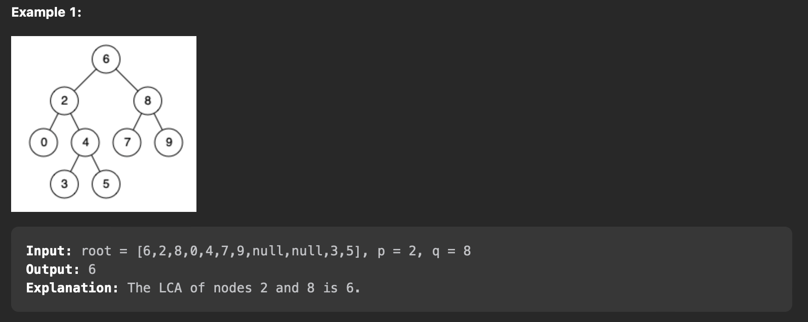
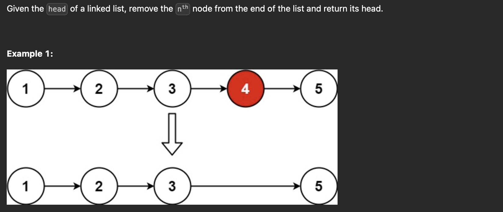
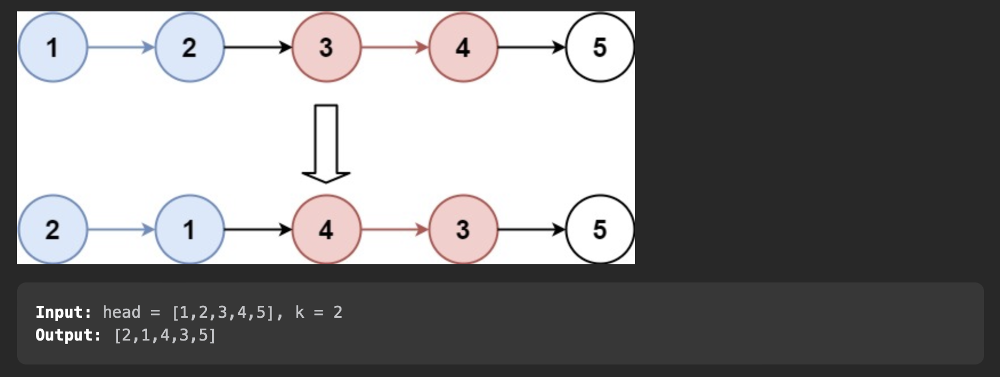
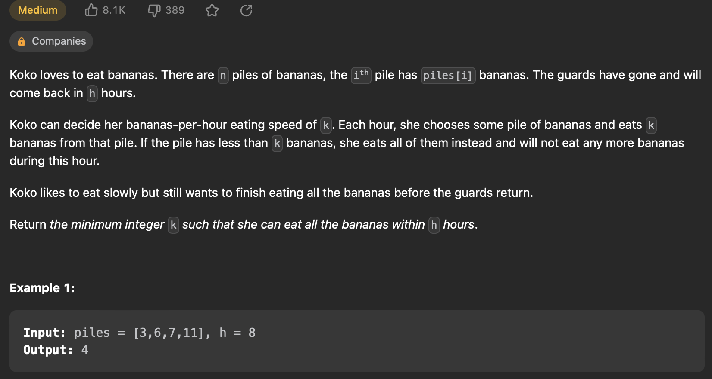
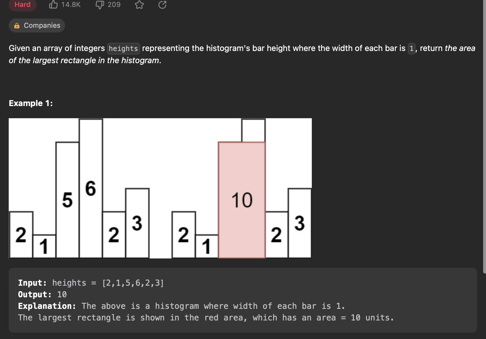
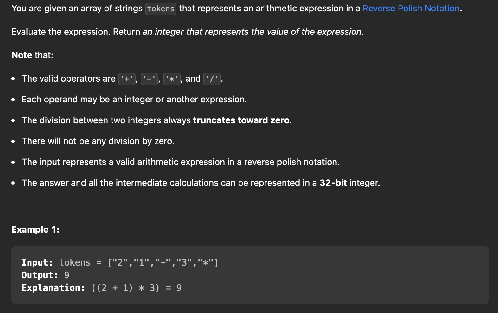

# LeetCode Solutions

## Binary Tree

### [98. Validate Binary Search Tree](https://leetcode.com/problems/validate-binary-search-tree/description/)


```java
class Solution {
    /*
        t.c - o(n)
        s.c - o(h)
        approach:
        1. to validate have to check the boundaries for each iteration
        2. init the iteration with -inf to +inf
        3. for each iter, for left tree update right boundary to root.val
        4. for each iter , for right tree update left boundary to root.val
        5. if condition is not satisfied ? return false : true

    */
    public boolean dfs(TreeNode root,Integer left,Integer right){
        if(root==null){
            //empty tree can be a bst
            return true;
        }
        if((left!=null && root.val<=left)||( right!=null && root.val>=right)){
            // condition not satisfied for a bst
            return false;
        }

        return ((dfs(root.left,left,root.val))&&(dfs(root.right,root.val,right)));
    }


    public boolean isValidBST(TreeNode root) {
        return dfs(root,null,null);
    }
}
```


### [102. Binary Tree Level Order Traversal](https://leetcode.com/problems/binary-tree-level-order-traversal/description/)


```java
class Solution {

    /*
        t.c - o(n)
        s.c - o(n)
        approach:
            1. init a deque with root elem
            2. if elem has left and right , append them into queue
            3. in the range of the lenght of q , pop left and add to currlevel , if it has left and right append to q

    */


    public List<List<Integer>> levelOrder(TreeNode root) {
        List<List<Integer>> res = new ArrayList<>();
        if(root==null){
            return res;
        }
       Deque<TreeNode> q = new ArrayDeque<>();
        q.offer(root);
        while(!q.isEmpty()){
            List<Integer> currLevel = new ArrayList<>();
            int levelSize = q.size();
            for(int z = 0;z<levelSize;z++){
                TreeNode t = q.pollFirst();
                currLevel.add(t.val);
                if(t.left!=null){
                    q.offer(t.left);
                }
                if(t.right!=null){
                    q.offer(t.right);
                }
            }
            res.add(currLevel);
        }
        return res;
    }
}
```

### [105. Construct Binary Tree from Preorder and Inorder Traversal](https://leetcode.com/problems/construct-binary-tree-from-preorder-and-inorder-traversal/description/)


```java
class Solution {
    /*
        t.c - o(n)
        s.c - o(n) - hm to hold the index of the elements
        approach:
        1. two diff traversals are pre-order(root,left,right) and inorder(left,root,right)
        2. the first index of preorder is always the root , check for the index of root in inorder
        3. everything left to the found index , will be in the left subtree of the root
        4. everything right to the found index , will be in the right subtree of the root
        5. build the tree accordingly
    */


    public TreeNode build(int[] preorder, int preStart , int preEnd , int[] inorder , int inStart, int inEnd,   Map<Integer,Integer> inToIndex){
        //base case to exit
        if (preStart > preEnd)
            return null;

        final int rootVal = preorder[preStart];
        final int rootInIndex = inToIndex.get(rootVal);
        final int leftSize = rootInIndex - inStart;

        TreeNode root = new TreeNode(rootVal);
        //root.left
        //preorder --> [1:mid+1] , inorder[:mid]

        root.left = build(preorder, preStart + 1, preStart + leftSize, inorder, inStart,
                        rootInIndex - 1, inToIndex);

        //root.right
        //preorder --> [mid+1:] , inorder [mid+1:]
        root.right = build(preorder, preStart + leftSize + 1, preEnd, inorder, rootInIndex + 1, inEnd,inToIndex);

        return root;
    }


    public TreeNode buildTree(int[] preorder, int[] inorder) {
        //hm to store the indexes
         Map<Integer, Integer> inToIndex = new HashMap<>();

        for (int i = 0; i < inorder.length; ++i)
            inToIndex.put(inorder[i], i);

        return build(preorder, 0, preorder.length - 1, inorder, 0, inorder.length - 1, inToIndex);
    }

}
```

### [110. Balanced Binary Tree](https://leetcode.com/problems/balanced-binary-tree/description/)


```java
class Solution {
    /*
        t.c - o(n)
        s.c - o(h)
        approach: (bottom up to reduce to o(n), top down is o(n**2))
            1. initially if root is null , return a new pair of (true,0)
            2. check for left and right node , if both the trees are valid and their height diff <=1
            3. return the boolean at last
    */
    public Pair<Boolean,Integer> dfs(TreeNode root){
        if(root==null){
            return new Pair<Boolean,Integer>(true,0);
        }

        var left = dfs(root.left);
        var right = dfs(root.right);

        Boolean balanced = (left.getKey() && right.getKey() && Math.abs(left.getValue() - right.getValue())<=1);

        return new Pair<Boolean,Integer>(balanced, 1 + Math.max(left.getValue(),right.getValue()));
    }

    public boolean isBalanced(TreeNode root) {
        return dfs(root).getKey();
    }
}
```

### [199. Binary Tree Right Side View](https://leetcode.com/problems/binary-tree-right-side-view/description/)


```java
class Solution {
    /*
        t.c o(n)
        s.c o(n)
        approach:
            1. init empty res , if root is null return empty res
            2. add root to queue and start bfs
            3. in each iter, add the last elem of the level to the res
            4. return
    */

    public List<Integer> rightSideView(TreeNode root) {
        List<Integer> res = new ArrayList<>();
        //base case
        if(root==null){
            return res;
        }
       Deque<TreeNode> q = new ArrayDeque<>();
        q.offer(root);
        while(!q.isEmpty()){
            TreeNode rightNode = null;
            int levelSize = q.size();
            for(int z = 0;z<levelSize;z++){
                TreeNode t = q.pollFirst();
                rightNode = t;
                if(t.left!=null){
                    q.offer(t.left);
                }
                if(t.right!=null){
                    q.offer(t.right);
                }
            }
            res.add(rightNode.val);
        }
        return res;
    }
}
```

### [230. Kth Smallest Element in a BST](https://leetcode.com/problems/kth-smallest-element-in-a-bst/description/)


```java
class Solution {
    /*
        t.c - o(n)
        s.c - o(h)
        approach:
        1. init an array list to store the elem
        2. do an in order traversal and store the values
        3. return k-1
    */

    public void inOrder(TreeNode root, List<Integer> res){
        if(root==null) return;

        inOrder(root.left,res);
        res.add(root.val);
        inOrder(root.right,res);
    }

    public int kthSmallest(TreeNode root, int k) {
        List<Integer> res = new ArrayList<>();
        inOrder(root,res);
        return res.get(k-1);
    }
}
```

`stack` - approach

```java
class Solution {
    /*
        t.c - o(n)
        s.c - o(h)
        approach:
        1. init stack and append root
        2. traverse until the end of the left tree
        3. for k-1 times , pop from stack and move the root to right tree and traverse it's left tree
        4. return top of the stack value
    */

    public int kthSmallest(TreeNode root, int k) {
        Stack<TreeNode> st = new Stack<>();
        TreeNode curr = root;

        while(curr!=null){
            st.push(curr);
            curr = curr.left;
        }

        //at the end of the left

        for(int z = 0 ; z<k-1;z++){
            TreeNode tmp = st.pop();
            tmp = tmp.right;
            while(tmp!=null){
                st.push(tmp);
                tmp = tmp.left;
            }
        }

        return st.peek().val;
    }
}
```

### [235. Lowest Common Ancestor of a Binary Search Tree](https://leetcode.com/problems/lowest-common-ancestor-of-a-binary-search-tree/description/)



```java
class Solution {
    /*
        LCA - either p,q is descent of the elem or the elem is equal to p or q (can be descendant of itself)
        t.c - o(logn)
        s.c - o(1)

        approach:
            1. have to return the node where both p and q are not greater or less than the TreeNode elem
            2. start with root , check two conditions to change the curr to left or right
            3. return the curr , when the condition satisfies

    */


    public TreeNode lowestCommonAncestor(TreeNode root, TreeNode p, TreeNode q) {
        TreeNode curr = root;

        while(curr!=null){
            if(p.val> curr.val && q.val > curr.val){
                //present in the right tree
                curr = curr.right;
            }
            else if(p.val < curr.val && q.val < curr.val){
                //present in left tree
                curr = curr.left;
            }
            else{
                return curr;
            }
        }
        return null;
    }
}
```

### [1448. Count Good Nodes in Binary Tree](https://leetcode.com/problems/count-good-nodes-in-binary-tree/description/)


`dfs` approach

```java
class Solution {
    /*
        t.c - o(n)
        s.c - o(h)
        approach:
            1. do a dfs on left and right subtree
            2. compare if val > maxVal then res++;
            3. return res

    */
    public int dfs(TreeNode root,int maxVal){
        if(root==null) return 0;

        int res = root.val >=maxVal ? 1:0;

        res+= dfs(root.left,Math.max(root.val,maxVal));
        res+=dfs(root.right,Math.max(root.val,maxVal));

        return res;
    }

    public int goodNodes(TreeNode root) {
        return dfs(root,Integer.MIN_VALUE);
    }
}
```

`bfs` approach

```java
class Solution {
    /*
        approach : bfs
        1. init q and maxValq to maintain the nodes
        2. for each level compare with maxVal and res++
        3. return res
    */

    public int goodNodes(TreeNode root) {
        if (root == null) {
            return 0;
        }

        int res = 0;
        Deque<TreeNode> nodeQueue = new LinkedList<>();
        Deque<Integer> maxValQueue = new LinkedList<>();

        nodeQueue.offer(root);
        maxValQueue.offer(root.val);

        while (!nodeQueue.isEmpty()) {
            TreeNode node = nodeQueue.poll();
            int maxVal = maxValQueue.poll();

            if (node.val >= maxVal) {
                res++;
            }

            int newMaxVal = Math.max(maxVal, node.val);

            if (node.left != null) {
                nodeQueue.offer(node.left);
                maxValQueue.offer(newMaxVal);
            }

            if (node.right != null) {
                nodeQueue.offer(node.right);
                maxValQueue.offer(newMaxVal);
            }
        }

        return res;
    }
}
```


## Linked list

### [2. Add Two Numbers](https://leetcode.com/problems/add-two-numbers/)

```java
/**
 * Definition for singly-linked list.
 * public class ListNode {
 *     int val;
 *     ListNode next;
 *     ListNode() {}
 *     ListNode(int val) { this.val = val; }
 *     ListNode(int val, ListNode next) { this.val = val; this.next = next; }
 * }
 */
class Solution {
    /*
        T.C - o(n)
        s.c - o(1)

        approach;;
        1. check if carry exists or l1 or l2
        2. add value to carry , make a new node with carry%10
        3. return
    */


    public ListNode addTwoNumbers(ListNode l1, ListNode l2) {
        ListNode dum = new ListNode();
        ListNode curr = dum;
        int carry = 0;

        while(carry>0 || l1!=null || l2!=null){
            if(l1!=null){
                carry+=l1.val;
                l1 = l1.next;
            }
            if(l2!=null){
                carry+=l2.val;
                l2 = l2.next;
            }
            curr.next = new ListNode(carry%10);
            carry /=10;
            curr = curr.next;
        }

        return dum.next;

    }
}
```

### [19. Remove Nth Node From End of List](https://leetcode.com/problems/remove-nth-node-from-end-of-list/description/)




```java
/**
 * Definition for singly-linked list.
 * public class ListNode {
 *     int val;
 *     ListNode next;
 *     ListNode() {}
 *     ListNode(int val) { this.val = val; }
 *     ListNode(int val, ListNode next) { this.val = val; this.next = next; }
 * }
 */
class Solution {
    /*
        t.c o(n)
        s.c o(1)
        approach:
            1.create a dummy node ,dummy.next = head
            2. assign l,r pointers to find the nth element from last
            3. l = dummy , r= moved by n times from head
            4. delete the node
            5. return
    */


    public ListNode removeNthFromEnd(ListNode head, int n) {
        ListNode dummy = new ListNode(0,head);
        ListNode l_ptr = dummy;
        ListNode r_ptr = head;

        while(n>0){
            r_ptr = r_ptr.next;
            n--;
        }

        while(r_ptr!=null){ //reaches the node n
            l_ptr = l_ptr.next;
            r_ptr = r_ptr.next;
        }

        l_ptr.next = l_ptr.next.next; //delete the node

        return dummy.next;

    }
}
```

### [21. Merge Two Sorted Lists](https://leetcode.com/problems/merge-two-sorted-lists/description/)

```java
/**
 * Definition for singly-linked list.
 * public class ListNode {
 *     int val;
 *     ListNode next;
 *     ListNode() {}
 *     ListNode(int val) { this.val = val; }
 *     ListNode(int val, ListNode next) { this.val = val; this.next = next; }
 * }
 */
class Solution {
    /*
        t.c o(n)
        s.c o(1)
        approach:
        1.create a dummy node to track
        2.while both l1 and l2 exists , check which is less and add to dum
        3.at end if any list is not all add to dum
        4.return dummy.next
    */


    public ListNode mergeTwoLists(ListNode list1, ListNode list2) {
        final ListNode dum = new ListNode();
        ListNode dum_ptr = dum;
        while(list1!=null && list2!=null){
            if(list1.val<list2.val){
                dum_ptr.next = list1;
                list1 = list1.next;
            }
            else{
                dum_ptr.next = list2;
                list2 = list2.next;
            }
            dum_ptr = dum_ptr.next;
        }
        //check for remaining portion
        dum_ptr.next = list1!=null?list1:list2;
        return dum.next;
    }
}
```

### [23. Merge k Sorted Lists](https://leetcode.com/problems/merge-k-sorted-lists/description/)

```java
/**
 * Definition for singly-linked list.
 * public class ListNode {
 *     int val;
 *     ListNode next;
 *     ListNode() {}
 *     ListNode(int val) { this.val = val; }
 *     ListNode(int val, ListNode next) { this.val = val; this.next = next; }
 * }
 */
class Solution {
    /*
        t.c o(nlogk)
        s.c o(1)

        approach:
        1. merge 2 lists at a time (helper function to merge)
        2. append to the main list after every merge
        3. return
    */
    private ListNode mergeTwoLists(ListNode list1, ListNode list2) {
        final ListNode dum = new ListNode();
        ListNode dum_ptr = dum;
        while(list1!=null && list2!=null){
            if(list1.val<list2.val){
                dum_ptr.next = list1;
                list1 = list1.next;
            }
            else{
                dum_ptr.next = list2;
                list2 = list2.next;
            }
            dum_ptr = dum_ptr.next;
        }
        //check for remaining portion
        dum_ptr.next = list1!=null?list1:list2;
        return dum.next;
    }


    public ListNode mergeKLists(ListNode[] lists) {
        int n = lists.length;
        int window =1;
        while(window<n){
            for(int z=0;z<n-window;z+=2*window){
                lists[z] = mergeTwoLists(lists[z],lists[z+window]);
            }
            window*=2;
        }
        return n>0?lists[0]:null;
    }
}
```

### [25. Reverse Nodes in k-Group](https://leetcode.com/problems/reverse-nodes-in-k-group/description/)



```java
class Solution {
class Solution {
    /*
        t.c - o(n)
        s.c - o(1)

        approach:
        1. find the total length , to split it into k parts
        2. for each part reverse the section and maintatin the curr as first elem of next section
        3. return dummy

    */


  public ListNode reverseKGroup(ListNode head, int k) {
    if (head == null || k == 1)
      return head;

    final int length = getLength(head);
    ListNode dummy = new ListNode(0, head);
    ListNode prev = dummy;
    ListNode curr = head;

    for (int i = 0; i < length / k; ++i) {
      for (int j = 0; j < k - 1; ++j) {
        // 1 - > 2 , 3->4
        // 2->1 -> curr (3) ,4-> 3->curr(5)
        ListNode tmp = curr.next; // 2
        curr.next = tmp.next; // 3
        tmp.next = prev.next; //1
        prev.next = tmp; // 2
      }
      prev = curr; //5
      curr = curr.next;
    }

    return dummy.next;
  }

  private int getLength(ListNode head) {
    int length = 0;
    for (ListNode curr = head; curr != null; curr = curr.next)
      ++length;
    return length;
  }
}
```

### [138. Copy List with Random Pointer](https://leetcode.com/problems/copy-list-with-random-pointer/)


```java
/*
// Definition for a Node.
class Node {
    int val;
    Node next;
    Node random;

    public Node(int val) {
        this.val = val;
        this.next = null;
        this.random = null;
    }
}
*/

class Solution {
    public Node copyRandomList(Node head) {

        /*
            t.c = 0(n)
            s.c = o(n) - hash map
            approach:
                1. two passes to make the deepy copy
                2. first pass , store the (curr,val) in the hashmap
                3. second pass , build the node by fetching values from the hashmap
        */
        Node curr = head;
        Map<Node,Node> hm = new HashMap<>();

        //first pass
        while(curr!=null){
            hm.put(curr,new Node(curr.val)); //create a new node
            curr = curr.next;
        }
        curr = head; //bring back curr for next iter
        while(curr!=null){
            hm.get(curr).next = hm.get(curr.next); //check for the curr.val in the map for curr
            hm.get(curr).random = hm.get(curr.random);
            curr = curr.next;
        }
        //return head from map
        return hm.get(head);
    }
}
```


### [143. Reorder List](https://leetcode.com/problems/reorder-list/description/)

```java
/**
 * Definition for singly-linked list.
 * public class ListNode {
 *     int val;
 *     ListNode next;
 *     ListNode() {}
 *     ListNode(int val) { this.val = val; }
 *     ListNode(int val, ListNode next) { this.val = val; this.next = next; }
 * }
 */
class Solution {
    /*
        t.c o(n)
        s.c o(1)
        approach:
            1. find the mid point of the llist
            2. reverse the portion from mid to end
            3. merge first and second portion

    */

    private ListNode findMid(ListNode head){
        ListNode slow = head;
        ListNode fast = head;
        ListNode prev = null;

        while(fast!=null && fast.next!=null){
            prev = slow;
            slow = slow.next;
            fast = fast.next.next;
        }
        //attach prev to null
        prev.next = null;
        return slow;
    }

    private ListNode reverse(ListNode head){
        ListNode prev = null;
        ListNode curr = head;
        while(curr!=null){
            ListNode tmp = curr.next;
            curr.next = prev;
            prev = curr;
            curr = tmp;
        }
        return prev;
    }

    private void merge(ListNode l1,ListNode l2){
        //1 2 --> l1
        //4 3 --> l2
        //1->4->2->3
        while(l2!=null){
            ListNode tmp = l1.next; //2
            l1.next = l2; // 1->4
            l1 = l2;// moves l1 to 4
            l2 = tmp;//1-4->2
        }
    }


    public void reorderList(ListNode head) {
        if (head == null || head.next == null){
            return;
        }
        ListNode mid = findMid(head);
        ListNode reverseOrder = reverse(mid);
        merge(head,reverseOrder);
    }
}
```

### [146. LRU Cache](https://leetcode.com/problems/lru-cache/description/)

```java
class LRUCache {
    /*
        t.c - o(1)
        s.c - 0(capacity)
        approach:
            1. create a doubly linked list to store the elems (lru_ptr ---- elemenets --- mru_ptr)
            2. keep a track of the most freq and least freq in the list
            3. after inserting , check the capacity and if exceed remove the lru element
    */
    private class Node{
        Node prev;
        Node next;

        private int key;
        private int value;

        public Node(int key,int value){
            this.key = key;
            this.value = value;
        }
    }

    //helper functions

    public void remove(Node elem){
        Node prev = elem.prev;
        Node nxt = elem.next;

        // 1 -> <- 2 -> <- 3

        prev.next = nxt;
        nxt.prev = prev;

    }

    public void insert(Node elem){
        //insert the end of the list (at the mru position)
        Node prev = this.mru.prev;
        Node nxt = this.mru;

        // prev -- x -- next
        prev.next = elem;
        elem.prev = prev;

        elem.next = nxt;
        nxt.prev = elem;

    }


    //define the hashmap and lru and mru pointers

    private Map<Integer,Node> hm;
    Node lru;
    Node mru;
    private int cap;
    public LRUCache(int capacity) {
        //init
        this.cap = capacity;
        hm = new HashMap<>();
        this.lru = new Node(0,0);
        this.mru = new Node(0,0);

        //keep all the values in between lru and mru

        this.lru.next = this.mru;
        this.mru.prev = this.lru;
    }

    public int get(int key) {
        //to get the key check if the key exists return
        if(hm.containsKey(key)){
            //add the element as mru
            remove(hm.get(key));
            insert(hm.get(key));
            return hm.get(key).value;
        }
        else{
            return -1;
        }
    }

    public void put(int key, int value) {
        //insert into the right end before mru
        if(hm.containsKey(key)){
            remove(hm.get(key));
        }

        hm.put(key,new Node(key,value));
        insert(hm.get(key));

        if(hm.size()>cap){
            Node lru_ptr = this.lru.next;
            remove(lru_ptr);
            hm.remove(lru_ptr.key);
        }
    }
}

/**
 * Your LRUCache object will be instantiated and called as such:
 * LRUCache obj = new LRUCache(capacity);
 * int param_1 = obj.get(key);
 * obj.put(key,value);
 */
```


## Sliding Window

### [3. Longest Substring Without Repeating Characters](https://leetcode.com/problems/longest-substring-without-repeating-characters/description/)

```java
class Solution {
    /*
        t.c o(n) s.c o(n) - set
        approach:
        1. use a set to check for duplicates
        2. start the left at 0 and increase the sliding window until no duplicates are found
        3. return the max res
    */

    public int lengthOfLongestSubstring(String s) {
        Set<Character> cs = new HashSet<>();
        char[] ns = s.toCharArray();
        int res = 0;
        int l = 0;
        int n = s.length();

        for(int r=0;r<n;r++){
            while(cs.contains(ns[r])){
                //remove elements update the pointer
                cs.remove(ns[l]);
                l++;
            }
            cs.add(ns[r]);
            res = Math.max(res, r-l+1);
        }
        return res;
    }
}
```

`second approach` - `t.c O(n), s.c O(128)`

```java
class Solution {
    /*
        t.c o(n)
        s.c o(128)
        approach:
            1. use a array of 128 len to represent all characters
            2. if any element in array has count>1 , indicates duplicates are found
            3. init l at 0 , r at 0 , increment the counter of the right elelment
            4. if count > 1 , move the left towards right (update the sliding window)
            5.return res
    */
    public int lengthOfLongestSubstring(String s) {
        int res = 0;
        int[] cnt = new int[128];

        for(int l=0,r=0;r<s.length();++r){
            ++cnt[s.charAt(r)];
            while(cnt[s.charAt(r)]>1){
                --cnt[s.charAt(l++)];
            }
            res = Math.max(res,r-l+1);
        }

        return res;

    }
}
```

### [76. Minimum Window Substring](https://leetcode.com/problems/minimum-window-substring/description/)


```java
class Solution {
    public String minWindow(String s, String t) {
        /*
        t.c o(m+n)
        s.c o(m)
        Approach:
            1. have to maintain hash map to check the counts between two strings
            2. init l,r as 0,0 where l stores the start of the subString to return , run until r reaches end
            3. match --> indicates total found matches
                minLen --> min substr found until now
            4. when match is found at r , add to map and decrement by 1 , if count == 0 , correct match
            5. run a while loop where matched == len(t) , keep on moving the left towards right to find the min len
            6.return the substr
        */

        HashMap<Character,Integer> hm = new HashMap<>();
        int l = 0;
        int match = 0;
        int subStrStart = 0;
        int minLen = s.length()+1; // can be any number > len of s

        //make map for string t
        for(char c:t.toCharArray()){
            hm.put(c,hm.getOrDefault(c,0)+1);
        }


        for(int r=0;r<s.length();r++){
            //move until match is found
            char right = s.charAt(r);
            if(hm.containsKey(right)){
                //decrement the count in map and check if it's 0
                hm.put(right,hm.get(right)-1);
                if(hm.get(right)==0){
                    //correct match
                    match++;
                }
            }

            //loop to move left
            while(match == hm.size()){
                //update minLen and subStrStart
                if(r-l+1 < minLen){
                    minLen = r-l+1;
                    subStrStart = l;
                }
                //pop left and check the count and l++
                char left = s.charAt(l++);
                if(hm.containsKey(left)){
                    if(hm.get(left)==0){
                        match--;
                    }
                    hm.put(left,hm.get(left)+1);
                }


            }
        }
        return minLen > s.length() ? "" : s.substring(subStrStart,subStrStart+minLen);
    }
}
```

`second approach` using s.c O(128)

```java
 class Solution {
    public String minWindow(String s, String t) {
    int[] count = new int[128];
    int required = t.length();
    int bestLeft = -1;
    int minLength = s.length() + 1;

    for (final char c : t.toCharArray())
      ++count[c];

    for (int l = 0, r = 0; r < s.length(); ++r) {
      if (--count[s.charAt(r)] >= 0)
        --required;
      while (required == 0) {
        if (r - l + 1 < minLength) {
          bestLeft = l;
          minLength = r - l + 1;
        }
        if (++count[s.charAt(l++)] > 0)
          ++required;
      }
    }

    return bestLeft == -1 ? "" : s.substring(bestLeft, bestLeft + minLength);
    }
}
```


### [121. Best Time to Buy and Sell Stock](https://leetcode.com/problems/best-time-to-buy-and-sell-stock/)

```java
class Solution {
    public int maxProfit(int[] prices) {
        /*
            t.c : o(n) s.c o(1)
            approach:
                1.init two pointer , l = 0 , r = 1
                2. check until r <= total_len
                3. if prices[l] < prices[r] // upward curve (calculate profit)
                4. else update left to the right (shift the whole window)
                5. return
        */

        int res = 0;
        int l = 0;
        int r = 1;

        while(r<prices.length){
            if(prices[l]<prices[r]){
                int profit = prices[r] - prices[l];
                res = Math.max(res,profit);
            }
            else{
                l = r; // shifting the whole window
            }
            r+=1;
        }

        return res;

    }
}
```

### [239. Sliding Window Maximum](https://leetcode.com/problems/sliding-window-maximum/description/)

```java
class Solution {
    public int[] maxSlidingWindow(int[] nums, int k) {
        /*
            brute force:
            t.c - o(k.(n-k)) s.c o(1)
            pass through each window and calculate the max


            linear - montonic decreasing queue
            t.c - o(n)
            s.c - o(n) - queue
            approach:
            1. init l,r =0, for first case offer all element in the range to the dequeue
            2. for the next iteration , check if the q is not empty and if r > last elem of queue , pop everything to left
            3. if windows size matches , add to the result array
            4. return
        */
        int n = nums.length;
        int[] res = new int[n-k+1];
        Deque<Integer> q = new LinkedList<>();

        int l = 0;
        for(int r=0;r<n;r++){
            //check if q is empty and the left index is not out of bounds
            if(!q.isEmpty() && q.peekFirst() < r-k+1){
                 q.pollFirst();
            }
            while(!q.isEmpty() && nums[r]> nums[q.peekLast()]){
                q.pollLast();
            }
            //add the element to queue
            q.offer(r);
            if(r>=k-1){
                res[l++] = nums[q.peekFirst()];
            }
        }

        return res;

    }
}
```


### [424. Longest Repeating Character Replacement](https://leetcode.com/problems/longest-repeating-character-replacement/description/)


```java
class Solution {
    public int characterReplacement(String s, int k) {
        /*
            t.c - o(26*n)
            s.c - o(26) - hashmap
            approach:
            1. init arr to store the cnt of characters
            2. start l,r = 0 until r reaches end - break point
            3. increase the cnt of char at r by 1
            4. check if window is valid (windowSize - max(hashMap) <= k)
            5. else decrese the count of char and increase the l
            6. return res
        */

        int res = 0;
        int[] hm = new int[26];
        int max = 0;
        for(int l=0,r=0;r<s.length();r++){
            hm[s.charAt(r)-'A']++;
            max = Math.max(max,hm[s.charAt(r)-'A']);
            //check if window is valid
            if(r-l+1 - max >k){
                //invalid
                hm[s.charAt(l)-'A']--;
                l++;
            }
            res = Math.max(res,r-l+1);
        }
        return res;
    }
}
```

### [567. Permutation in String](https://leetcode.com/problems/permutation-in-string/description/)


```java
class Solution {
    public boolean checkInclusion(String s1, String s2) {
        /*
            t.c O(26+n)
            s.c O(26)
            approach:
            1. init count arr for s1 and s2 o(26)
            2. init l as 0 and r in range until end
            3. check for matches (when both arrays are equal) , for a premutation substr matches should be 26 (return true)
            4. check for l and r and update matches accordingly
            5.
            5.return matches == 26

        */
        //base case
        if (s1.length() > s2.length()) {
            return false;
        }

        int[] s1Count = new int[26];
        int[] s2Count = new int[26];

        for (int i = 0; i < s1.length(); i++) {
            s1Count[s1.charAt(i) - 'a']++;
            s2Count[s2.charAt(i) - 'a']++;
        }

        int matches = 0;
        for (int i = 0; i < 26; i++) {
            matches += (s1Count[i] == s2Count[i]) ? 1 : 0;
        }

        int l = 0;
        for (int r = s1.length(); r < s2.length(); r++) {
            if (matches == 26) {
                return true;
            }

            int index = s2.charAt(r) - 'a';
            s2Count[index]++;
            if (s1Count[index] == s2Count[index]) {
                matches++;
            } else if (s1Count[index] + 1 == s2Count[index]) { //check with 0
                matches--;
            }

            index = s2.charAt(l) - 'a';
            s2Count[index]--;
            if (s1Count[index] == s2Count[index]) {
                matches++;
            } else if (s1Count[index] - 1 == s2Count[index]) { //check with 1
                matches--;
            }
            l++;
        }

        return matches == 26;
    }
}
```


## Binary Search

### [4. Median of Two Sorted Arrays](https://leetcode.com/problems/median-of-two-sorted-arrays/)

```java
class Solution {
    public double findMedianSortedArrays(int[] nums1, int[] nums2) {
        /*
            t.c o(log(min(m,n))) s.c o(1)

            Approach;
                1. No need to merge both the arrays the whole thing can be made into left and right portions
                2. take the min_len array , make l , r as start and end
                3. for the other array , set l as 0 and right as ((total/2) - end of first arr)
                4. check if the partitions are correct by checking the boundaries
                5. if even:
                        max(first_array)+min(second_array) / 2
                    odd:
                        max(left_array)
        */

       int m = nums1.length;
        int n = nums2.length;

        if (m > n) {
            return findMedianSortedArrays(nums2, nums1);
        }

        int total = m + n;
        int half = (total + 1) / 2;

        int left = 0;
        int right = m;

        var result = 0.0;

        while (left <= right) {
            int i = left + (right - left) / 2;
            int j = half - i;

            // get the four points around possible median
            int left1 = (i > 0) ? nums1[i - 1] : Integer.MIN_VALUE;
            int right1 = (i < m) ? nums1[i] : Integer.MAX_VALUE;
            int left2 = (j > 0) ? nums2[j - 1] : Integer.MIN_VALUE;
            int right2 = (j < n) ? nums2[j] : Integer.MAX_VALUE;

            // partition is correct
            if (left1 <= right2 && left2 <= right1) {
                // even
                if (total % 2 == 0) {
                    result =
                        (Math.max(left1, left2) + Math.min(right1, right2)) /
                        2.0;
                    // odd
                } else {
                    result = Math.max(left1, left2);
                }
                break;
            }
            // partition is wrong (update left/right pointers)
            else if (left1 > right2) {
                right = i - 1;
            } else {
                left = i + 1;
            }
        }

        return result;
    }
}
```

### [33. Search in Rotated Sorted Array](https://leetcode.com/problems/search-in-rotated-sorted-array/)

```java
class Solution {
    public int search(int[] nums, int target) {
        /*
            T.C  o(logn) s.c o(1)

            approach:
                1.init l,r = 0,len(nums)-1
                2. check if target is in left portionn or right portion (based on nums[l])
                3. if left portion:
                        check with nums[l] and mid:
                            if target<nums[l] or target>mid: //element in right portion
                                left = mid+1
                            else:
                                r = mid-1
                    if right portion:
                        check with nums[r] and mid:
                            if target < mid or target > nums[r]: // element in left portion
                                r = mid-1
                            else:
                                l = mid+1
        */
        int l = 0;
        int r = nums.length - 1;

        while(l<=r){

            int mid = (l+r)/2;

            if(nums[mid] == target){
                return mid;
            }
            //left sorted
            if(nums[l]<=nums[mid]){
                if(target > nums[mid] || target < nums[l]){
                    l = mid + 1;
                }else{
                    r = mid - 1;
                }
            }else{//right sorted
                if(target < nums[mid] || target > nums [r]){
                    r = mid - 1;
                }else{
                    l = mid + 1;
                }
            }

        }
        return -1;
    }
}
```

### [74. Search a 2D matrix](https://leetcode.com/problems/search-a-2d-matrix/description/)

```java
class Solution {
    public boolean searchMatrix(int[][] matrix, int target) {
        /*
            t.c - o(logm+logn) s.c - o(1)
            Approach:
                1.find the row which contains the element by b,s log(m)
                2.peform a second b,s to find the element in that row log(n)
                3.return el
        */
        //edge case
        if(matrix.length==0){
            return false;
        }


        int ROWS = matrix.length;
        int COL = matrix[0].length;

        int top = 0;
        int btm = ROWS-1;

        while (top<=btm){
            int row = (top + btm) / 2;
            System.out.println(row);
            System.out.println(COL-1);
            if (target > matrix[row][matrix[row].length-1]){ // after the mid
                top = row+1;
            }
            else if(target < matrix[row][0]){
                btm = row-1;
            }
            else{
                break;
            }
        }

        //if no row is found with the elem , break
        if(!(top<=btm)){
            return false;
        }
        //search in the row
        int s_row = (top + btm) / 2;
        int l = 0;Sea
        int r = matrix[0].length;

        while (l<=r){
            int mid = (l+r) / 2;
            if(matrix[s_row][mid]==target){
                return true;
            }
            if (matrix[s_row][mid]>target){ //ans in left portion
                r = mid-1;
            }
            else if(matrix[s_row][mid]<target){
                l = mid+1;
            }
        }
        return false;
    }
}
```

`second approach` - works for smaller matrix , less number of rows

```java
class Solution {
  public boolean searchMatrix(int[][] matrix, int target) {
    /*
        t.c o(log(m*n)) s.c o(1)
        approach:
        1. flatten the matrix , left = start , end = m*n
        2.search for el
        3.return


    */
    //edge case
    if (matrix.length == 0)
      return false;

    final int m = matrix.length;
    final int n = matrix[0].length;
    int l = 0;
    int r = m * n;

    while (l < r) {
      final int mid = (l + r) / 2;
      final int i = mid / n;
      final int j = mid % n;
      if (matrix[i][j] == target)
        return true;
      if (matrix[i][j] < target)
        l = mid + 1;
      else
        r = mid;
    }

    return false;
  }
}
```

### [153. Find Minimum in Rotated Sorted Array](https://leetcode.com/problems/find-minimum-in-rotated-sorted-array/)


```java
class Solution {
    /*
        t,c - o(logn) s,c o(1)

        ALGO:
        1. maintain a res to hold min
        2. in a sorted rotated array , at any point mid can belong either to right sorted portion or left sorted portion
        3. if nums[mid]>= nums[left] --> belongs to left portion , have to search in right portion for min value (set left = mid+1)
        4.else belongs to right portion , have to search in left (set right = mid)
        5.return left

    */


    public int findMin(int[] nums) {
        // int m = Integer.MAX_VALUE;
        // for(int c:nums)
        //     m = Math.min(m,c);
        // return m;

        int res = 0;
        int l = 0;
        int r = nums.length-1;

        while(l<=r){
            if (nums[l] <= nums[r]) {
                return nums[l]; //termination condition , minimum at left
            }
            int mid = (l+r)/2;
            if(nums[mid]>=nums[l]){
                l = mid+1;
            }
            else if(nums[mid]<=nums[l]){
                r = mid;
            }
        }
        return 0;
    }
}
```

### [704. Binary Search](https://leetcode.com/problems/binary-search/description/)

```java
class Solution {
    public int search(int[] nums, int target) {

        /*
            t.c - O(logn) s.c - O(1)
            Approach:
                s.w
                1.init l,r at start and end
                2.find mid and compare with target
                3.update left and right
                4.return mid when equal
        */

        int l = 0;
        int r = nums.length-1;
        while (l<=r){
            int mid = (l+r) / 2;
            if(nums[mid]==target){
                return mid;
            }
            if (nums[mid]>target){ //ans in left portion
                r = mid-1;
            }
            else if(nums[mid]<target){
                l = mid+1;
            }
        }
        return -1;
    }
}
```

### [875. Koko Eating Bananas](https://leetcode.com/problems/koko-eating-bananas/)



```java
class Solution {
        /*
            t.c - o(Nlog(max(n))) s.c o(1)
            approach-
            1. need to find the k which is optimal to finish in less than h hours
            2. total possible for k ->[1,max(piles)] , do a binary search on this range
            3. calculate total hours for a specific k , if calculated_hours< h , search in left portion , else right
            4.return mid
        */
    public int calucateHours(int[] piles,int k){
        //calcuate hours taken for a k
        int res = 0;
        for(int c:piles){
            res+= Math.ceil((double) c / k);
        }
        return res;
    }

    public int minEatingSpeed(int[] piles, int h) {


        int l = 1;
        int r = 1;
        for(int c:piles)
            r = Math.max(r,c);

        while (l<r){
            int mid = (l+r)/2;
            int hrs = calucateHours(piles,mid);
            if (hrs<=h){
                r = mid;
            }
            else if(hrs>h){
                l = mid+1;
            }
        }
        return r;
    }
}
```

### [981. Time Based Key-Value Store](https://leetcode.com/problems/time-based-key-value-store/)

```java
class TimeMap {
    /*
        t.c - o(logn) s.c O(1)
        approach:
        1. items in set operation are sorted (time is always increasing)
        2. perform binary operation on the dict[key]
        3. find the closest to the timestamp (<=)
        4. return
    */
    private HashMap<String,List<Pair<String,Integer>>> mp;

    private String binaySearch(List<Pair<String,Integer>> val,int ts){
        //peform binary
        int l = 0;
        int r = val.size()-1;
        String res = "";
        while (l<=r){
            int m = (l+r)/2;
            //check if <= timestamp
            int el = val.get(m).getValue();
            if(el <= ts){
                res = val.get(m).getKey();
                l = m+1;
            }
            else{
                r = m-1;
            }
        }
        return res;
    }

    public TimeMap() {
        mp = new HashMap();
    }

    public void set(String key, String value, int timestamp) {
        //set to the key
        if(!mp.containsKey(key)){
            mp.put(key,new ArrayList<>());
        }
        mp.get(key).add(new Pair(value,timestamp));
    }

    public String get(String key, int timestamp) {
        //check if key exists
        if(!mp.containsKey(key))
            return "";
        List<Pair<String,Integer>> val = mp.get(key);
        return binaySearch(val,timestamp);
    }
}

/**
 * Your TimeMap object will be instantiated and called as such:
 * TimeMap obj = new TimeMap();
 * obj.set(key,value,timestamp);
 * String param_2 = obj.get(key,timestamp);
 */
```


## Stack

### [22.Generate Parentheses](https://leetcode.com/problems/generate-parentheses/description/)


```py
class Solution:
    def generateParenthesis(self, n: int) -> List[str]:
        '''
         t.c - O(2^n) s.c O(n) to hold stack and O(2^n) for res stack
         Approach:
            backtrack algo
            start with (0,0)
            maintain two integers open and close
            if open < n:
                add('(')
                backtrack(open+1)
                pop()
            if close < o: (closed cant be greater than o)
                add(')')
                backtrack(close+1)
                pop()
        '''
        res = []
        st = []

        def bt(o,c):
            if o == c == n:
                res.append("".join(st))
                return
            if o < n:
                st.append("(")
                bt(o+1,c)
                st.pop()
            if c < o:
                st.append(")")
                bt(o,c+1)
                st.pop()
        bt(0,0)
        return res
```

### [36.Valid Paranthesis]()

```py
class Solution:
  def isValid(self, s: str) -> bool:
    stack = []

    for c in s:
      if c == '(':
        stack.append(')')
      elif c == '{':
        stack.append('}')
      elif c == '[':
        stack.append(']')
      elif not stack or stack.pop() != c:
        return False

    return not stack
```

### [84. Largest Rectangle in Histogram](https://leetcode.com/problems/largest-rectangle-in-histogram/)



```java
class Solution {
    public int largestRectangleArea(int[] heights) {
        /*
            largest area --> max_width or max_height
            area = (l*b)
            t.c -> O(n)
            s.c -> O(n)
            Approach:
                1. we can make an rectangle only when the next element is greater than the current
                2. start at ind 0, add to stack with pair (ind,height)
                3. when element height is less than stack peek , pop from stack and calcuate the area
                4. at last if any elements are left in the stack , they can extend all the way until end
                5. return the maxArea formed
        */

        int res = 0;
        int n = heights.length;
        int start;

        Stack<Pair<Integer,Integer>> st = new Stack<>();
        //start iteration
        for(int z=0;z<n;z++){
            int el = heights[z];
            start = z;
            //start poping from stack and modify the start index
            while(!st.empty() && st.peek().getValue()>el){
                Pair<Integer,Integer> p = st.pop();
                int index = p.getKey();
                int val = p.getValue();
                res = Math.max(res,val*(z-index)); //calculating all rectangles
                start = index; //update start index
            }
            //add to stack
            st.push(new Pair(z,el));
        }

        //check for the remaining element in the stack (can be extended until end)
        while(!st.empty()){
            Pair<Integer,Integer> s = st.pop();
            int i = s.getKey();
            int h = s.getValue();
            res = Math.max(res,h*(n-i));
        }

        return res;
    }
}
```

### [150.Evaluate Reverse Polish Notation](https://leetcode.com/problems/evaluate-reverse-polish-notation/description/)



```java
class Solution {
    /*
        t.c -> O(n) , s.c O(n)
        Approach:
            whenever we approach a expression pop two elements from the stack and add the result back to the stack


    */


    public int evalRPN(String[] tokens) {
        Stack<Integer> st = new Stack<>();

        for(String c:tokens){
            if(c.equals("+")){
                int a = st.pop();
                int b = st.pop();
                st.push(a+b);
            }
            else if(c.equals("-")){
                int a = st.pop();
                int b = st.pop();
                st.push(b-a);
            }
            else if(c.equals("*")){
                st.push(st.pop() * st.pop());
            }
            else if(c.equals("/")){
                int a = st.pop();
                int b = st.pop();
                st.push(b/a);
            }
            else{
                st.add(Integer.parseInt(c));
            }
        }

        return st.pop();
    }
}
```

### [155.Min Stack](https://leetcode.com/problems/min-stack/description/)

```java
class MinStack {
        /*t.c O(1) , s.c O(n)
         Approach:
         to find the minValue in constant time , maintain a minstack which stores the min until now

        */
    private Stack<Integer> st;
    private Stack<Integer> minSt;

    public MinStack(){
        st = new Stack<>();
        minSt = new Stack<>();
    }

    public void push(int val) {
        st.push(val);

        val = Math.min(val, minSt.isEmpty()?val:minSt.peek());
        minSt.push(val);
    }

    public void pop() {
        st.pop();
        minSt.pop();
    }

    public int top() {
        return st.peek();
    }

    public int getMin() {
        return minSt.peek();
    }
}
```

### [739.Daily Temperatures](https://leetcode.com/problems/daily-temperatures/description/)

```java
class Solution {
    public int[] dailyTemperatures(int[] temperatures) {
        /*
            t.c - O(n) s.c O(n) extra stack

            Approach:
                keep a stack to store the elements
                start from the back , check if the stack is empty , if empty then append 0
                else:
                    check if element is greater then pop (continue until stack exists)
                    if element is less than the top of stack , append the difference between curr and top stack to res
        */

        int[] ans = new int[temperatures.length];
        Stack<Integer> stack = new Stack<>();
        for (int currDay = 0; currDay < temperatures.length; currDay++) {
            while (!stack.isEmpty() && temperatures[currDay] > temperatures[stack.peek()]) {
                int prevDay = stack.pop();
                ans[prevDay] = currDay - prevDay;
            }
            stack.add(currDay);
        }
        return ans;
    }
}
```

### [853.Car Fleet](https://leetcode.com/problems/car-fleet/description/)

```java
class Car{
    public int position;
    public double time;
    public Car(int pos,double time){
        this.position = pos;
        this.time = time;
    }
}

class Solution {
    public int carFleet(int target, int[] position, int[] speed) {
        /*
            Approach 1 : t.c - O(nlogn) s.c O(n) - stack
            algo:
                1.make pairs of cars [[pos,speed]]
                2.start from right , add time taken by car to stack
                3. if stack has more than 2 items , check if st[-1] <= st[-2] , pop from stack
                4.return total len of the stack
            Approach 2: t.c - O(sort) , s.c O(n)
            algo:
                1.make car class objects car(pos,time)
                2.sort the array,
                3.for car in carArr , if car.time > maxTime --> res++
                4.return res

        */
        double maxTime = 0;
        int n = position.length;
        int res = 0;
        Car[] car = new Car[n];
        for(int z = 0 ; z<n; z++){
            car[z] = new Car(position[z],(double)(target-position[z])/speed[z]);
        }
        Arrays.sort(car,(a,b)-> b.position - a.position);

        for(Car c:car){
            if(c.time>maxTime){
                maxTime = c.time;
                res++;
            }
        }
        return res;

    }
}
```

## Two Pointers

### [11.Container With Most Water](https://leetcode.com/problems/container-with-most-water/)

```java
class Solution {
    public int maxArea(int[] height) {

        int res = 0;
        int l = 0;
        int r = height.length - 1;
        int area = Integer.MIN_VALUE;

        while(l<r){
            area = (r-l) * Math.min(height[l],height[r]);
            res = Math.max(res,area);

            if(height[l]<height[r]){
                l++;
            }
            else{
                r--;
            }
        }
        return res;
    }
}
```

### [15.3Sum](https://leetcode.com/problems/3sum/)

```py
class Solution:
  def threeSum(self, nums: List[int]) -> List[List[int]]:
    if len(nums) < 3:
      return []

    ans = []

    nums.sort()

    for i in range(len(nums) - 2):
      if i > 0 and nums[i] == nums[i - 1]:
        continue
      l = i + 1
      r = len(nums) - 1
      while l < r:
        summ = nums[i] + nums[l] + nums[r]
        if summ == 0:
          ans.append((nums[i], nums[l], nums[r]))
          l += 1
          r -= 1
          while nums[l] == nums[l - 1] and l < r:
            l += 1
          while nums[r] == nums[r + 1] and l < r:
            r -= 1
        elif summ < 0:
          l += 1
        else:
          r -= 1

    return ans
```

### [42.Trapping rain water](https://leetcode.com/problems/trapping-rain-water/)

```py
class Solution:
    def trap(self, height: List[int]) -> int:
        #edge case
        if not height:
            return 0

        res = 0
        l = 0
        r = len(height)-1
        maxL = height[l]
        maxR = height[r]

        while(l<r):
            if(maxL<maxR):
                res+= maxL - height[l]
                l+=1
                maxL = max(maxL,height[l])
            else:
                res+=maxR - height[r]
                r-=1
                maxR = max(maxR,height[r])
        return res
```

## Matrix

### [36.Valid Sudoku](https://leetcode.com/problems/valid-sudoku/)

```java
class Solution {
    public boolean isValidSudoku(char[][] board) {
        Set<String> seen = new HashSet<>();

        for(int i = 0 ; i<9;i++){
            for(int j = 0 ; j<9;j++){
                if(board[i][j]=='.'){
                    continue;
                }
                final char c = board[i][j];
                if (!seen.add(c + "@row" + i) || //
                    !seen.add(c + "@col" + j) || //
                    !seen.add(c + "@box" + i / 3 + j / 3))
                return false;
            }
        }
        return true;
    }
}
```
