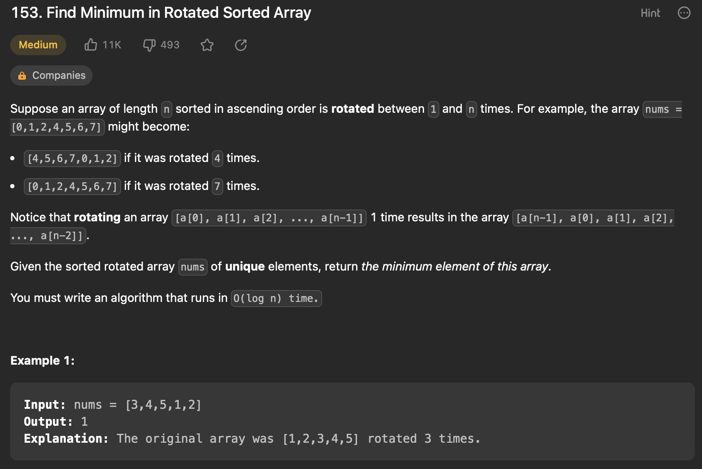

# LeetCode Solutions

## Binary Search

### [4. Median of Two Sorted Arrays](https://leetcode.com/problems/median-of-two-sorted-arrays/)

```java
class Solution {
    public double findMedianSortedArrays(int[] nums1, int[] nums2) {
        /*
            t.c o(log(min(m,n))) s.c o(1)

            Approach;
                1. No need to merge both the arrays the whole thing can be made into left and right portions
                2. take the min_len array , make l , r as start and end
                3. for the other array , set l as 0 and right as ((total/2) - end of first arr)
                4. check if the partitions are correct by checking the boundaries
                5. if even:
                        max(first_array)+min(second_array) / 2
                    odd:
                        max(left_array)
        */

       int m = nums1.length;
        int n = nums2.length;

        if (m > n) {
            return findMedianSortedArrays(nums2, nums1);
        }

        int total = m + n;
        int half = (total + 1) / 2;

        int left = 0;
        int right = m;

        var result = 0.0;

        while (left <= right) {
            int i = left + (right - left) / 2;
            int j = half - i;

            // get the four points around possible median
            int left1 = (i > 0) ? nums1[i - 1] : Integer.MIN_VALUE;
            int right1 = (i < m) ? nums1[i] : Integer.MAX_VALUE;
            int left2 = (j > 0) ? nums2[j - 1] : Integer.MIN_VALUE;
            int right2 = (j < n) ? nums2[j] : Integer.MAX_VALUE;

            // partition is correct
            if (left1 <= right2 && left2 <= right1) {
                // even
                if (total % 2 == 0) {
                    result =
                        (Math.max(left1, left2) + Math.min(right1, right2)) /
                        2.0;
                    // odd
                } else {
                    result = Math.max(left1, left2);
                }
                break;
            }
            // partition is wrong (update left/right pointers)
            else if (left1 > right2) {
                right = i - 1;
            } else {
                left = i + 1;
            }
        }

        return result;
    }
}
```

### [33. Search in Rotated Sorted Array](https://leetcode.com/problems/search-in-rotated-sorted-array/)

```java
class Solution {
    public int search(int[] nums, int target) {
        /*
            T.C  o(logn) s.c o(1)

            approach:
                1.init l,r = 0,len(nums)-1
                2. check if target is in left portionn or right portion (based on nums[l])
                3. if left portion:
                        check with nums[l] and mid:
                            if target<nums[l] or target>mid: //element in right portion
                                left = mid+1
                            else:
                                r = mid-1
                    if right portion:
                        check with nums[r] and mid:
                            if target < mid or target > nums[r]: // element in left portion
                                r = mid-1
                            else:
                                l = mid+1
        */
        int l = 0;
        int r = nums.length - 1;

        while(l<=r){

            int mid = (l+r)/2;

            if(nums[mid] == target){
                return mid;
            }
            //left sorted
            if(nums[l]<=nums[mid]){
                if(target > nums[mid] || target < nums[l]){
                    l = mid + 1;
                }else{
                    r = mid - 1;
                }
            }else{//right sorted
                if(target < nums[mid] || target > nums [r]){
                    r = mid - 1;
                }else{
                    l = mid + 1;
                }
            }

        }
        return -1;
    }
}
```

### [74. Search a 2D matrix](https://leetcode.com/problems/search-a-2d-matrix/description/)

```java
class Solution {
    public boolean searchMatrix(int[][] matrix, int target) {
        /*
            t.c - o(logm+logn) s.c - o(1)
            Approach:
                1.find the row which contains the element by b,s log(m)
                2.peform a second b,s to find the element in that row log(n)
                3.return el
        */
        //edge case
        if(matrix.length==0){
            return false;
        }


        int ROWS = matrix.length;
        int COL = matrix[0].length;

        int top = 0;
        int btm = ROWS-1;

        while (top<=btm){
            int row = (top + btm) / 2;
            System.out.println(row);
            System.out.println(COL-1);
            if (target > matrix[row][matrix[row].length-1]){ // after the mid
                top = row+1;
            }
            else if(target < matrix[row][0]){
                btm = row-1;
            }
            else{
                break;
            }
        }

        //if no row is found with the elem , break
        if(!(top<=btm)){
            return false;
        }
        //search in the row
        int s_row = (top + btm) / 2;
        int l = 0;Sea
        int r = matrix[0].length;

        while (l<=r){
            int mid = (l+r) / 2;
            if(matrix[s_row][mid]==target){
                return true;
            }
            if (matrix[s_row][mid]>target){ //ans in left portion
                r = mid-1;
            }
            else if(matrix[s_row][mid]<target){
                l = mid+1;
            }
        }
        return false;
    }
}
```

`second approach` - works for smaller matrix , less number of rows

```java
class Solution {
  public boolean searchMatrix(int[][] matrix, int target) {
    /*
        t.c o(log(m*n)) s.c o(1)
        approach:
        1. flatten the matrix , left = start , end = m*n
        2.search for el
        3.return


    */
    //edge case
    if (matrix.length == 0)
      return false;

    final int m = matrix.length;
    final int n = matrix[0].length;
    int l = 0;
    int r = m * n;

    while (l < r) {
      final int mid = (l + r) / 2;
      final int i = mid / n;
      final int j = mid % n;
      if (matrix[i][j] == target)
        return true;
      if (matrix[i][j] < target)
        l = mid + 1;
      else
        r = mid;
    }

    return false;
  }
}
```

### [153. Find Minimum in Rotated Sorted Array](https://leetcode.com/problems/find-minimum-in-rotated-sorted-array/)



```java
class Solution {
    /*
        t,c - o(logn) s,c o(1)

        ALGO:
        1. maintain a res to hold min
        2. in a sorted rotated array , at any point mid can belong either to right sorted portion or left sorted portion
        3. if nums[mid]>= nums[left] --> belongs to left portion , have to search in right portion for min value (set left = mid+1)
        4.else belongs to right portion , have to search in left (set right = mid)
        5.return left

    */


    public int findMin(int[] nums) {
        // int m = Integer.MAX_VALUE;
        // for(int c:nums)
        //     m = Math.min(m,c);
        // return m;

        int res = 0;
        int l = 0;
        int r = nums.length-1;

        while(l<=r){
            if (nums[l] <= nums[r]) {
                return nums[l]; //termination condition , minimum at left
            }
            int mid = (l+r)/2;
            if(nums[mid]>=nums[l]){
                l = mid+1;
            }
            else if(nums[mid]<=nums[l]){
                r = mid;
            }
        }
        return 0;
    }
}
```

### [704. Binary Search](https://leetcode.com/problems/binary-search/description/)

```java
class Solution {
    public int search(int[] nums, int target) {

        /*
            t.c - O(logn) s.c - O(1)
            Approach:
                s.w
                1.init l,r at start and end
                2.find mid and compare with target
                3.update left and right
                4.return mid when equal
        */

        int l = 0;
        int r = nums.length-1;
        while (l<=r){
            int mid = (l+r) / 2;
            if(nums[mid]==target){
                return mid;
            }
            if (nums[mid]>target){ //ans in left portion
                r = mid-1;
            }
            else if(nums[mid]<target){
                l = mid+1;
            }
        }
        return -1;
    }
}
```

### [875. Koko Eating Bananas](https://leetcode.com/problems/koko-eating-bananas/)


```java
class Solution {
        /*
            t.c - o(Nlog(max(n))) s.c o(1)
            approach-
            1. need to find the k which is optimal to finish in less than h hours
            2. total possible for k ->[1,max(piles)] , do a binary search on this range
            3. calculate total hours for a specific k , if calculated_hours< h , search in left portion , else right
            4.return mid
        */
    public int calucateHours(int[] piles,int k){
        //calcuate hours taken for a k
        int res = 0;
        for(int c:piles){
            res+= Math.ceil((double) c / k);
        }
        return res;
    }

    public int minEatingSpeed(int[] piles, int h) {


        int l = 1;
        int r = 1;
        for(int c:piles)
            r = Math.max(r,c);

        while (l<r){
            int mid = (l+r)/2;
            int hrs = calucateHours(piles,mid);
            if (hrs<=h){
                r = mid;
            }
            else if(hrs>h){
                l = mid+1;
            }
        }
        return r;
    }
}
```

### [981. Time Based Key-Value Store](https://leetcode.com/problems/time-based-key-value-store/)

```java
class TimeMap {
    /*
        t.c - o(logn) s.c O(1)
        approach:
        1. items in set operation are sorted (time is always increasing)
        2. perform binary operation on the dict[key]
        3. find the closest to the timestamp (<=)
        4. return
    */
    private HashMap<String,List<Pair<String,Integer>>> mp;

    private String binaySearch(List<Pair<String,Integer>> val,int ts){
        //peform binary
        int l = 0;
        int r = val.size()-1;
        String res = "";
        while (l<=r){
            int m = (l+r)/2;
            //check if <= timestamp
            int el = val.get(m).getValue();
            if(el <= ts){
                res = val.get(m).getKey();
                l = m+1;
            }
            else{
                r = m-1;
            }
        }
        return res;
    }

    public TimeMap() {
        mp = new HashMap();
    }

    public void set(String key, String value, int timestamp) {
        //set to the key
        if(!mp.containsKey(key)){
            mp.put(key,new ArrayList<>());
        }
        mp.get(key).add(new Pair(value,timestamp));
    }

    public String get(String key, int timestamp) {
        //check if key exists
        if(!mp.containsKey(key))
            return "";
        List<Pair<String,Integer>> val = mp.get(key);
        return binaySearch(val,timestamp);
    }
}

/**
 * Your TimeMap object will be instantiated and called as such:
 * TimeMap obj = new TimeMap();
 * obj.set(key,value,timestamp);
 * String param_2 = obj.get(key,timestamp);
 */
```


## Stack

### [22.Generate Parentheses](https://leetcode.com/problems/generate-parentheses/description/)


```py
class Solution:
    def generateParenthesis(self, n: int) -> List[str]:
        '''
         t.c - O(2^n) s.c O(n) to hold stack and O(2^n) for res stack
         Approach:
            backtrack algo
            start with (0,0)
            maintain two integers open and close
            if open < n:
                add('(')
                backtrack(open+1)
                pop()
            if close < o: (closed cant be greater than o)
                add(')')
                backtrack(close+1)
                pop()
        '''
        res = []
        st = []

        def bt(o,c):
            if o == c == n:
                res.append("".join(st))
                return
            if o < n:
                st.append("(")
                bt(o+1,c)
                st.pop()
            if c < o:
                st.append(")")
                bt(o,c+1)
                st.pop()
        bt(0,0)
        return res
```

### [36.Valid Paranthesis]()

```py
class Solution:
  def isValid(self, s: str) -> bool:
    stack = []

    for c in s:
      if c == '(':
        stack.append(')')
      elif c == '{':
        stack.append('}')
      elif c == '[':
        stack.append(']')
      elif not stack or stack.pop() != c:
        return False

    return not stack
```

### [84. Largest Rectangle in Histogram](https://leetcode.com/problems/largest-rectangle-in-histogram/)


```java
class Solution {
    public int largestRectangleArea(int[] heights) {
        /*
            largest area --> max_width or max_height
            area = (l*b)
            t.c -> O(n)
            s.c -> O(n)
            Approach:
                1. we can make an rectangle only when the next element is greater than the current
                2. start at ind 0, add to stack with pair (ind,height)
                3. when element height is less than stack peek , pop from stack and calcuate the area
                4. at last if any elements are left in the stack , they can extend all the way until end
                5. return the maxArea formed
        */

        int res = 0;
        int n = heights.length;
        int start;

        Stack<Pair<Integer,Integer>> st = new Stack<>();
        //start iteration
        for(int z=0;z<n;z++){
            int el = heights[z];
            start = z;
            //start poping from stack and modify the start index
            while(!st.empty() && st.peek().getValue()>el){
                Pair<Integer,Integer> p = st.pop();
                int index = p.getKey();
                int val = p.getValue();
                res = Math.max(res,val*(z-index)); //calculating all rectangles
                start = index; //update start index
            }
            //add to stack
            st.push(new Pair(z,el));
        }

        //check for the remaining element in the stack (can be extended until end)
        while(!st.empty()){
            Pair<Integer,Integer> s = st.pop();
            int i = s.getKey();
            int h = s.getValue();
            res = Math.max(res,h*(n-i));
        }

        return res;
    }
}
```

### [150.Evaluate Reverse Polish Notation](https://leetcode.com/problems/evaluate-reverse-polish-notation/description/)


```java
class Solution {
    /*
        t.c -> O(n) , s.c O(n)
        Approach:
            whenever we approach a expression pop two elements from the stack and add the result back to the stack


    */


    public int evalRPN(String[] tokens) {
        Stack<Integer> st = new Stack<>();

        for(String c:tokens){
            if(c.equals("+")){
                int a = st.pop();
                int b = st.pop();
                st.push(a+b);
            }
            else if(c.equals("-")){
                int a = st.pop();
                int b = st.pop();
                st.push(b-a);
            }
            else if(c.equals("*")){
                st.push(st.pop() * st.pop());
            }
            else if(c.equals("/")){
                int a = st.pop();
                int b = st.pop();
                st.push(b/a);
            }
            else{
                st.add(Integer.parseInt(c));
            }
        }

        return st.pop();
    }
}
```

### [155.Min Stack](https://leetcode.com/problems/min-stack/description/)

```java
class MinStack {
        /*t.c O(1) , s.c O(n)
         Approach:
         to find the minValue in constant time , maintain a minstack which stores the min until now

        */
    private Stack<Integer> st;
    private Stack<Integer> minSt;

    public MinStack(){
        st = new Stack<>();
        minSt = new Stack<>();
    }

    public void push(int val) {
        st.push(val);

        val = Math.min(val, minSt.isEmpty()?val:minSt.peek());
        minSt.push(val);
    }

    public void pop() {
        st.pop();
        minSt.pop();
    }

    public int top() {
        return st.peek();
    }

    public int getMin() {
        return minSt.peek();
    }
}
```

### [739.Daily Temperatures](https://leetcode.com/problems/daily-temperatures/description/)

```java
class Solution {
    public int[] dailyTemperatures(int[] temperatures) {
        /*
            t.c - O(n) s.c O(n) extra stack

            Approach:
                keep a stack to store the elements
                start from the back , check if the stack is empty , if empty then append 0
                else:
                    check if element is greater then pop (continue until stack exists)
                    if element is less than the top of stack , append the difference between curr and top stack to res
        */

        int[] ans = new int[temperatures.length];
        Stack<Integer> stack = new Stack<>();
        for (int currDay = 0; currDay < temperatures.length; currDay++) {
            while (!stack.isEmpty() && temperatures[currDay] > temperatures[stack.peek()]) {
                int prevDay = stack.pop();
                ans[prevDay] = currDay - prevDay;
            }
            stack.add(currDay);
        }
        return ans;
    }
}
```

### [853.Car Fleet](https://leetcode.com/problems/car-fleet/description/)

```java
class Car{
    public int position;
    public double time;
    public Car(int pos,double time){
        this.position = pos;
        this.time = time;
    }
}

class Solution {
    public int carFleet(int target, int[] position, int[] speed) {
        /*
            Approach 1 : t.c - O(nlogn) s.c O(n) - stack
            algo:
                1.make pairs of cars [[pos,speed]]
                2.start from right , add time taken by car to stack
                3. if stack has more than 2 items , check if st[-1] <= st[-2] , pop from stack
                4.return total len of the stack
            Approach 2: t.c - O(sort) , s.c O(n)
            algo:
                1.make car class objects car(pos,time)
                2.sort the array,
                3.for car in carArr , if car.time > maxTime --> res++
                4.return res

        */
        double maxTime = 0;
        int n = position.length;
        int res = 0;
        Car[] car = new Car[n];
        for(int z = 0 ; z<n; z++){
            car[z] = new Car(position[z],(double)(target-position[z])/speed[z]);
        }
        Arrays.sort(car,(a,b)-> b.position - a.position);

        for(Car c:car){
            if(c.time>maxTime){
                maxTime = c.time;
                res++;
            }
        }
        return res;

    }
}
```

## Sliding window

### [11.Container With Most Water](https://leetcode.com/problems/container-with-most-water/)

```java
class Solution {
    public int maxArea(int[] height) {

        int res = 0;
        int l = 0;
        int r = height.length - 1;
        int area = Integer.MIN_VALUE;

        while(l<r){
            area = (r-l) * Math.min(height[l],height[r]);
            res = Math.max(res,area);

            if(height[l]<height[r]){
                l++;
            }
            else{
                r--;
            }
        }
        return res;
    }
}
```

### [15.3Sum](https://leetcode.com/problems/3sum/)

```py
class Solution:
  def threeSum(self, nums: List[int]) -> List[List[int]]:
    if len(nums) < 3:
      return []

    ans = []

    nums.sort()

    for i in range(len(nums) - 2):
      if i > 0 and nums[i] == nums[i - 1]:
        continue
      l = i + 1
      r = len(nums) - 1
      while l < r:
        summ = nums[i] + nums[l] + nums[r]
        if summ == 0:
          ans.append((nums[i], nums[l], nums[r]))
          l += 1
          r -= 1
          while nums[l] == nums[l - 1] and l < r:
            l += 1
          while nums[r] == nums[r + 1] and l < r:
            r -= 1
        elif summ < 0:
          l += 1
        else:
          r -= 1

    return ans
```

### [42.Trapping rain water](https://leetcode.com/problems/trapping-rain-water/)

```py
class Solution:
    def trap(self, height: List[int]) -> int:
        #edge case
        if not height:
            return 0

        res = 0
        l = 0
        r = len(height)-1
        maxL = height[l]
        maxR = height[r]

        while(l<r):
            if(maxL<maxR):
                res+= maxL - height[l]
                l+=1
                maxL = max(maxL,height[l])
            else:
                res+=maxR - height[r]
                r-=1
                maxR = max(maxR,height[r])
        return res
```

## Matrix

### [36.Valid Sudoku](https://leetcode.com/problems/valid-sudoku/)

```java
class Solution {
    public boolean isValidSudoku(char[][] board) {
        Set<String> seen = new HashSet<>();

        for(int i = 0 ; i<9;i++){
            for(int j = 0 ; j<9;j++){
                if(board[i][j]=='.'){
                    continue;
                }
                final char c = board[i][j];
                if (!seen.add(c + "@row" + i) || //
                    !seen.add(c + "@col" + j) || //
                    !seen.add(c + "@box" + i / 3 + j / 3))
                return false;
            }
        }
        return true;
    }
}
```
