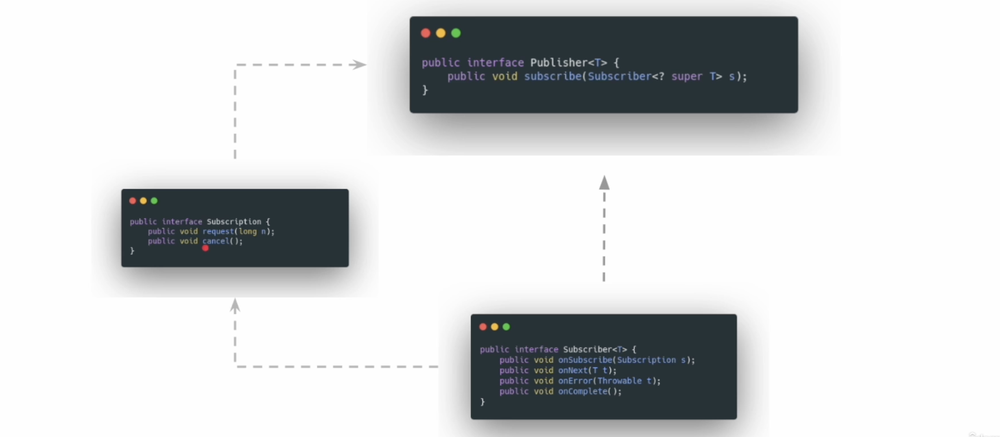

# Java Spring FrameWork

Course Link - [Chad Darby](https://gale.udemy.com/course/spring-hibernate-tutorial/learn/lecture/36828980#overview)

## Spring Core

### Inversion of Control (IoC)

- In general approach whenever a components needs to use another component, it creates an instance of the compoments or requests for the component from a service provider, this creates a "tight coupling" between the components i.e whenever one component changes the other would be affected by the change
- To solve this Inversion of control reverses the traditional approach, in this approach whenever a component requires an object, it is passed as a prop rather than instatiating the object in the class.
- Different Types of IoC

1. Dependency Injection: receive the dependencies through constructor, settor or an interface
2. service locator: receive the dependencies by making a request to a central repository.
3. Factory Pattern: Have a interface class deliver the required dependencies

- Spring framework uses spring container, to handle the Ioc functionalities

## Annotations

- In spring application, the Application context contains the bean factory, by default spring does not create any class objects but by using the @component annotation, we can notify the bean factory.
- If we have multiple class dependencies, the spring framework is notified to fetch required beans using the @AutoWired annotation.
- scopes for objects, singleton and prototype (creates multiple objects each type getBean() is called)

### @Configuration

- Annotation used to define class, which would be used to create the bean factory

### @Bean

- This tag is used to declare beans inside the config file, all beans would be declared and made available during the init process

### @Value

- sets the value in a bean, when its created

## Layers

### Controller

- responsible for handling all the incoming connections, use @RestController annotation, swagger can be integrated into the controller layer

### Service

- responsible for handling all the bussiness logic, use @Service annotation

### Respository

- responsible for connecting to the database, use @Repository annotation

## JPA

- Java Persistence API, its a form of contract used to connect and talk with different databases
- ORM (object relation mapper) is the tool which translates java objects into data base schemas and data rows

## Spring AOP

This is usefull for performance metrics, input validation and security and providing rbac, rollback transactions on exceptions, custom exception handling, caching, auditing, API rate limiting

| **Use Case**                 | **Description**                                     | **Example Annotation** |
| ---------------------------- | --------------------------------------------------- | ---------------------- |
| **Logging & Monitoring**     | Logs method execution time and method calls.        | `@Around`              |
| **Security & Authorization** | Restricts access based on user roles.               | `@Before`              |
| **Transaction Management**   | Ensures rollback on failures.                       | `@Transactional`       |
| **Exception Handling**       | Centralized error handling across services.         | `@AfterThrowing`       |
| **Caching**                  | Stores frequently used data to improve performance. | `@Cacheable`           |
| **Auditing**                 | Tracks user activity for compliance.                | `@Before`              |
| **API Rate Limiting**        | Prevents abuse by limiting API calls.               | `@Before`              |
| **Feature Toggles**          | Enables/disables features dynamically.              | `@Before`              |

Aspect Oriented Programming Concepts in a Nutshell

1. Join Point (When): Think of it as a scene in the movie of your program's execution.
   It's where the action happens!
2. Advice (What): This is the action! It's what happens at a particular scene (Join Point). It's like a plot twist in your program's execution.
3. Aspect (Where-Conceptual): It's the script of your movie. It defines what plot twists (Advice) happen and where (Pointcut).
4. Pointcut (Where-Operational): It's the specific scenes (Join Points) where the plot twists (Advice) occur. It's like a bookmark in your script (Aspect).
5. Target Object (Whom): This is the main character. It's the object that experiences the plot twists (Advice).
6. Weaving (How): This is the director's job. It's how the script (Aspect) is turned into a movie. In Spring AOP, this happens at runtime.
7. Proxy (The Double): This is the stunt double in your movie. In Spring AOP, it's the object that is created after applying advice to the target object. It's the one that takes the hits, performs the stunts, and makes the main character (Target Object) look good.

## Reactive Programming

process - a singular unit with a set of resources attached to it and used at the runtime
thread - a singular unit in a process, which would share the resources and perform its actions
scheduler - a part of the OS, which determines the duration for which a thread can execute

different types of IO calls

sync + blocking - thread sends a request, sits idle until response is available
async - a thread, creates a new thread and delegates its task to fetch the results
non-blocking - a thread perfroms the fetch request from the source and gets a call back when the response is ready
non-blocking + async - a thread, creates a new thread to deleagate, the new thread reaches out to source and gets notified when response is delivered

- communication patterns

1. request --> response : classic type of communication, for each request a response is delivered
2. request --> streaming response: A single request is made and stream of response are delivered
   (booked a cab (req), server sends stream responses , (driver details, time to arrival))
3. streaming request --> response : A single request is initiated to the server, and multiple requests are made
   (Galaxy watch sending sensor data to the server)
4. bi directional : multiple requests and multiple responses (singular connections, but stream of req's and responses)

At the heart and core, reactive programming depends on the observer pattern

- in this pattern, a set of chained reactive calls are made, when any change is observed
  (input height in number --> conversion in diff units)
- pub/sub communication model

(
workflow --> whenever a subscriber wants to connect to a publisher a subscription is generated which implements all the methods
)



- processors - the intermit units between the publishers and subscribers who can acts as the both
- Reactor is the implementation of the pub/sub commnication model
- Mono: in this model, the publisher always emits 0 or 1 item
- Flux: in this model, publisher can emit 0 .. N items at once
- backpressure --> occurs when producers sends more data than a consumer can handle
- Mono.just(`<T>` value) --> creates a publisher with a single value, subscribers can subscribe to fetch the values
- Mono.fromSupplier(()-> ()) --> used to delay the emit, the value is computed and emitted only when subscription is made.

### Hot/ Cold publisher

- in case of cold publisher , each subscriber would get its own flux stream , in case of netflix , its acts as a cold pub
- in case of hot publisher , each subscriber would get the parent flux stream , in case of football match streaming

### scheduler

- In general scenarion the creation of the flux object and the subscription and data stream is handled by the main thread
- If we want to avoid this and let only the main thread handle the creation process, we can use schedulers

to get this functionalities, reactor provides schedulers, reactor.core.scheduler

- different modes

1. boundedElastic --> useful for network bound calls
2. parallel --> useful for computive intense

#### subscribe on

- this method is used to attach the reactor core schedule for upstream, example

```java
flux.create(
   //logic for emit and complete
)
.subscribeOn(Scheduler.boundedElatic())
.subscribe(default_sub)
```

- in this case, the main thread handles the creation of the flux (pub), and the other parts are handled by the thread pool
  (when ever a sub arrives, a new thread fetchs the information from the pub, not the main thread)

#### publish on

- this method is used to attach the reactor core scheduler for downstream, whenever a publisher starts emitting data and sees a publisher on will assign the task to thread pool

```java
flux.create(
   //logic for emit and complete
)
.publishOn(Scheduler.boundedElatic())
.subscribe(default_sub)
```

the handling with the schedulers is handled by the scheduler

### BackPressure

- Occurs when subscriber is taking slowly than at the rate pub is producing (sub taking 100 items but pub producing 10000 items)

- to handle this by default reactor.core uses a queue to maintain the buffer stream and has a default max value of 256

- If the sub is taking at a slow rate, pub would produce till the max and wait until

methods to handle the back pressure manually (in case of flux.create())

1. Add an additonal buffer (this would store the items and pass on to subscriber) (onBackPressureBuffer)
2. thrown an error, in this case, whenever upstream produces more than the buffer size (an error will be thrown)
3. Drop strategy --> in this case, a operator drops the extra items from the upstream, lets say sub takes 2 items and pub produces 20 items, 18 items would be dropped
